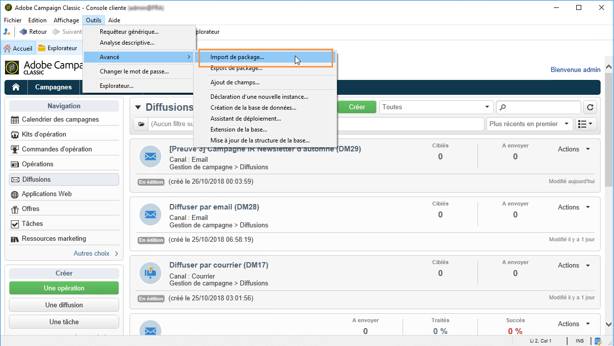
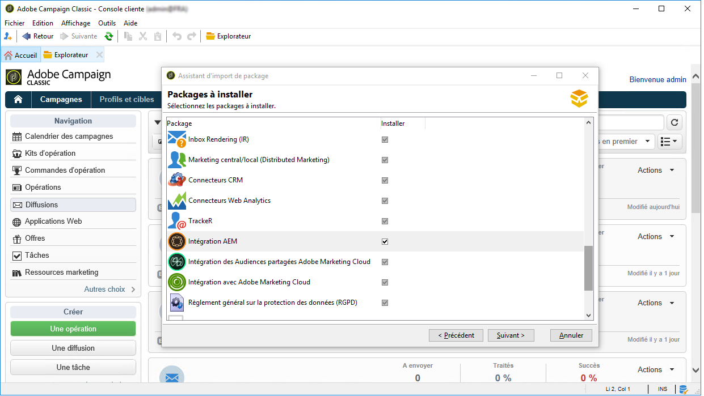
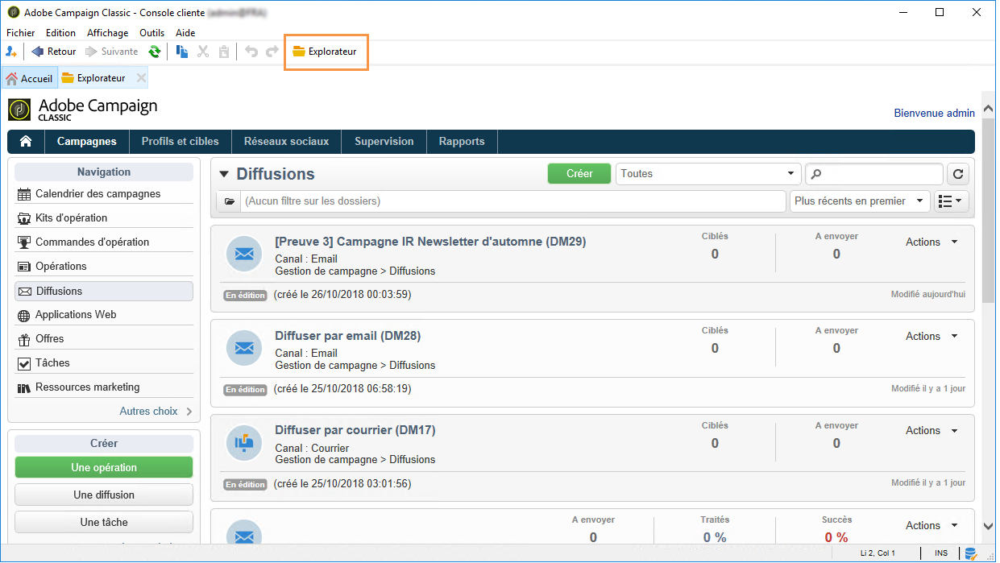
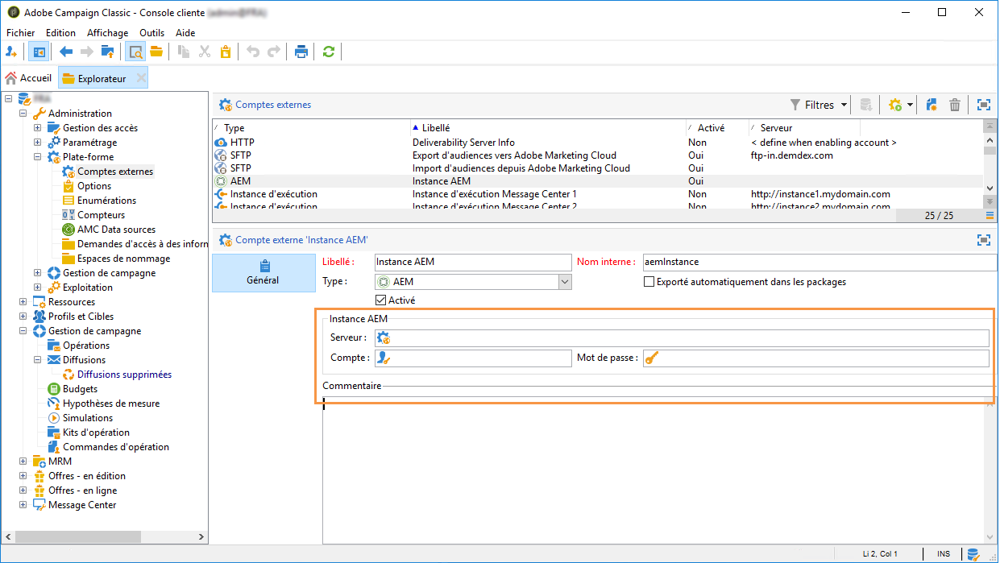
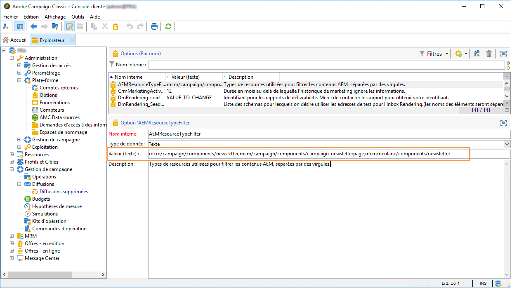

# Configuration de l’intégration Campaign-AEM{#configuring-the-integration}


## Procédure de configuration dans Adobe Campaign {#configuring-in-adobe-campaign}

Afin de pouvoir utiliser conjointement ces deux solutions, vous devez les paramétrer pour les connecter l&#39;une à l&#39;autre.

Suivez les étapes ci-dessous pour commencer la configuration dans Adobe Campaign :

1. [Installation du package d&#39;intégration AEM dans Adobe Campaign](#install-the-aem-integration-package-in-adobe-campaign)
1. [Configuration du compte externe](#configure-the-external-account)
1. [Configuration du filtrage des ressources AEM](#configure-aem-resources-filtering)

Pour les configurations avancées telles que la gestion des blocs et des champs de personnalisation, consultez la [documentation](https://helpx.adobe.com/fr/experience-manager/6-5/sites/administering/using/campaignonpremise.html) d&#39;Adobe Experience Manager.

### Installation du package d&#39;intégration AEM dans Adobe Campaign {#install-the-aem-integration-package-in-adobe-campaign}

Vous devez d&#39;abord installer le package **[!UICONTROL AEM Integration]**.

1. Depuis votre instance Adobe Campaign, sélectionnez **[!UICONTROL Outils]** dans la barre d&#39;outils supérieure.
1. Sélectionnez **[!UICONTROL Outils > Avancé > Import de package...]**.

   

1. Sélectionnez **[!UICONTROL Installer un package standard]**.
1. Cochez **[!UICONTROL AEM Integration]**, puis cliquez sur le bouton **[!UICONTROL Suivant]**.

   

1. Dans la fenêtre suivante, cliquez sur le bouton **[!UICONTROL Démarrer]** pour commencer l&#39;installation du package. Une fois l&#39;installation terminée, fermez la fenêtre.

### Configuration de la zone de sécurité pour l&#39;opérateur AEM {#configure-the-security-zone-for-aem-operator}

Le package **[!UICONTROL AEM Integration]** définit l&#39;opérateur **[!UICONTROL aemserver]** dans Campaign. Cet opérateur sera utilisé pour connecter le serveur Adobe Experience Manager à Adobe Campaign.

Vous devez configurer une zone de sécurité pour que cet opérateur puisse se connecter à Adobe Campaign par le biais d&#39;Adobe Experience Manager.

>[!CAUTION]
>
>Il est vivement recommandé de créer une zone de sécurité dédiée à AEM afin d&#39;éviter tout problème de sécurité. Voir à ce propos le [guide](../../installation/using/security-zones.md) d&#39;installation.

Si votre instance Campaign est hébergée par Adobe, contactez l’équipe d&#39;[Assistance clientèle d&#39;Adobe](https://helpx.adobe.com/fr/enterprise/admin-guide.html/enterprise/using/support-for-experience-cloud.ug.html). Si vous utilisez Campaign on-premise, procédez comme suit :

1. Ouvrez le fichier de configuration **serverConf.xml**.
1. Accédez à l&#39;attribut **allowUserPassword** de la zone de sécurité sélectionnée et définissez-le sur **true**.

   AEM peut ainsi se connecter à Adobe Campaign par le biais d&#39;un identifiant/mot de passe.

### Configuration du compte externe {#configure-the-external-account}

Le package **[!UICONTROL Intégration AEM]** a créé le compte externe pour Adobe Experience Cloud. Vous devez maintenant le configurer pour qu’il se connecte à votre instance Adobe Experience Manager.

Pour configurer le compte externe AEM, suivez la procédure ci-dessous :

1. Cliquez sur le bouton **[!UICONTROL Explorateur]**.

   

1. Sélectionnez **[!UICONTROL Administration > Plateforme > Comptes externes]**.
1. Dans la liste **[!UICONTROL Compte externe]**, sélectionnez **[!UICONTROL Instance AEM]**.
1. Renseignez les paramètres de votre instance de création AEM :

   * **[!UICONTROL Serveur]**
   * **[!UICONTROL Compte]**
   * **[!UICONTROL Mot de passe]**

   >[!NOTE]
   >
   >Vérifiez que l&#39;adresse du **[!UICONTROL Serveur]** ne se termine pas par une barre oblique.

   

1. Cochez la case **[!UICONTROL Activé]**.
1. Cliquez sur le bouton **[!UICONTROL Enregistrer]**.

### Configuration du filtrage des ressources AEM {#configure-aem-resources-filtering}

L&#39;option **AEMResourceTypeFilter** sert à filtrer les types de ressources Experience Manager pouvant être utilisés dans Adobe Campaign. Adobe Campaign peut ainsi récupérer les contenus Experience Manager spécialement conçus pour être utilisés uniquement dans Adobe Campaign.

Pour vérifier si l&#39;option **[!UICONTROL AEMResourceTypeFilter]** est configurée :

1. Cliquez sur le bouton **[!UICONTROL Explorateur]**.
1. Sélectionnez **[!UICONTROL Administration > Plateforme > Options]**.
1. Dans la liste **[!UICONTROL Options]**, sélectionnez **[!UICONTROL AEMResourceTypeFilter]**.
1. Dans le champ **[!UICONTROL Valeur (texte)]**, le chemin doit être le suivant :

   ```
   mcm/campaign/components/newsletter,mcm/campaign/components/campaign_newsletterpage,mcm/neolane/components/newsletter
   ```

   Ou, dans certains cas :

   ```
   mcm/campaign/components/newsletter
   ```

   

## Procédure de configuration dans Adobe Experience Manager {#configuring-in-adobe-experience-manager}

Suivez les étapes ci-dessous pour commencer la configuration dans Adobe Experience Manager :

1. Configurez la **réplication** entre les instances Adobe Experience Manager de création et de publication.

   Pour découvrir comment configurer la réplication, consultez la [documentation](https://helpx.adobe.com/fr/experience-manager/6-5/sites/deploying/using/replication.html) d&#39;Adobe Experience Manager.

1. Connectez Adobe Experience Manager à Adobe Campaign en configurant un **Cloud Service dédié**.

   Pour découvrir comment connecter les deux solutions via les Cloud Services, consultez la [documentation](https://helpx.adobe.com/fr/experience-manager/6-5/sites/administering/using/campaignonpremise.html#ConfiguringAdobeExperienceManager) d&#39;Adobe Experience Manager .

1. Configurez le **service d&#39;externalisation**.

   Pour découvrir comment le configurer, consultez la [documentation](https://helpx.adobe.com/fr/experience-manager/6-5/sites/developing/using/externalizer.html) d&#39;Adobe Experience Manager.
