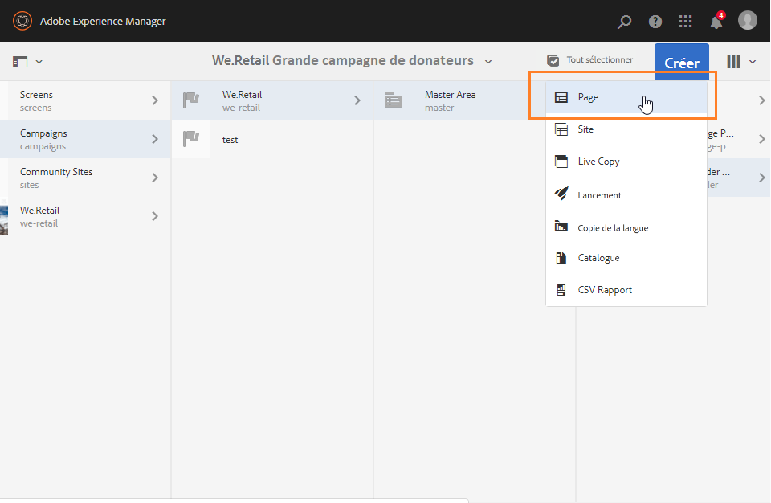

# Création d&#39;une newsletter Experience Manager{#creating-an-experience-manager-newsletter}

Cette intégration peut être utilisée, par exemple, pour créer une newsletter dans Adobe Experience Manager, qui sera ensuite utilisée dans le cadre d’une campagne e-mail dans Adobe Campaign.

**Depuis Adobe Experience Manager :**

1. Depuis votre instance de création AEM, cliquez sur le logo **Adobe Experience** en haut à gauche de la page, puis sélectionnez **[!UICONTROL Sites]**.

   

1. Sélectionnez **[!UICONTROL Campagnes > Nom de votre marque (We.Retail, dans le cas présent) > Zone principale > Campagnes par e-mail]**.
1. Cliquez sur le bouton **[!UICONTROL Créer]** en haut à droite de la page, puis sélectionnez **[!UICONTROL Page]**.

   

1. Sélectionnez le modèle **[!UICONTROL Adobe Campaign Email (AC 6.1)]** et attribuez un nom à votre newsletter.
1. Une fois votre page créée, accédez au menu **[!UICONTROL Informations sur la page]**, puis cliquez sur **[!UICONTROL Ouvrir les propriétés]**.

   

1. Dans l&#39;onglet **[!UICONTROL Services Cloud]**, sélectionnez **[!UICONTROL Adobe Campaign]** en tant que **[!UICONTROL Configurations du service Cloud]** et votre instance Adobe Campaign dans la seconde liste déroulante.

   

1. Editez le contenu de votre email en ajoutant des composants, par exemple des champs de personnalisation depuis Adobe Campaign.
1. Lorsque votre email est prêt, accédez au menu **[!UICONTROL Informations sur la page]**, puis cliquez sur **[!UICONTROL Démarrer le flux de travail]**.

   

1. Dans la première liste déroulante, sélectionnez **[!UICONTROL Publier dans Adobe Campaign]** en tant que modèle de workflow, puis cliquez sur **[!UICONTROL Démarrer le flux de travail]**.

   

1. Comme à l&#39;étape précédente, lancez ensuite le workflow **[!UICONTROL Approuver pour Adobe Campaign]**.
1. Une clause d&#39;exclusion de responsabilité apparaît en haut de la page. Cliquez sur **[!UICONTROL Terminé]** pour confirmer la consultation, puis cliquez sur **[!UICONTROL OK]**.

   

1. Cliquez à nouveau sur **[!UICONTROL Terminé]**, puis sélectionnez **[!UICONTROL Approbation de la newsletter]** dans la liste déroulante **[!UICONTROL Étape suivante]**.

   

Votre newsletter est maintenant prête et synchronisée dans Adobe Campaign.

**Depuis Adobe Campaign :**

1. Dans l&#39;onglet **[!UICONTROL Campagnes]**, cliquez sur **[!UICONTROL Diffusions]** et sur **[!UICONTROL Créer]**.

   

1. Dans la liste déroulante **[!UICONTROL Modèle de diffusion]**, sélectionnez le modèle **[!UICONTROL Diffusion par email avec contenu AEM (mailAEMContent)]**.

   

1. Ajoutez un **[!UICONTROL Libellé]** à votre diffusion, puis cliquez sur **[!UICONTROL Continuer]**.
1. Cliquez sur le bouton **[!UICONTROL Synchroniser]**.

   Si ce bouton ne s&#39;affiche pas dans votre interface, cliquez sur le bouton **[!UICONTROL Propriétés]** et sélectionnez l&#39;onglet **[!UICONTROL Avancé]**. Le champ **[!UICONTROL Mode d&#39;édition du contenu]** doit être défini sur **[!UICONTROL AEM]** avec votre instance AEM dans le champ **[!UICONTROL Compte AEM]**.

   

1. Sélectionnez la diffusion ayant été précédemment créée dans Adobe Experience Manager, puis cliquez sur **[!UICONTROL OK]**.
1. Cliquez sur le bouton **[!UICONTROL Rafraîchir le contenu]** dès que des modifications sont apportées à votre diffusion AEM.

   

Votre email est maintenant prêt à être envoyé à votre audience.
