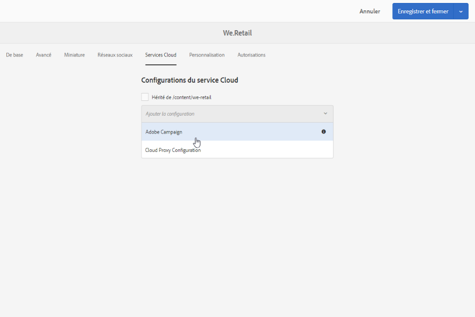

# Création d&#39;une newsletter Experience Manager{#creating-an-experience-manager-newsletter}

Cette intégration peut être utilisée, par exemple, pour créer une newsletter dans Adobe Experience Manager, qui sera ensuite utilisée dans le cadre d&#39;une campagne email dans Adobe Campaign.

Pour obtenir un exemple plus détaillé de l&#39;utilisation de cette intégration, consultez ce [guide pas à pas](https://docs.campaign.adobe.com/doc/AC/getting_started/EN/aem.html).

**Depuis Adobe Experience Manager :**

1. Depuis votre instance de création AEM, cliquez sur le logo **Adobe Experience** en haut à gauche de la page, puis sélectionnez **[!UICONTROL Sites]**.

   

1. Sélectionner **[!UICONTROL Campaigns > Name of your brand (here We.Retail) > Master Area > Email campaigns]**.
1. Click the **[!UICONTROL Create]** button in the upper right side of the page then select **[!UICONTROL Page]**.

   

1. Select the **[!UICONTROL Adobe Campaign Email (AC 6.1)]** template and name your newsletter.
1. Une fois votre page créée, accédez au **[!UICONTROL Page information]** menu et cliquez sur **[!UICONTROL Open Properties]**.

   

1. Dans l’ **[!UICONTROL Cloud Services]** onglet, sélectionnez **[!UICONTROL Adobe Campaign]** et votre instance Adobe Campaign **[!UICONTROL Cloud service configuration]** dans la deuxième liste déroulante.

   

1. Editez le contenu de votre email en ajoutant des composants, par exemple des champs de personnalisation depuis Adobe Campaign.
1. Lorsque votre adresse électronique est prête, accédez au **[!UICONTROL Page information]** menu et cliquez sur **[!UICONTROL Start workflow]**.

   

1. Dans la première liste déroulante, sélectionnez **[!UICONTROL Publish to Adobe Campaign]** comme modèle de flux de travail et cliquez sur **[!UICONTROL Start workflow]**.

   

1. Ensuite, comme l’étape précédente, lancez le **[!UICONTROL Approve for Campaign]** flux de travaux.
1. Une clause de rejet de responsabilité s’affiche en haut de votre page. Cliquez sur **[!UICONTROL Complete]** pour confirmer la révision, puis sur **[!UICONTROL Ok]**.

   

1. Cliquez de nouveau **[!UICONTROL Complete]** et sélectionnez **[!UICONTROL Newsletter approval]** dans la **[!UICONTROL Next Step]** liste déroulante.

   

Votre newsletter est maintenant prête et synchronisée dans Adobe Campaign.

**Depuis Adobe Campaign :**

1. Dans l’ **[!UICONTROL Campaigns]** onglet, cliquez **[!UICONTROL Deliveries]** puis **[!UICONTROL Create]**.

   

1. Dans la **[!UICONTROL Delivery template]** liste déroulante, sélectionnez le **[!UICONTROL Email delivery with AEM content (mailAEMContent)]** modèle.

   

1. Add a **[!UICONTROL Label]** to your delivery and click **[!UICONTROL Continue]**.
1. Cliquez sur le **[!UICONTROL Synchronize]** bouton.

   Si ce bouton n’apparaît pas dans votre interface, cliquez sur le **[!UICONTROL Properties]** bouton et sélectionnez l’ **[!UICONTROL Advanced]** onglet. Le **[!UICONTROL Content editing mode]** champ doit être défini sur **[!UICONTROL AEM]** avec votre instance AEM dans le **[!UICONTROL AEM account]** champ.

   

1. Sélectionnez la diffusion ayant été précédemment créée dans Adobe Experience Manager, puis cliquez sur **[!UICONTROL Ok]**.
1. Click the **[!UICONTROL Refresh content]** button as soon as some changes are made to your AEM delivery.

   

Votre email est maintenant prêt à être envoyé à votre audience.
