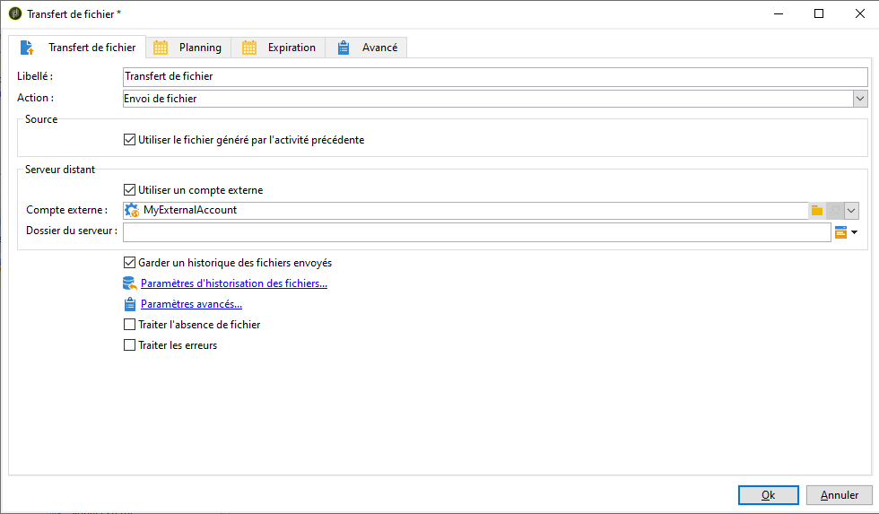

# Exporter des données de Campaign vers Adobe Experience Platform {#sources}

Pour exporter des données de Campaign Classic vers Adobe Real-time Customer Data Platform (RTCDP), vous devez d&#39;abord créer un workflow dans Campaign Classic pour exporter les données que vous souhaitez partager vers votre emplacement de stockage S3 ou Azure Blob.

Une fois le workflow configuré et les données envoyées à votre emplacement de stockage, vous devez connecter votre emplacement de stockage S3 ou Azure Blob en tant que **Source** dans Adobe Experience Platform.

>[!NOTE]
>
>Veuillez noter que nous vous recommandons d’exporter uniquement les données générées par Campaign (par exemple, envois, ouvertures, clics, etc.) vers Adobe Experience Platform. Les données ingérées à partir d’une source tierce (tel que votre CRM) doivent être importées directement dans Adobe Experience Platform.

## Création d&#39;un workflow d&#39;export dans Campaign Classic

Pour exporter des données de Campaign Classic vers votre emplacement de stockage S3 ou Azure Blob, vous devez créer un workflow pour cibler les données à exporter et les envoyer vers votre emplacement de stockage.

Pour ce faire, ajoutez et configurez les éléments suivants :

* Une activité **[!UICONTROL Extraction (fichier)]** pour extraire les données ciblées dans un fichier CSV. Pour plus d&#39;informations sur la configuration de cette activité, consultez [cette section](../../workflow/using/extraction--file-.md).

  

* Une activité **[!UICONTROL Transfert de fichier]** pour transférer le fichier CSV vers votre emplacement de stockage. Pour plus d’informations sur la configuration de cette activité, consultez [cette section](../../workflow/using/file-transfer.md).

  

Par exemple, le workflow ci-dessous extrait régulièrement les logs dans un fichier CSV, puis transfère ce fichier vers un emplacement de stockage.

## Connecter votre emplacement de stockage en tant que source

Les étapes principales pour connecter votre emplacement de stockage S3 ou Azure Blob en tant que **Source** dans Adobe Experience Platform sont énumérées ci-dessous. Des informations détaillées sur chacune de ces étapes sont disponibles dans la [documentation des connecteurs source](https://experienceleague.adobe.com/docs/experience-platform/sources/home.html?lang=fr).

1. Dans le menu **[!UICONTROL Sources]** d’Adobe Experience Platform, créez une connexion vers votre emplacement de stockage :

   * [Création d’une connexion source Amazon S3](https://experienceleague.adobe.com/docs/experience-platform/sources/ui-tutorials/create/cloud-storage/s3.html?lang=fr)
   * [Connecteur Azure Blob](https://experienceleague.adobe.com/docs/experience-platform/sources/connectors/cloud-storage/blob.html?lang=fr)

   >[!NOTE]
   >
   >L&#39;emplacement de l&#39;enregistrement peut être Amazon S3, SFTP avec mot de passe, SFTP avec clé SSH ou des connexions Azure Blob. La méthode préférée pour envoyer des données vers Adobe Campaign est via Amazon S3 ou Azure Blob :

   

1. Configurez un flux de données pour une connexion par lots vers l’espace de stockage. Un flux de données est une tâche planifiée qui récupère et ingère des données issues de l’emplacement de stockage pour obtenir un jeu de données Adobe Experience Platform. Cette procédure permet de configurer l’ingestion des données depuis votre emplacement de stockage, y compris la sélection des données et le mappage des champs CSV avec un schéma XDM.

   Des informations détaillées sont disponibles dans [cette page](https://experienceleague.adobe.com/docs/experience-platform/sources/ui-tutorials/dataflow/cloud-storage.html?lang=fr).

   

1. Une fois la source configurée, Adobe Experience Platform importe le fichier à partir de l’emplacement de stockage que vous avez indiqué.

   Cette opération peut être planifiée en fonction de vos besoins. Il est recommandé d’effectuer l’exportation jusqu’à 6 fois par jour, selon la charge déjà présente sur l’instance.
