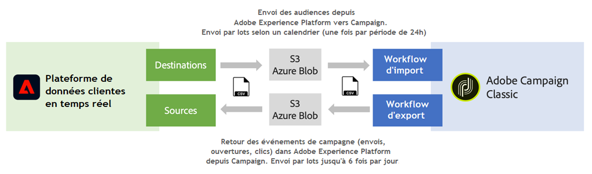

# Utilisation des sources et des destinations {#rtcdp}

## À propos des sources et des destinations

Adobe Experience Platform permet de partager des données entre Campaign Classic et Adobe Real-time Customer Data Platform (RTCDP). Vous pouvez ainsi cibler des audiences Adobe Experience Platform dans vos workflows Campaign, puis renvoyer à Adobe Real-time Customer Data Platform les données liées à ces audiences, notamment les envois, les ouvertures et les clics.

* Avec **Destinations**, ingérez les audiences d&#39;Adobe Experience Platform dans Campaign Classic. Il est ainsi possible d&#39;activer vos données connues et inconnues pour vos opérations marketing.
* Avec **Sources**, exportez les données de Campaign Classic (par exemple, envois, ouvertures, clics) dans Adobe Experience Platform. Vous pouvez ainsi centraliser les données collectées à partir de sources disparates dans un seul et même endroit, et utiliser les informations acquises pour faire davantage.

>[!IMPORTANT]
>
>Lorsque vous utilisez cette fonctionnalité, gardez à l&#39;esprit les limites du stockage SFTP, les limites du stockage en base de données, et les limites des profils actifs en fonction de votre contrat Adobe Campaign.

Pour un aperçu plus détaillé d’Adobe Real-time Customer Data Platform, des destinations et des sources, consultez les pages suivantes :

* [Adobe Real-time Customer Data Platform](https://experienceleague.adobe.com/docs/experience-platform/rtcdp/overview.html?lang=fr)
* [Documentation sur les destinations](https://experienceleague.adobe.com/docs/experience-platform/destinations/home.html?lang=fr)
* [Documentation sur les sources](https://experienceleague.adobe.com/docs/experience-platform/sources/home.html?lang=fr)

## Connecter Campaign Classic à Adobe Experience Platform

Pour pouvoir partager des données entre Adobe Experience Platform et Campaign Classic, vous devez d&#39;abord connecter Adobe Campaign en tant que **destination** et connecter votre emplacement de stockage AWS S3 ou Azure Blob en tant que **source** dans Adobe Experience Platform.

Une fois les connecteurs configurés, vous pouvez configurer un import ou un export de données dans Campaign Classic à l&#39;aide de workflows.

Pour plus d&#39;informations sur la configuration de ces processus d&#39;import et d&#39;export, reportez-vous aux sections suivantes :

* [Ingérer des segments Adobe Experience Platform dans Campaign](../../integrations/using/ingest-aep-data.md)
* [Exporter des données de Campaign vers Adobe Experience Platform](../../integrations/using/export-campaign-data.md)
