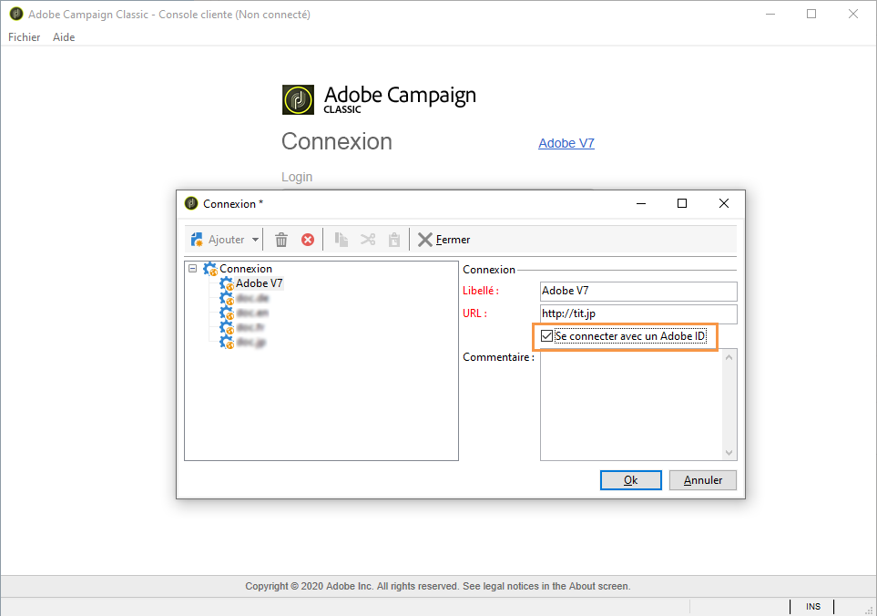

# Implémenter l&#39;IMS{#implementing-ims}

Une fois la [configuration IMS](configuring-ims.md) terminée, vous pouvez activer la connexion.

Pour activer le mode d’authentification IMS dans Adobe Campaign, procédez comme suit :

1. Ouvrez l’écran de connexion de la console cliente.
1. Sélectionnez l’environnement pour lequel vous devez activer la connexion.
1. Activez l’option **[!UICONTROL Se connecter avec un Adobe ID]** et enregistrez vos modifications.

   

1. Lors de la connexion à cet environnement, utilisez votre Adobe ID et votre mot de passe.
