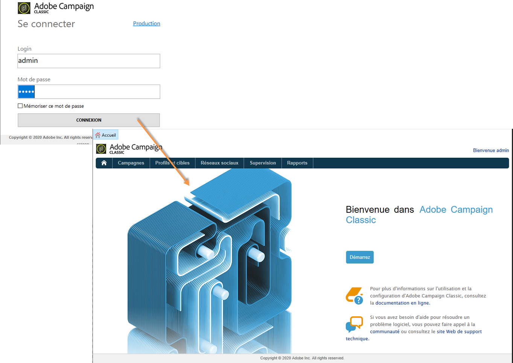

# Implémenter l&#39;IMS{#implementing-ims}

## Activer la connexion via l&#39;IMS {#enabling-the-ims-connection}

1. Pour activer la connexion via l&#39;IMS, cochez la case **[!UICONTROL Se connecter avec un Adobe ID]** dans la fenêtre de gestion des connexions de la console.

   

1. Saisissez votre identifiant et mot de passe Adobe. L&#39;écran d&#39;accueil Adobe Campaign apparait.

   

## Désactiver la connexion via l&#39;IMS {#disabling-the-ims-connection}

Pour désactiver la connexion via l&#39;Adobe ID, déconnectez-vous, cliquez sur le menu **[!UICONTROL Fichier > Connexions]** et décochez la case **[!UICONTROL Se connecter avec un Adobe ID]**.

