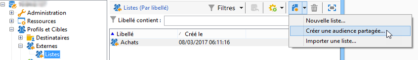
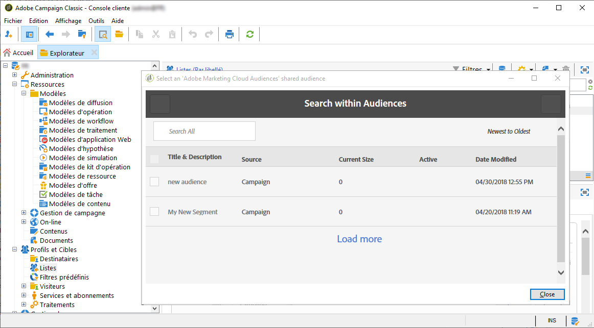
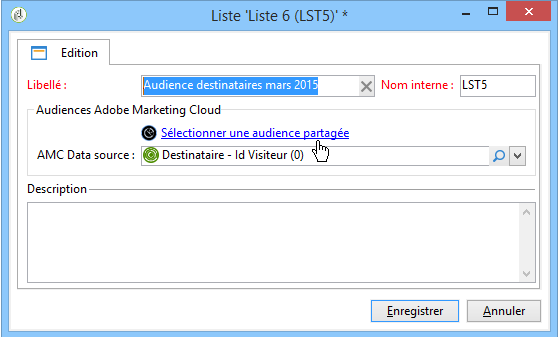
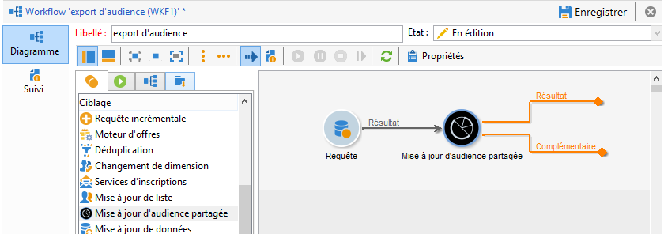
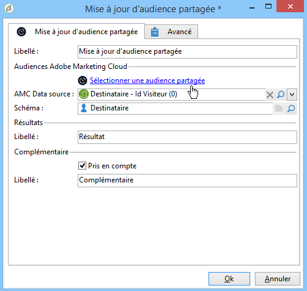

# Import et export d&#39;audiences{#importing-and-exporting-audiences}

## Importer une audience {#importing-an-audience}

L&#39;import d&#39;audiences/de segments depuis Audience Manager ou People core service dans Adobe Campaign peut être réalisé via les listes de destinataires.

1. Accédez au noeud **[!UICONTROL Profils et Cibles]** > **[!UICONTROL Listes]** de l&#39;explorateur Adobe Campaign.
1. Depuis la barre d&#39;actions, sélectionnez **[!UICONTROL Nouveau]** > **[!UICONTROL Créer une audience partagée...]**.

   

1. Dans la fenêtre qui s’ouvre, cliquez sur **[!UICONTROL Sélectionner une audience partagée]** afin d’accéder à la liste des audiences partagées/segments disponibles à partir des autres solutions Adobe Experience Cloud.
1. Sélectionnez l&#39;audience de votre choix puis validez. Les informations de l&#39;audience sélectionnée sont automatiquement renseignées.

   Veuillez noter que pour pouvoir importer une audience partagée, le produit **[!UICONTROL Audience partagée]** devrait vous être assigné dans la console d&#39;administration et vous devriez être administrateur dans Audience Manager. Pour en savoir plus à ce sujet, consultez la [documentation de la console d&#39;administration](https://helpx.adobe.com/fr/enterprise/managing/user-guide.html).

   

1. Sélectionnez la source de données AMC au niveau du champ **[!UICONTROL AMC Datasource]** afin de définir le type de données attendu.

   

1. Enregistrez l&#39;audience.

L&#39;audience est importée par l&#39;intermédiaire d&#39;un workflow technique. La liste importée contient des éléments réconciliables au moyen d&#39;une AMC Data source. Les éléments non reconnus par Adobe Campaign ne sont pas importés.

Le processus d&#39;import prend entre 24 et 36 heures pour se synchroniser lorsque les segments sont importés directement à partir de People core service ou d&#39;Audience Manager. Au terme de cette période, vous pourrez trouver et utiliser votre nouvelle audience dans Adobe Campaign.

>[!NOTE]
>
>Si vous importez des audiences d&#39;Adobe Analytics vers Adobe Campaign, celles-ci doivent d&#39;abord être partagées dans People core service ou Audience Manager. Ce processus prend entre 12 et 24 heures (temps venant s&#39;ajouter aux 24 à 36 heures requises pour la synchronisation avec Campaign).
>
>Dans ce cas spécifique, la durée de partage de l&#39;audience peut prendre jusqu&#39;à 60 heures. Pour plus d&#39;informations sur le partage d&#39;audiences Adobe Analytics dans People Core service et Audience Manager, consultez la [documentation d&#39;Adobe Analytics](https://experienceleague.adobe.com/docs/analytics/components/segmentation/segmentation-workflow/seg-publish.html?lang=fr).

Lors de chaque synchronisation, les données de l&#39;audience sont entièrement remplacées. Seuls les segments peuvent être importés. Les données granulaires, notamment les paires clé-valeur, les caractéristiques et les règles ne sont pas prises en charge.

## Exporter une audience {#exporting-an-audience}

L&#39;export d&#39;une audience depuis Adobe Campaign vers People core service ou Audience Manager peut être réalisé à l&#39;aide d&#39;un workflow. La création et l&#39;utilisation d&#39;un workflow sont détaillées dans [ce document](../../workflow/using/building-a-workflow.md). Les audiences exportées sont enregistrées sous forme de segments dans People core service :

1. Créez un nouveau workflow de ciblage.
1. En utilisant les différentes activités à votre disposition, ciblez un ensemble de destinataires.
1. A la suite du ciblage, placez une activité **[!UICONTROL Mise à jour d&#39;audience partagée]** puis ouvrez-la.

   

1. Définissez l&#39;audience que vous souhaitez exporter via l&#39;option **[!UICONTROL Sélectionner une audience partagée]**. Dans la fenêtre de sélection qui s&#39;ouvre, vous pouvez choisir une audience existante ou créer une nouvelle audience.

   Si vous sélectionnez une audience existante, seuls les nouveaux enregistrements seront ajoutés à l&#39;audience.

   Pour exporter votre liste de destinataires dans une nouvelle audience, renseignez le champ **[!UICONTROL Segment name]** puis cliquez sur **[!UICONTROL Create]** avant de sélectionner l&#39;audience nouvellement créée.

   Terminez l&#39;opération en cliquant sur la coche de validation située en haut à droite de la fenêtre, puis sur le bouton **[!UICONTROL Ok]**.

1. Sélectionnez la source de données **[!UICONTROL AMC Datasource]** afin de définir le type de données attendu. Le schéma est automatiquement déduit.

   

1. Enregistrez l&#39;audience.

L&#39;audience est alors exportée. L&#39;activité de sauvegarde d&#39;audience a deux transitions sortantes. La transition principale contient les destinataires ayant été exportés avec succès. La transition complémentaire contient les destinataires n&#39;ayant pas pu être mappés avec un identifiant visiteur ou un declared ID.

La synchronisation entre Adobe Campaign et People core service prend entre 24 et 36 heures. Au terme de cette période, vous pourrez trouver votre nouvelle audience dans People core service et la réutiliser dans d&#39;autres solutions Adobe Experience Cloud. Pour plus d&#39;informations sur l&#39;utilisation d&#39;une audience partagée Adobe Campaign dans Adobe People core service, consultez cette [documentation](https://experienceleague.adobe.com/docs/core-services/interface/audiences/t-audience-create.html?lang=fr).

>[!NOTE]
>
>Pour pouvoir être réconciliés, les enregistrements doivent posséder un identifiant Adobe Experience Cloud (&#39;Visitor ID&#39; ou &#39;Declared ID&#39;). Les enregistrements ne disposant pas d&#39;un identifiant Adobe Experience Cloud sont ignorés lors de l&#39;export et de l&#39;import des audiences.
