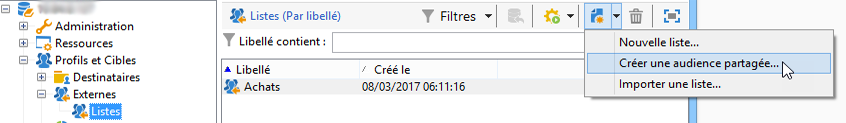
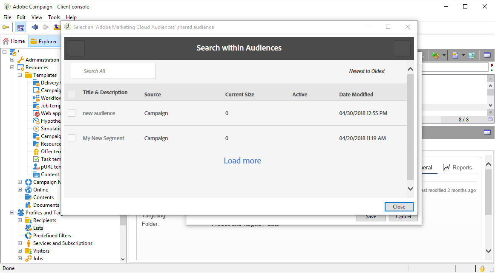
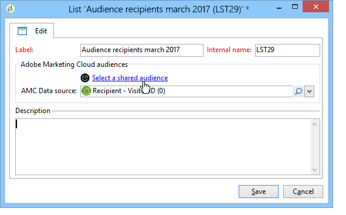
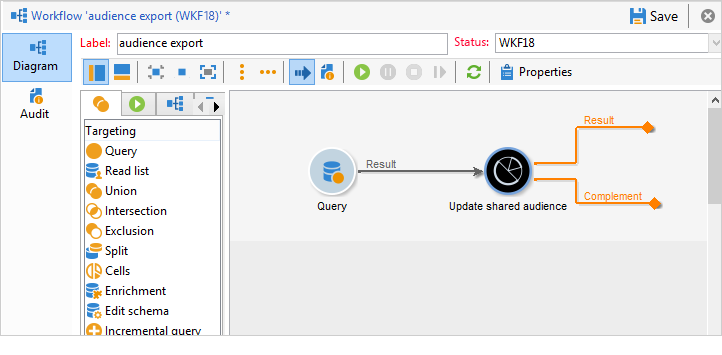
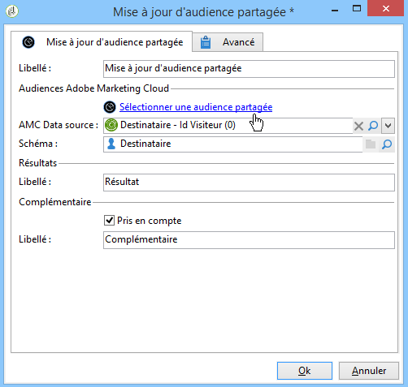

# Import et export d&#39;audiences{#importing-and-exporting-audiences}

## Importer une audience {#importing-an-audience}

Vous pouvez importer des audiences/segments à partir d’Audience Manager dans Adobe Campaign via les listes des destinataires.

1. Accédez au noeud **[!UICONTROL Profils et Cibles]** > **[!UICONTROL Listes]** de l&#39;explorateur Adobe Campaign.
1. Depuis la barre d&#39;actions, sélectionnez **[!UICONTROL Nouveau]** > **[!UICONTROL Créer une audience partagée...]**.

   

1. Dans la fenêtre qui s’ouvre, cliquez sur **[!UICONTROL Sélectionner une audience partagée]** afin d’accéder à la liste des audiences partagées/segments disponibles à partir des autres solutions Adobe Experience Cloud.
1. Sélectionnez une audience et confirmez. Les informations de l’audience sont automatiquement renseignées.

   Veuillez noter que pour pouvoir importer une audience partagée, le produit **[!UICONTROL Audience partagée]** devrait vous être assigné dans la console d&#39;administration et vous devriez être administrateur dans Audience Manager. Pour en savoir plus à ce sujet, consultez la [documentation de la console d&#39;administration](https://helpx.adobe.com/fr/enterprise/managing/user-guide.html).

   

1. Sélectionnez la source de données AMC au niveau du champ **[!UICONTROL AMC Datasource]** afin de définir le type de données attendu.

   

1. Enregistrez l&#39;audience.

L&#39;audience est importée via un workflow technique. La liste importée contient des éléments réconciliables à l&#39;aide de l&#39;AMC Data source. Les éléments non reconnus par Adobe Campaign ne sont pas importés.

Le processus d’import met entre 24 et 36 heures pour se synchroniser lorsque les segments sont importés directement à partir d’Audience Manager. Au terme de cette période, vous pourrez trouver et utiliser votre nouvelle audience dans Adobe Campaign.

>[!NOTE]
>
>Si vous importez des audiences à partir d’Adobe Analytics vers Adobe Campaign, celles-ci doivent d’abord être partagées dans Audience Manager. Ce processus prend entre 12 et 24 heures (temps venant s’ajouter aux 24 à 36 heures requises pour la synchronisation avec Campaign).
>
>Dans ce cas spécifique, la durée de partage de l’audience peut prendre jusqu’à 60 heures. Pour plus d’informations sur le partage d’audiences Adobe Analytics dans Audience Manager, consultez la [documentation d’Adobe Analytics](https://experienceleague.adobe.com/docs/analytics/components/segmentation/segmentation-workflow/seg-publish.html?lang=fr){target="_blank"}.

Lors de chaque synchronisation, les données de l&#39;audience sont entièrement remplacées. Seuls les segments peuvent être importés. Les données granulaires, notamment les paires clé-valeur, les caractéristiques et les règles, ne sont pas prises en charge.

## Exporter une audience {#exporting-an-audience}

Vous pouvez exporter une audience à partir d’Adobe Campaign vers Audience Manager à l’aide d’un workflow. La création et l’utilisation d’un workflow sont détaillées dans la [documentation de Campaign v8](https://experienceleague.adobe.com/docs/campaign/automation/workflows/introduction/build-a-workflow.html?lang=fr){target="_blank"}. Les audiences exportées sont enregistrées sous forme de segments :

1. Créez un nouveau workflow de ciblage.
1. En utilisant les différentes activités à votre disposition, ciblez un ensemble de destinataires.
1. A la suite du ciblage, placez une activité **[!UICONTROL Mise à jour d&#39;audience partagée]** puis ouvrez-la.

   

1. Définissez l&#39;audience à exporter à partir de l&#39;option **[!UICONTROL Sélectionner une audience partagée]**. Dans la fenêtre qui s’ouvre, vous pouvez sélectionner une audience existante ou en créer une nouvelle.

   Si vous sélectionnez une audience existante, seuls les nouveaux enregistrements seront ajoutés à l&#39;audience.

   Pour exporter votre liste de destinataires dans une nouvelle audience, renseignez le champ **[!UICONTROL Segment name]** puis cliquez sur **[!UICONTROL Create]** avant de sélectionner l&#39;audience nouvellement créée.

   Terminez l’opération en cliquant sur la coche située en haut à droite de la fenêtre, puis sur le bouton **[!UICONTROL Ok]**.

1. Sélectionnez la **[!UICONTROL source de données AMC]** pour spécifier le type de données attendu. Le schéma est automatiquement déterminé.

   

1. Enregistrez l&#39;audience.

L’audience est ensuite exportée. L’activité de sauvegarde d’audience comporte deux transitions sortantes. La transition principale contient les destinataires qui ont été exportés avec succès. La transition supplémentaire contient les destinataires qui n’auraient pas pu être mappés avec un identifiant visiteur ou un identifiant déclaré.

La synchronisation entre les solutions prend entre 24 et 36 heures. Au terme de cette période, vous pouvez accéder à votre nouvelle audience et la réutiliser dans d’autres solutions Adobe Experience Cloud. Pour plus d’informations sur l’utilisation d’une audience partagée Adobe Campaign, consultez cette [documentation](https://experienceleague.adobe.com/fr/docs/core-services/interface/services/audiences/create){target="_blank"}.

>[!NOTE]
>
>Pour pouvoir être réconciliés, les enregistrements doivent posséder un identifiant Adobe Experience Cloud (&#39;Visitor ID&#39; ou &#39;Declared ID&#39;). Les enregistrements sans Adobe Experience Cloud ID sont ignorés lors de l&#39;export et de l&#39;import d&#39;audiences.
