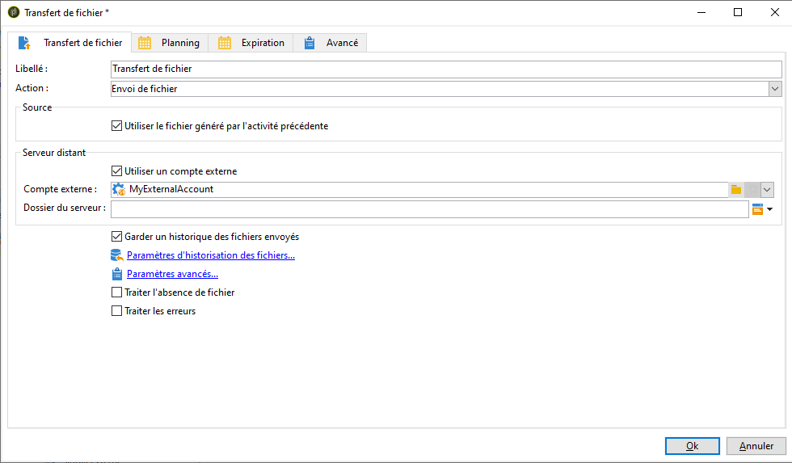
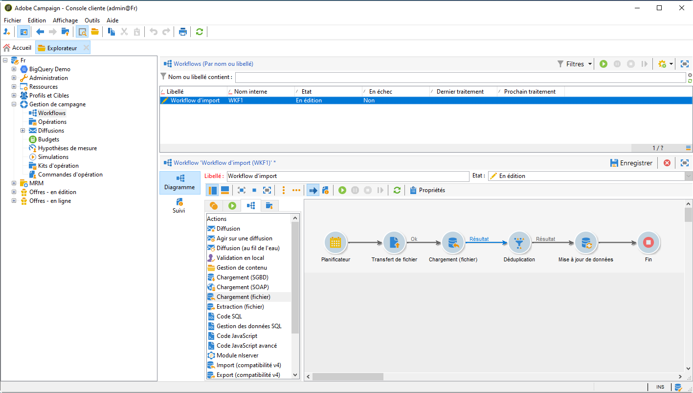

# Ingérer des segments Adobe Experience Platform dans Campaign {#destinations}

Pour ingérer des audiences Adobe Experience Platform dans Campaign et les utiliser dans vos workflows, vous devez d’abord connecter Adobe Campaign en tant que **destination** Adobe Experience Platform et le configurer avec le segment à exporter.

Une fois la destination configurée, les données sont exportées vers votre emplacement de stockage et vous devez créer un workflow dédié dans Campaign Classic pour les ingérer.

## Connecter Adobe Campaign en tant que destination

Dans Adobe Experience Platform, configurez une connexion avec Adobe Campaign en sélectionnant un emplacement d’enregistrement pour les segments exportés. Cette procédure permet également de sélectionner les segments à exporter et de spécifier des champs XDM additionnels à inclure.

Consultez à ce sujet la [documentation sur les destinations](https://experienceleague.adobe.com/docs/experience-platform/destinations/catalog/email-marketing/adobe-campaign.html?lang=fr).

Une fois la destination configurée, Adobe Experience Platform crée un fichier .txt ou .csv délimité par des tabulations à l’emplacement de stockage indiqué. Cette opération est planifiée et exécutée une fois toutes les 24 heures.

Vous pouvez désormais configurer un workflow Campaign Classic pour ingérer le segment dans Campaign.

## Création d&#39;un workflow d&#39;import dans Campaign Classic

Une fois Campaign Classic configuré en tant que destination, vous devez créer un workflow dédié pour importer le fichier qui a été exporté par Adobe Experience Platform.

Pour ce faire, vous devez ajouter et configurer une activité **[!UICONTROL Transfert de fichier]**. Pour plus d’informations sur la configuration de cette activité, consultez la [documentation de Campaign v8](https://experienceleague.adobe.com/fr/docs/campaign/automation/workflows/wf-activities/event-activities/file-transfer.html?lang=fr){target="_blank"}.

Vous pouvez ensuite créer votre workflow en fonction de vos besoins (mettre à jour la base de données à l’aide des données de segment, envoyer des diffusions cross-canal au segment, etc.)

Par exemple, le workflow ci-dessous télécharge quotidiennement le fichier depuis votre emplacement de stockage, puis met à jour la base de données Campaign à l’aide des données de segment.

