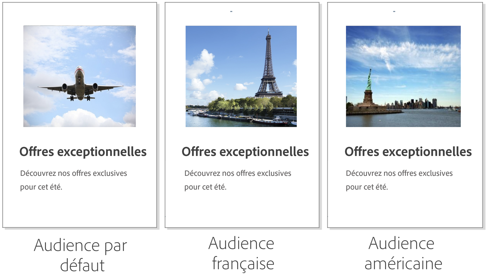
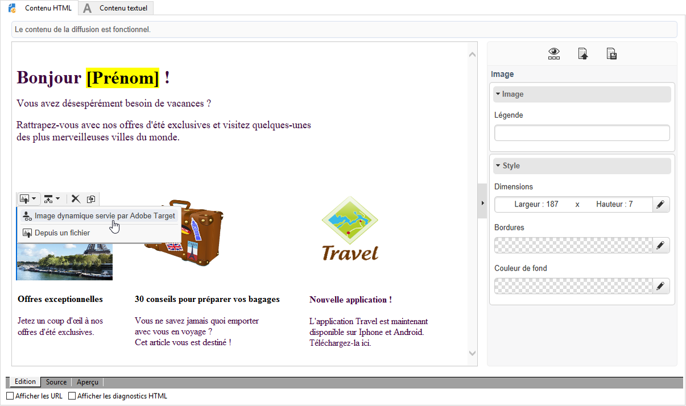
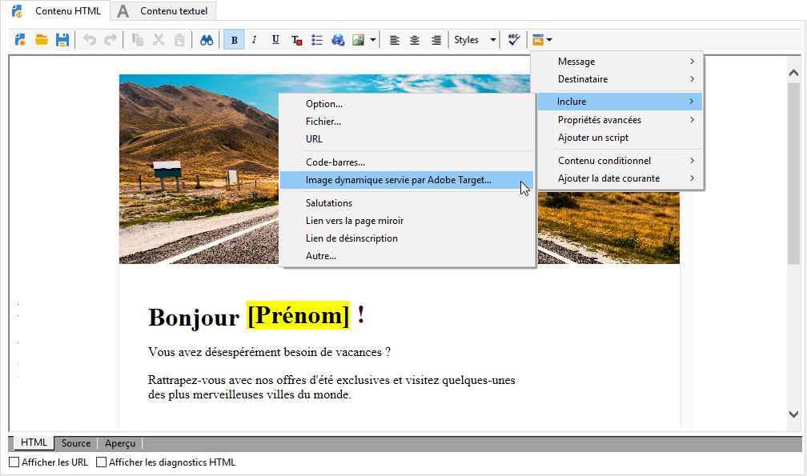
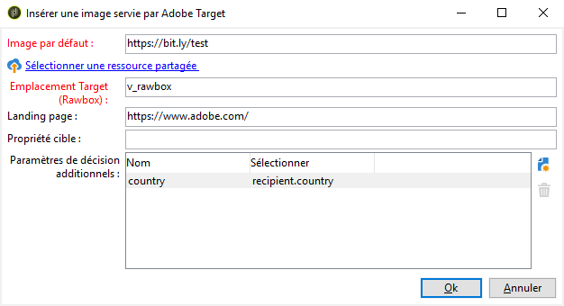
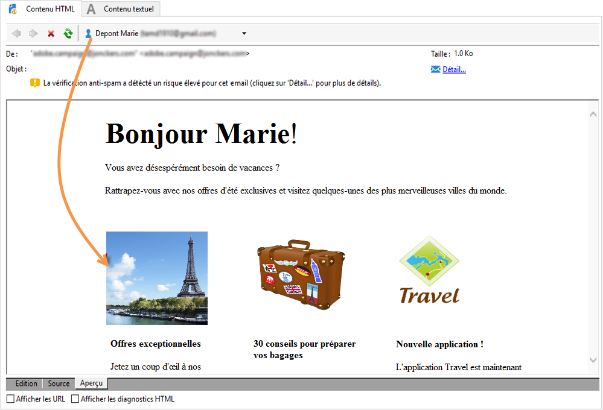

# Insérer du contenu dynamique Target {#inserting-a-dynamic-image}

Dans ce guide, nous allons décrire comment intégrer une offre dynamique provenant de Target dans un email créé préalablement dans Adobe Campaign.

Nous souhaitons créer une diffusion contenant un bloc d&#39;image qui change dynamiquement en fonction du pays du destinataire. Les données sont envoyées avec chaque demande de mbox et dépendent de l’adresse IP du visiteur.

Dans cet e-mail, nous souhaitons que les images changent dynamiquement en fonction des expériences utilisateur suivantes :

* L&#39;e-mail est ouvert en France.
* L&#39;e-mail est ouvert aux États-Unis.
* Si aucune de ces conditions n’est remplie, une image par défaut s’affiche.

Pour ce faire, nous devons suivre les étapes suivantes dans Adobe Campaign et Target :

1. [Insérer l’offre dynamique dans un email](../../integrations/using/inserting-a-dynamic-image.md#inserting-dynamic-offer)
1. [Créer des offres de redirection](../../integrations/using/inserting-a-dynamic-image.md#create-redirect-offers)
1. [Création d&#39;une audience](../../integrations/using/inserting-a-dynamic-image.md#audiences-target)
1. [Créer une activité de ciblage d’expérience](../../integrations/using/inserting-a-dynamic-image.md#creating-targeting-activity)
1. [Prévisualiser et envoyer l’email](../../integrations/using/inserting-a-dynamic-image.md#preview-send-email)

## Insérer l’offre dynamique dans un email {#inserting-dynamic-offer}

Dans Adobe Campaign, une fois que vous avez défini la cible et le contenu de votre email, vous pouvez insérer une image dynamique provenant de Target.

Pour ce faire, spécifiez l’URL de l’image par défaut, le nom de l’emplacement et les champs que vous souhaitez transférer à Target.

Dans Adobe Campaign, vous pouvez insérer une image dynamique de Target dans un email de deux manières différentes :

* Si vous utilisez l&#39;éditeur Digital Content Editor, choisissez une image existante, puis sélectionnez **[!UICONTROL Insérer]** > **[!UICONTROL Image dynamique servie par Adobe Target]** depuis la barre d&#39;outils.

   

* Si vous utilisez l&#39;éditeur standard, placez le curseur à l&#39;endroit où vous souhaitez insérer l&#39;image et sélectionnez **[!UICONTROL Inclure]** > **[!UICONTROL Image dynamique servie par Adobe Target...]** dans le menu déroulant de personnalisation.

   

### Définir les paramètres de l’image {#defining-image-parameters}

* L’**[!UICONTROL URL de l’image par défaut]** : il s’agit de l’image affichée si aucune des conditions n’est remplie. Vous pouvez également sélectionner une image dans votre bibliothèque Assets.
* L’**[!UICONTROL Emplacement Target]** : saisissez le nom de l’emplacement de votre offre dynamique. Vous devrez sélectionner cet emplacement dans votre activité Target.
* La **[!UICONTROL Landing Page]** : si vous souhaitez que l’image par défaut soit redirigée vers une landing page par défaut. Cette adresse URL ne s’applique qu’aux cas où l’image par défaut est affichée dans l’email final et est facultative.
* Les **[!UICONTROL Paramètres de décision additionnels]** : associez les champs définis dans les segments d’Adobe Target et les champs d’Adobe Campaign. Les champs d’Adobe Campaign utilisés doivent avoir été spécifiés au niveau du « rawbox ». Dans notre exemple, nous avons ajouté le champ Pays.

Si vous utilisez les permissions d&#39;Enterprise pour les paramètres d&#39;Adobe Target, ajoutez la propriété correspondante dans ce champ. Pour en savoir plus sur les permissions de Target Enterprise, voir [cette page](https://experienceleague.adobe.com/docs/target/using/administer/manage-users/enterprise/properties-overview.html?lang=fr).

## Créer des offres de redirection {#create-redirect-offers}

Avec Target, vous pouvez créer différentes versions de votre offre. Selon chaque expérience utilisateur, vous pouvez créer une offre de redirection et spécifier l&#39;image qui sera affichée.

Dans notre cas, nous avons besoin de deux offres de redirection, la troisième (celle par défaut) étant définie dans Adobe Campaign.

1. Pour créer une offre de redirection dans Target Standard, cliquez sur **[!UICONTROL Offres (code)]** dans l&#39;onglet **[!UICONTROL Contenu]**.

1. Cliquez sur **[!UICONTROL Créer]**, puis sur **[!UICONTROL Offre de redirection]**.

   

1. Saisissez le nom de votre offre et l&#39;URL de votre image.

   

1. Suivez la même procédure pour l&#39;offre de redirection restante. Voir à ce propos [cette page](https://experienceleague.adobe.com/docs/target/using/experiences/offers/offer-redirect.html?lang=fr).

## Création d&#39;une audience {#audiences-target}

Avec Target, vous devez créer les deux audiences dans lesquelles les visiteurs de votre offre seront classés selon les différents contenus à diffuser. Pour chaque audience, ajoutez une règle pour définir qui pourra visualiser l’offre.

1. Pour créer une audience avec Target, dans l&#39;onglet **[!UICONTROL Audiences]**, cliquez sur **[!UICONTROL Créer une audience]**.

   

1. Ajoutez un nom à l&#39;audience.

   

1. Cliquez sur **[!UICONTROL Ajouter une règle]** et sélectionnez une catégorie. La règle utilise des critères spécifiques pour cibler les visiteurs. Vous pouvez affiner les règles en ajoutant des conditions ou en créant des règles dans d&#39;autres catégories.

1. Suivez la même procédure pour les audiences restantes.

## Créer une activité de ciblage d’expérience {#creating-targeting-activity}

Dans Target, nous devons créer une activité de ciblage d’expérience, définir les différentes expériences et les associer aux offres correspondantes.

### Définir l’audience {#defining-the-audience}

1. Pour créer une activité de ciblage d&#39;expérience, dans l&#39;onglet **[!UICONTROL Activités]**, cliquez sur **[!UICONTROL Créer une activité]**, puis sur **[!UICONTROL Ciblage d&#39;expérience]**.

   

1. Sélectionnez **[!UICONTROL Formulaire]** comme **[!UICONTROL compositeur d&#39;expérience]**.

1. Choisissez une audience en cliquant sur le bouton **[!UICONTROL Changer l&#39;audience]**.

   

1. Sélectionnez l&#39;audience créée aux étapes précédentes.

   

1. Créez une autre expérience en cliquant sur **[!UICONTROL Ajouter le ciblage d&#39;expérience]**.

### Définir l’emplacement et le contenu {#defining-location-content}

Ajoutez un contenu pour chaque audience :

1. Sélectionnez le nom de l’emplacement choisi lors de l’insertion de l’offre dynamique dans Adobe Campaign.

   

1. Cliquez sur le bouton de liste déroulante et sélectionnez **[!UICONTROL Modifier l&#39;offre de redirection]**.

   

1. Sélectionnez l&#39;offre de redirection précédemment créée.

   

1. Suivez la même procédure pour la deuxième expérience.

### Définir l’activité {#defining-activity}

La fenêtre **[!UICONTROL Target]** résume votre activité. Au besoin, vous pouvez ajouter d&#39;autres expériences.

La fenêtre **[!UICONTROL Objectif et paramètres]** permet de personnaliser votre activité en définissant une priorité, un objectif ou une durée.

La section **[!UICONTROL Paramètres de création de rapports]** permet de sélectionner une action et d&#39;éditer les paramètres qui déterminent à quel moment votre objectif est atteint.

## Prévisualiser et envoyer l’email dans Campaign Classic {#preview-send-email}

Dans Adobe Campaign, vous pouvez désormais prévisualiser votre e-mail et en tester le rendu pour différents destinataires. Vous pouvez constater que l&#39;image change selon les différentes expériences créées. Pour en savoir plus sur la création d’un email, consultez cette [page](../../delivery/using/defining-the-email-content.md).

Votre email comprenant une offre dynamique provenant de Target peut maintenant être envoyé.

