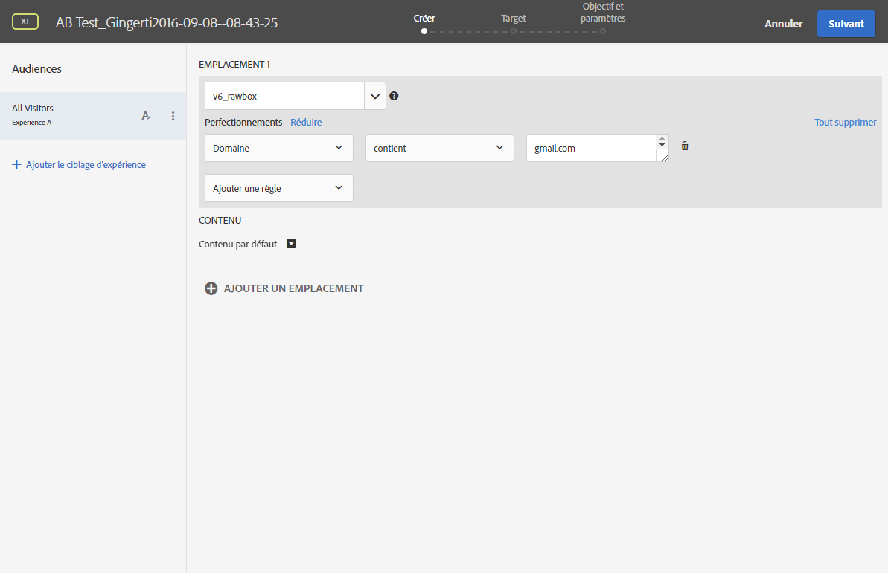

# Insérer une image dynamique{#inserting-a-dynamic-image}

Cette section décrit les étapes à mener dans Adobe Campaign afin d&#39;intégrer une image provenant d&#39;Adobe Target dans un email.

Vous devez au préalable réaliser les actions suivantes dans Adobe Target :

* créer une ou plusieurs [offres de redirection](https://docs.adobe.com/help/en/target/using/experiences/offers/offer-redirect.html), dans lesquelles vous devez spécifier l&#39;URL de l&#39;image que vous souhaitez utiliser.
* créer une ou plusieurs [audiences](https://marketing.adobe.com/resources/help/en_US/target/target/t_create-audience.html), afin de définir la cible de votre activité.
* créer une activité de type [compositeur d&#39;expérience d&#39;après les formulaires](https://docs.adobe.com/content/help/en/target/using/activities/abtest/create/test-create-ab.html), dans laquelle vous devez sélectionner un &quot;rawbox&quot; et définir plusieurs expériences, en fonction du nombre d&#39;offres de redirection créées. Pour chaque expérience, vous devez sélectionner une des offres de redirection créées.

   Pour définir ces expériences, vous pouvez créer des segments utilisant des informations provenant d&#39;Adobe Campaign. Si vous souhaitez utiliser des données issues d&#39;Adobe Campaign dans les règles de sélection de l&#39;offre, vous devez les spécifier au niveau du &quot;rawbox&quot; dans Adobe Target.

Pour insérer une image Adobe Target dans une diffusion Adobe Campaign :

1. Créez une diffusion email.
1. Dans les champs de personnalisation disponibles, sélectionnez **[!UICONTROL Inclure > Image dynamique servie par Adobe Target]**.

   

1. Dans la fenêtre qui s&#39;ouvre, sélectionnez l&#39;image qui s&#39;affichera par défaut dans l&#39;email. Vous pouvez indiquer l&#39;URL de l&#39;image ou utiliser une [image partagée](../../integrations/using/sharing-assets-with-adobe-experience-cloud.md).
1. Saisissez le nom du &quot;rawbox&quot; défini dans Adobe Target.
1. Saisissez une URL dans le champ **[!UICONTROL Landing Page]** si vous souhaitez que l&#39;image par défaut effectue une redirection vers une landing page par défaut. Cette URL n&#39;est nécessaire que dans les cas où l&#39;image par défaut est affichée dans l&#39;email final et est facultative.
1. Si vous utilisez les autorisations d&#39;Enterprise permissions dans vos paramètres d&#39;Adobe Target, ajoutez la propriété correspondante dans ce champ. Vous trouverez des informations supplémentaires sur les autorisations d&#39;Enterprise dans [cette page](https://marketing.adobe.com/resources/help/en_US/target/target/properties-overview.html). Ce champ est facultatif. Il n&#39;est pas obligatoire si vous n&#39;utilisez pas les autorisations d&#39;Enterprise dans Target.
1. Dans **[!UICONTROL Paramètres de décision additionnels]**, associez les champs définis dans les segments Adobe Target et les champs d&#39;Adobe Campaign. Les champs d&#39;Adobe Campaign utilisés doivent avoir été spécifiés au niveau du &quot;rawbox&quot;. 

   

   La définition du paramètre dans Adobe Target est réalisée via les rawbox crées lors de l&#39;intégration de l&#39;image Target dans Adobe Campaign et l&#39;option **Refinements**.

   

   L&#39;exemple ici illustré indique comment définir différentes expériences pour les hommes et les femmes.

Vous pouvez également, par exemple, définir plusieurs cas en fonction du domaine de l&#39;adresse email de l&#39;utilisateur. Les données sont récupérées automatiquement à partir du navigateur de l&#39;utilisateur qui ouvre l&#39;email.

Lors de la prévisualisation de votre email, vous pouvez voir en sélectionnant différents profils que l&#39;image insérée change en fonction des paramètres définis dans l&#39;activité Adobe Target et dans Adobe Campaign.

Vous pouvez mesurer les résultats de vos envois dans Adobe Target.

