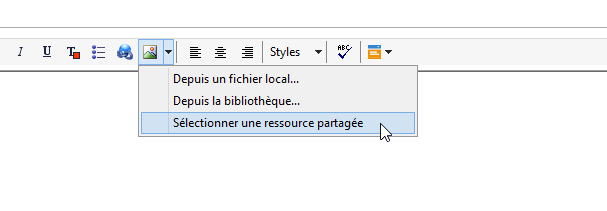
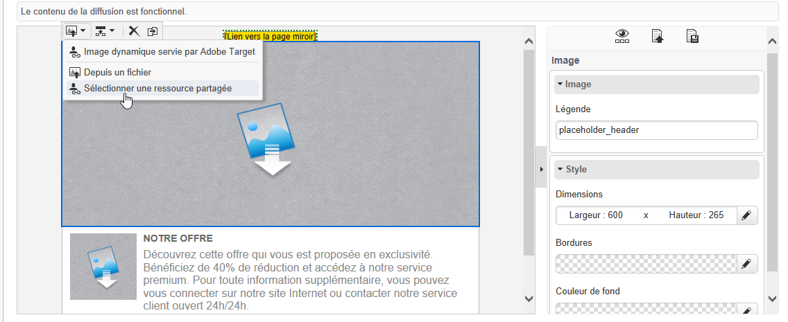
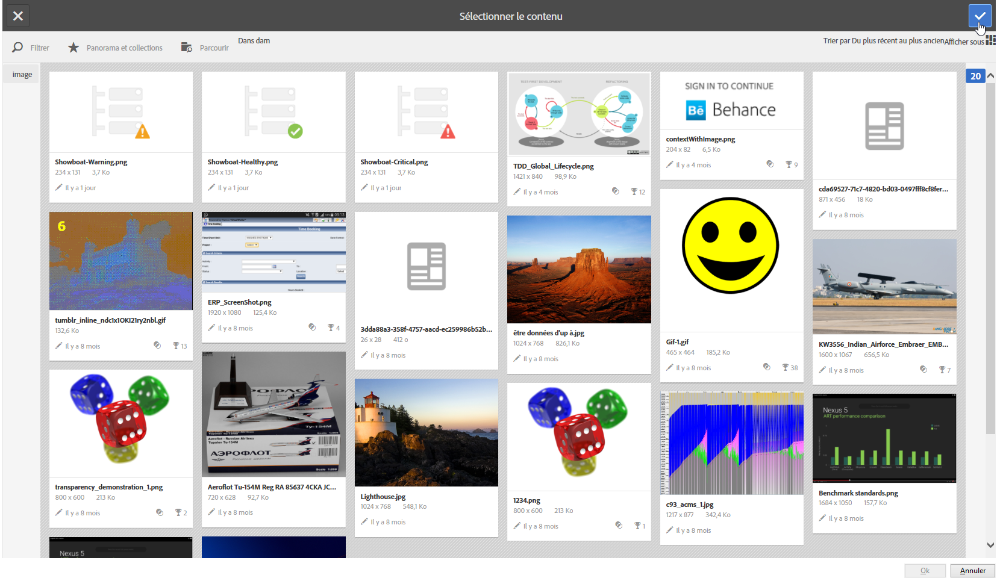

# Insérer une ressource partagée{#inserting-a-shared-asset}

Les ressources partagées depuis Adobe Experience Cloud peuvent être utilisées dans vos emails et landing pages de la manière suivante :

1. Créez un email ou une landing page.

   Si vous utilisez des ressources provenant de la bibliothèque de ressources Adobe Experience Manager, utilisez un modèle de diffusion créé lors de la [configuration de l&#39;intégration](../../integrations/using/configuring-access-to-assets.md#integrating-with-aem-assets).

   Si vous ne disposez pas de modèle spécifique, assurez-vous que dans les **Propriétés** de la diffusion, le **[!UICONTROL Mode d&#39;édition du contenu]** (onglet **[!UICONTROL Avancé]**) est bien paramétré sur **DCE** et que le compte externe de type AEM que vous souhaitez utiliser pour accéder à votre bibliothèque de ressources AEM Assets est bien renseigné.

1. Dans la fenêtre d&#39;édition, sélectionnez l&#39;option d&#39;insertion d&#39;une image :

   * si vous utilisez le [mode d&#39;édition standard](../../delivery/using/defining-the-email-content.md#adding-images), sélectionnez **[!UICONTROL Image]** > **[!UICONTROL Sélectionner une ressource partagée]**.

      

   * si vous utilisez le [mode d&#39;édition avancé](../../web/using/about-campaign-html-editor.md) (DCE), placez-vous sur un bloc de type image, puis via le menu contextuel, sélectionnez **[!UICONTROL Sélectionner une ressource partagée]**.

      

      >[!NOTE]
      >
      >Vous ne pouvez pas insérer d&#39;images partagées depuis Adobe Campaign dans l&#39;[accès web](../../platform/using/adobe-campaign-workspace.md#console-and-web-access) si vous utilisez le DCE.

1. Dans la fenêtre de sélection qui s&#39;ouvre, sélectionnez une image, puis validez.

   Les images disponibles proviennent de votre bibliothèque Adobe Experience Cloud ou de votre bibliothèque AEM Assets, selon la configuration de votre instance Adobe Campaign. Reportez-vous à la section [Configuration de l’accès aux ressources](../../integrations/using/configuring-access-to-assets.md) .

   

>[!NOTE]
>
>Si vous utilisez l&#39;intégration avec Adobe Target, vous pouvez utiliser une image partagée comme image par défaut. Consultez [cette page](../../integrations/using/integrating-with-adobe-target.md).

