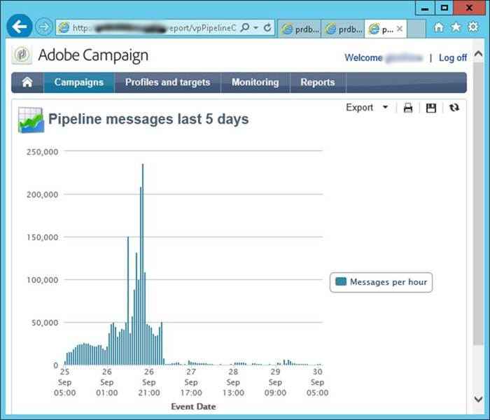

# Surveillance du pipeline {#pipeline-monitoring}

Le service web de statut [!DNL pipelined] fournit des informations sur le statut du processus [!DNL pipelined].

Il est accessible manuellement à l’aide d’un navigateur ou automatiquement à l’aide d’une application de surveillance.

Il est au format REST, qui est décrit ci-dessous.

## Indicators {#indicators}

Cette section répertorie les indicateurs dans le service web de statut.

Les indicateurs recommandés pour la surveillance sont mis en surbrillance.

* Consumer : nom du client qui active les déclencheurs. Configuré dans l’option de pipeline.
* http-request
   * last-alive-ms-ago : laps de temps en ms depuis qu’une vérification de connexion a été effectuée.
   * last-failed-cnx-ms-ago : laps de temps en ms depuis le dernier échec de la vérification de connexion.
   * pipeline-host : nom de l’hôte à partir duquel les données du pipeline sont extraites.
* pointeur
   * current-offsets : valeur du pointeur dans le pipeline, par thread enfant.
   * last-flush-ms-ago : laps de temps en ms depuis la récupération d’un lot de déclencheurs.
   * next-offsets-flush : délai d’attente jusqu’au lot suivant, une fois le lot actuel terminé.
   * processed-since-last-flush : nombre de déclencheurs traités dans le dernier lot.
* routage
   * triggers : liste des déclencheurs récupérés. Configuré dans l’option [!DNL pipelined].
* stats
   * average-pointer-flush-time-ms : temps de traitement moyen pour un lot de déclencheurs.
   * average-trigger-processing-time-ms : temps moyen passé à analyser les données des déclencheurs.
   * bytes-read : nombre d’octets lus à partir de la file d’attente depuis le démarrage du processus.
   * current-messages : nombre actuel de messages en attente extraits de la file d’attente et en attente de traitement. **Cet indicateur doit être proche de zéro**.
   * current-retries : nombre actuel de messages dont le traitement a échoué et qui attendent une reprise.
   * peak-messages : nombre maximal de messages en attente traités par le processus depuis le démarrage de celui-ci.
   * pointer-flushes : nombre de lots de messages traités depuis le début.
   * routing-JS-custom : nombre de messages qui ont été traités par le JS personnalisé.
   * trigger-discarded : nombre de messages qui ont été ignorés après un trop grand nombre de reprises en raison d’erreurs de traitement.
   * trigger-processed : nombre de messages qui ont été traités sans erreur.
   * trigger-received : nombre de messages reçus de la file d’attente.

Ces statistiques sont affichées par thread de traitement.

* average-trigger-processing-time-ms : temps moyen passé à analyser les données des déclencheurs.
* is-JS-processor : valeur « 1 » si ce thread utilise le JS personnalisé.
* trigger-discarded : nombre de messages qui ont été ignorés après un trop grand nombre de reprises en raison d’erreurs de traitement. **Cet indicateur doit être nul**.
* trigger-failure : nombre d’erreurs de traitement dans le JS. **Cet indicateur doit être nul**.
* trigger-received : nombre de messages reçus de la file d&#39;attente.

* Paramètres : ils sont définis dans les fichiers de configuration.
   * flush-pointer-msg-count : nombre de messages dans un lot.
   * flush-pointer-period-ms : laps de temps entre deux lots, en millisecondes.
   * processing-threads-JS : nombre de threads de traitement exécutant le JS personnalisé.
   * retry-period-ms : laps de temps entre deux reprises lorsqu’une erreur de traitement se produit.
   * retry-valid-duration-ms : durée à partir du moment où le traitement est relancé et jusqu’à ce que le message soit ignoré.
   * Rapport des messages de pipeline

## Rapport des messages de pipeline {#pipeline-report}

Ce rapport affiche le nombre de messages par heure au cours des cinq derniers jours.

