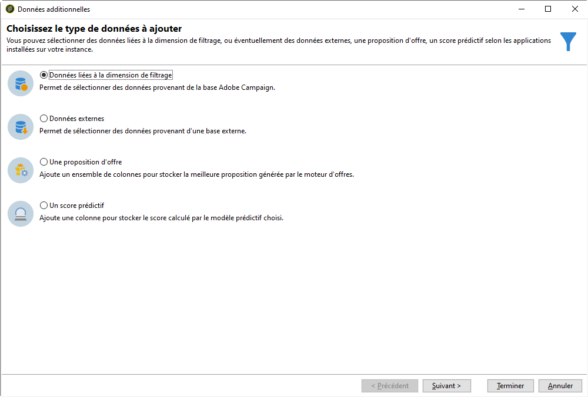

# Synchronisation des audiences{#synchronizing-audiences}

Vous pouvez créer une liste complexe à l&#39;aide des fonctionnalités avancées de Campaign v7 et la partager de façon transparente en tant qu&#39;audience directement et en temps réel avec Campaign Standard (y compris, les données additionnelles). L&#39;utilisateur d&#39;Adobe Campaign peut ensuite utiliser l&#39;audience dans Adobe Campaign Standard.

Un ciblage complexe impliquant des données additionnelles qui ne sont pas répliquées dans Campaign Standard n&#39;est possible qu&#39;avec Campaign v7.

Vous pouvez également simplement partager des listes de destinataires ou de données provenant d&#39;un connecteur tel que Microsoft Dynamics avec Campaign Standard.

Ce cas pratique montre comment préparer la cible de votre diffusion dans Campaign v7 et la réutiliser avec ses données additionnelles dans une diffusion créée et envoyée dans Adobe Campaign Standard.

>[!NOTE]
>
>Vous pouvez également enrichir les données à l&#39;aide d&#39;agrégats et de collections dans Adobe Campaign Standard si toutes les données dont vous avez besoin sont déjà répliquées.

## Conditions préalables requises {#prerequisites}

Pour ce faire, les éléments suivants sont nécessaires :

* Des destinataires stockés dans la base de données de Campaign v7 et synchronisés avec Campaign Standard. Pour plus d&#39;informations, consultez la section [Synchronisation des profils](../../integrations/using/synchronizing-profiles.md).
* Des données additionnelles telles que des abonnements ou des transactions stockées dans des tables associées à nms:recipients dans la base de données de Campaign v7. Ces données peuvent provenir de tables personnalisées ou de schémas d&#39;usine de Campaign v7. Par défaut, ces données ne sont pas accessibles dans Campaign Standard, car elles ne sont pas synchronisées.
* Droits d&#39;exécution de workflows dans Campaign v7 et Campaign Standard.
* Droits de création et d&#39;exécution d&#39;une diffusion dans Campaign Standard.

## Créer un workflow de ciblage avec des données additionnelles dans Campaign v7 {#create-a-targeting-workflow-with-additional-data-in-campaign-v7}

Un ciblage complexe impliquant des données additionnelles qui ne sont pas répliquées dans Campaign Standard n&#39;est possible qu&#39;avec Campaign v7.

Une fois que la cible et ses données additionnelles ont été définies, il est possible d&#39;enregistrer la cible en tant que liste pouvant être partagée avec Campaign Standard.

>[!NOTE]
>
>Il s&#39;agit d&#39;un exemple. En fonction de vos besoins, vous pouvez simplement lancer des requêtes sur une liste de destinataires et la partager avec ACS sans appliquer d&#39;autres traitements. Vous pouvez également utiliser d&#39;autres activités de gestion des données pour préparer la cible finale.

Pour obtenir l&#39;audience finale et ses données additionnelles :

1. Créez un nouveau workflow depuis **[!UICONTROL Profils et Cibles]** > **[!UICONTROL Traitements]** > **[!UICONTROL Workflows de ciblage]**.
1. Ajoutez une activité **[!UICONTROL Requête]** et sélectionnez les destinataires auxquels vous souhaitez envoyer l&#39;email final, tels que par exemple, tous les destinataires ayant entre 18 et 30 ans et habitant en France.

   

1. Ajoutez des données additionnelles issues de la requête. Pour plus d&#39;informations, reportez-vous à la section [Ajouter des données](../../workflow/using/query.md#adding-data).

   Cet exemple montre comment ajouter un agrégat pour comptabiliser le nombre de diffusions reçues par un destinataires au cours d&#39;une année.

   Dans la **[!UICONTROL Requête]**, sélectionnez **[!UICONTROL Ajouter des données...]**.

   

1. Sélectionnez **[!UICONTROL Données liées à la dimension de filtrage]**, puis cliquez sur **[!UICONTROL Suivant]**.

   

1. Sélectionnez **[!UICONTROL Données liées à la dimension de filtrage]**, puis le nœud **[!UICONTROL Logs de diffusion du destinataire]**. Cliquez ensuite sur **[!UICONTROL Suivant]**.

   

1. Dans le champ **[!UICONTROL Données collectées]**, sélectionnez **[!UICONTROL Agrégats]**, puis cliquez sur **[!UICONTROL Suivant]**.

   

1. Ajoutez une condition de filtrage pour ne prendre en compte que les logs créés au cours des derniers 365 jours, puis cliquez sur **[!UICONTROL Suivant]**.

   

1. Définissez les colonnes de sortie. Dans le cas présent, seule la colonne permettant de compter le nombre de diffusions est nécessaire. Pour la définir :

   * Sélectionnez **[!UICONTROL Ajouter]** à droite de la fenêtre.
   * Dans la fenêtre **[!UICONTROL Sélection du champ]**, cliquez sur **[!UICONTROL Sélection avancée]**.
   * Sélectionnez **[!UICONTROL Agrégat]**, puis **[!UICONTROL Comptage]**. Cochez l&#39;option **[!UICONTROL Distinct]**, puis cliquez sur **[!UICONTROL Suivant]**.
   * Dans la liste des champs, sélectionnez le champ utilisé pour la fonction de **Comptage**. Choisissez un champ qui sera toujours renseigné, par exemple le champ **[!UICONTROL Clé primaire]**, puis cliquez sur **[!UICONTROL Terminer]**.
   * Changez l&#39;expression dans la colonne **[!UICONTROL Alias]**. Cet alias, par exemple **NBdeliveries**, permettra de récupérer facilement la colonne ajoutée à la diffusion finale.
   * Cliquez sur **[!UICONTROL Terminer]** et enregistrez la configuration de l&#39;activité **[!UICONTROL Requête]**.

   

1. Enregistrez le workflow. La section suivante montre comment partager la population avec ACS.

## Partager la cible avec Campaign Standard {#share-the-target-with-campaign-standard}

Une fois que la population cible est définie, vous pouvez la partager avec ACS par le biais d&#39;une activité **[!UICONTROL Mise à jour de liste]**.

1. Dans le workflow précédemment créé, ajoutez une activité **[!UICONTROL Mise à jour de liste]** et spécifiez la liste que vous souhaitez mettre à jour ou créer.

   Indiquez le dossier dans lequel vous souhaitez enregistrer la liste dans Campaign v7. Les listes sont soumises au mappage de dossiers défini lors de la mise en œuvre, ce qui peut avoir un impact sur leur visibilité une fois qu’elles sont partagées dans Campaign Standard. Pour plus d&#39;informations, consultez la section [Conversion des droits](../../integrations/using/acs-connector-principles-and-data-cycle.md#rights-conversion).

1. Vérifiez que l&#39;option **[!UICONTROL Partager avec ACS]** est cochée. Elle l&#39;est par défaut.

   

1. Enregistrez et exécutez le workflow.

   La cible et ses données additionnelles sont enregistrées dans une liste, dans Campaign v7, et sont immédiatement partagées en tant qu&#39;audience de type liste dans Campaign Standard. Seuls les profils qui ont été répliqués sont partagés avec ACS.

Si une erreur se produit dans l&#39;activité **[!UICONTROL Mise à jour de liste]**, cela signifie que la synchronisation avec Campaign Standard n&#39;a peut-être pas été effectuée correctement. Pour déterminer ce qui s&#39;est passé, accédez à **[!UICONTROL Administration]** > **[!UICONTROL ACS Connector]** > **[!UICONTROL Traitement]** > **[!UICONTROL Diagnostic]**. Ce dossier contient les workflows de synchronisation déclenchés par l&#39;exécution de l&#39;activité **[!UICONTROL Mise à jour de liste]**. Pour plus d&#39;informations, consultez la section [Résolution des problèmes liés à ACS Connector](../../integrations/using/troubleshooting-the-acs-connector.md).

## Récupérer les données dans Campaign Standard et les utiliser dans une diffusion {#retrieve-the-data-in-campaign-standard-and-use-it-in-a-delivery}

Une fois que le workflow de ciblage a été exécuté dans Campaign v7, l&#39;audience de type liste est accessible en lecture seule dans le menu **[!UICONTROL Audiences]** de Campaign Standard.

En créant un workflow de diffusion dans Campaign Standard, vous pourrez ensuite utiliser cette audience et ses données additionnelles dans une diffusion.

1. Créez un nouveau workflow depuis le menu **[!UICONTROL Activités marketing]**.
1. Ajoutez une activité **[!UICONTROL Lecture audience]** et sélectionnez l&#39;audience que vous avez précédemment partagée depuis Campaign v7.

   Cette activité sert à récupérer les données de l&#39;audience sélectionnée. Si besoin, vous pouvez également appliquer un autre **[!UICONTROL Filtrage de la source]** à l&#39;aide de l&#39;onglet adéquat de cette activité.

1. Ajoutez une activité **[!UICONTROL Diffusion Email]** et configurez-la comme n&#39;importe quelle autre [activité de diffusion email](https://experienceleague.adobe.com/docs/campaign-standard/using/managing-processes-and-data/channel-activities/email-delivery.html?lang=fr).
1. Ouvrez le contenu de la diffusion.
1. Ajoutez un champ de personnalisation. Dans la fenêtre contextuelle, recherchez le nœud **[!UICONTROL Données additionnelles (targetData)]**. Ce nœud contient les données additionnelles de l&#39;audience qui ont été calculées dans le workflow de ciblage initial. Vous pouvez les utiliser comme tout autre champ de personnalisation.

   Dans cet exemple, les données additionnelles provenant du workflow de ciblage d&#39;origine sont le nombre de diffusions envoyées à chaque destinataire au cours des 365 dernier jours. L&#39;alias NBdeliveries spécifié dans le workflow de ciblage est visible ici.

   

1. Enregistrez la diffusion et le workflow.

   Le workflow est prêt à être exécuté. La diffusion sera analysée et prête à être envoyée.

   

## Envoyer et suivre votre diffusion {#send-and-monitor-your-delivery}

Lorsque la diffusion et son contenu sont prêts, envoyez la diffusion :

1. Exécutez le workflow de diffusion. Cette étape prépare l&#39;envoi de l&#39;email.
1. Dans le tableau de bord de la diffusion, validez manuellement l&#39;envoi de la diffusion.
1. Examinez les rapports et les logs de la diffusion :

   * **Dans Campaign Standard** : accédez aux [rapports](https://experienceleague.adobe.com/docs/campaign-standard/using/reporting/about-reporting/about-dynamic-reports.html?lang=fr) et [logs](https://experienceleague.adobe.com/docs/campaign-standard/using/testing-and-sending/monitoring-messages/monitoring-a-delivery.html?lang=fr) relatifs à la diffusion comme pour toute autre diffusion.
   * **Dans Campaign v7 et Campaign Standard** : les identifiants des diffusions, les broadLogs et les logs de tracking des emails sont synchronisés dans Campaign v7. Vous obtenez alors une vue à 360° de vos campagnes marketing depuis Campaign v7.

     Les quarantaines sont automatiquement synchronisées avec Campaign v7. Ainsi, les informations de non-délivrabilité peuvent être prises en compte pour le prochain ciblage effectué dans Campaign v7.

     Pour plus d&#39;informations sur la gestion des quarantaines dans Campaign Standard, reportez-vous à [cette section](https://experienceleague.adobe.com/docs/campaign-standard/using/testing-and-sending/monitoring-messages/understanding-quarantine-management.html?lang=fr).
