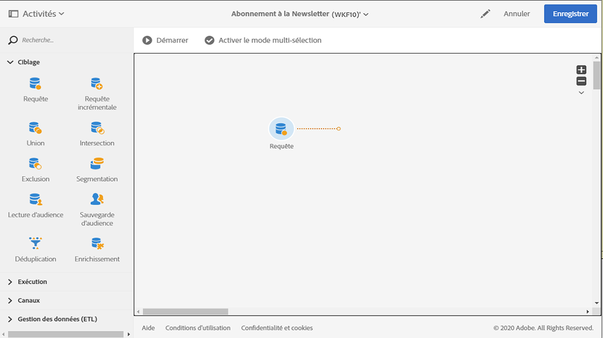
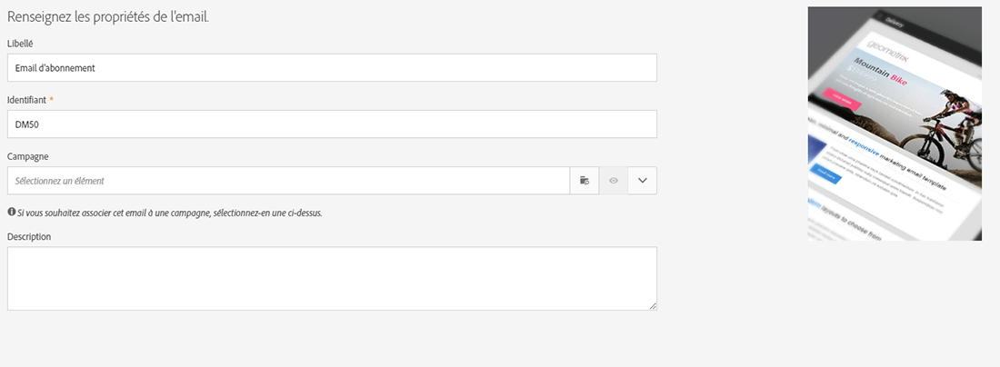
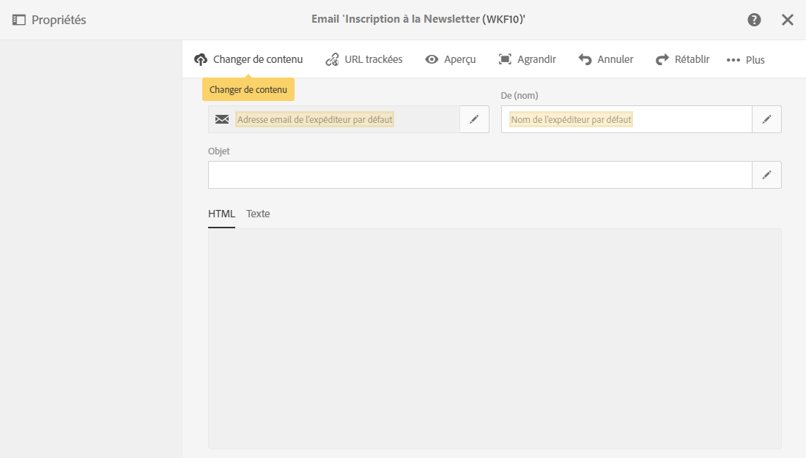

# Synchronisation des profils{#synchronizing-profiles}

ACS Connector réplique les données de Campaign v7 vers Campaign Standard. Le données reçues de Campaign v7 peuvent être utilisées pour créer des diffusions dans Campaign Standard. Les opérations ci-dessous vous permettent de voir la manière dont les profils sont synchronisés.

* **Ajouter de nouveaux destinataires** : créez un nouveau destinataire dans Campaign v7 et vérifiez qu&#39;un profil correspondant a été répliqué vers Campaign Standard. Consultez la section [Création d’un nouveau destinataire](#creating-a-new-recipient).
* **Mise à jour des destinataires** : modifiez un nouveau destinataire dans Campaign v7 et visualisez le profil correspondant dans Campaign Standard pour vérifier que la mise à jour a été répliquée. Consultez la section [Modification d’un destinataire](#editing-a-recipient).
* **Création dʼun workflow dans Campaign Standard** : créez un workflow dans Campaign Standard qui comprend une requête avec une audience ou des profils répliqués depuis Campaign v7. Consultez la section [Création dʼun workflow](#creating-a-workflow).
* **Création dʼune diffusion dans Campaign Standard** : exécutez le workflow jusquʼà la fin pour envoyer une diffusion. Consultez la section [Création d’une diffusion](#creating-a-delivery).
* **Vérification du lien de désinscription** : utilisez une application web de Campaign v7 pour vous assurer que le choix du destinataire de se désinscrire dʼun service est envoyé à la base de données de Campaign v7. Lʼoption permettant dʼinterrompre le service est répliquée vers Campaign Standard. Consultez la section [Modification du lien de désinscription](#changing-the-unsubscription-link).

## Conditions préalables requises {#prerequisites}

Les sections ci-après décrivent la manière dont ACS Connector permet d&#39;ajouter et d&#39;éditer des destinataires dans Campaign v7 et de les utiliser ensuite dans une diffusion Campaign Standard. ACS Connector requiert les éléments suivants :

* des destinataires dans Campaign v7 répliqués vers Campaign Standard,
* les droits utilisateurs pour exécuter des workflows dans Campaign v7 et Campaign Standard,
* les droits utilisateurs pour créer et exécuter une diffusion dans Campaign Standard.

## Modification du lien de désinscription {#changing-the-unsubscription-link}

Lorsqu&#39;un destinataire clique sur le lien de désinscription dans un email envoyé par Campaign Standard, le profil correspondant dans Campaign Standard est mis à jour. Pour s&#39;assurer qu&#39;un profil répliqué comprend le choix d&#39;un utilisateur de se désinscrire d&#39;un service, l&#39;information doit être envoyée à Campaign v7 plutôt qu&#39;à Campaign Standard. Pour appliquer la modification, le service de désinscription est associé à une application web de Campaign v7 plutôt qu&#39;à Campaign Standard.

>[!NOTE]
>
>Avant de suivre la procédure ci-dessous, demandez à votre consultant de configurer l&#39;application web pour le service de désinscription.

## Création dʼun destinataire {#creating-a-new-recipient}

1. Créez un destinataire dans Campaign v7 pour la réplication vers Campaign Standard. Renseignez autant d’informations que possible, y compris le nom de famille, le prénom, l’adresse e-mail et l’adresse postale du destinataire. Toutefois, ne choisissez pas une **[!UICONTROL Civilité]**, car elle sera ajoutée à la section suivante, [Modification d’un destinataire](#editing-a-recipient). Pour plus dʼinformations, consultez la section [Ajout de destinataires](../../platform/using/adding-profiles.md).

   

1. Vérifiez que le nouveau destinataire a été ajouté dans Campaign Standard. Lors de la vérification du profil, assurez-vous que les données saisies dans Campaign v7 sont également disponibles dans Campaign Standard. Pour savoir où trouver les profils dans Campaign Standard, reportez-vous à la section [Principes de navigation](https://experienceleague.adobe.com/docs/campaign-standard/using/getting-started/discovering-the-interface/interface-description.html?lang=fr).

   

   Par défaut, la réplication périodique d&#39;ACS Connector a lieu toutes les 15 minutes. Pour plus d’informations, voir [Réplication des données](../../integrations/using/acs-connector-principles-and-data-cycle.md#data-replication).

## Modification dʼun destinataire {#editing-a-recipient}

Les étapes ci-dessous qui permettent de modifier un point unique de données constituent un exemple simple de la façon dont Campaign v7 devient la base de données principale de Campaign Standard lors de l’utilisation de la réplication de données. La modification ou la suppression de données répliquées dans Campaign v7 a le même effet sur les données correspondantes dans Campaign Standard.

1. Sélectionnez le destinataire nouvellement créé à lʼétape précédente, [Création d’un destinataire](#creating-a-new-recipient) et modifiez son nom. Par exemple, choisissez une **[!UICONTROL Civilité]** pour le destinataire (par ex. M. ou Mme). Pour plus dʼinformations, consultez la section [Modification dʼun profil](../../platform/using/editing-a-profile.md).

   

1. Vérifiez que le nom du destinataire a été mis à jour dans Campaign Standard. Pour savoir où trouver les profils dans Campaign Standard, reportez-vous à la section [Principes de navigation](https://experienceleague.adobe.com/docs/campaign-standard/using/getting-started/discovering-the-interface/interface-description.html?lang=fr).

   

   Par défaut, la réplication périodique d&#39;ACS Connector a lieu toutes les 15 minutes. Pour plus d’informations, voir [Réplication des données](../../integrations/using/acs-connector-principles-and-data-cycle.md#data-replication).

## Création dʼun workflow {#creating-a-workflow}

Les profils et services répliqués depuis Campaign v7 permettent aux spécialistes du marketing digital d&#39;exploiter les données complètes dans Campaign Standard. Les instructions ci-dessous montrent comment ajouter une requête à un workflow de Campaign Standard et comment l&#39;utiliser ensuite avec la base de données répliquée.

Pour plus d&#39;informations et des instructions complètes relatives aux workflows Campaign Standard, reportez-vous à la section [Workflows](../../workflow/using/about-workflows.md).

1. Allez dans Campaign Standard et cliquez sur **[!UICONTROL Activités marketing]**.
1. Cliquez sur **[!UICONTROL Créer]** en haut à droite.
1. Cliquez sur **[!UICONTROL Workflow]**.
1. Cliquez sur **[!UICONTROL Nouveau workflow]**, puis sur **[!UICONTROL Suivant]**.
1. Saisissez un nom pour le workflow dans le champ **[!UICONTROL Libellé]** et d&#39;autres informations si nécessaire. Cliquez ensuite sur **[!UICONTROL Suivant]**.
1. Depuis **[!UICONTROL Ciblage]** à gauche, déplacez une activité **[!UICONTROL Requête]** vers l&#39;espace de travail.

   

1. Double-cliquez sur l&#39;activité **[!UICONTROL Requête]** et sélectionnez un paramètre pouvant être utilisé avec la base de données répliquée. Vous pouvez par exemple :

   * Placer **[!UICONTROL Profils]** dans l&#39;espace de travail. Utilisez le menu déroulant du champ pour sélectionner .**[!UICONTROL Est une ressource externe]** afin de trouver les profils qui ont été répliqués depuis Campaign v7.
   * Placer d&#39;autres paramètres de requête pour cibler davantage les profils répliqués.

## Création dʼune diffusion {#creating-a-delivery}

>[!NOTE]
>
>Les instructions pour créer la diffusion sʼappliquent au workflow commencé à la section [Création dʼun workflow](#creating-a-workflow).

Les spécialistes du marketing digital peuvent utiliser une application web de Campaign v7 pour sʼassurer que le choix du destinataire de se désinscrire dʼun service est envoyé à la base de données de Campaign v7. Une fois que le destinataire a cliqué sur le lien de désinscription, lʼoption permettant dʼinterrompre le service est répliquée vers Campaign Standard. Pour plus dʼinformations, consultez la section [Modification du lien de désinscription](#changing-the-unsubscription-link).

Suivez la procédure ci-dessous pour ajouter une diffusion email à un workflow existant avec le service de désinscription créé dans Campaign v7. Pour obtenir des informations supplémentaires et des instructions complètes en ce qui concerne les workflows de Campaign Standard, consultez ce [document](../../workflow/using/about-workflows.md).

>[!NOTE]
>
>Avant de suivre la procédure ci-dessous, demandez à votre consultant de configurer l&#39;application web pour le service de désinscription.

1. Cliquez sur **[!UICONTROL Canaux]** à gauche.
1. Positionnez **[!UICONTROL Diffusion Email]** dans le workflow existant de l&#39;espace de travail.

   

1. Double-cliquez sur l&#39;activité **[!UICONTROL Diffusion Email]** et sélectionnez **[!UICONTROL Email unique]** ou **[!UICONTROL Email récurrent]**. Sélectionnez vos options, puis cliquez sur **[!UICONTROL Suivant]**.
1. Cliquez sur **[!UICONTROL Diffuser par email]**, puis sur **[!UICONTROL Suivant]**.

   

1. Saisissez un nom pour la diffusion dans le champ **[!UICONTROL Libellé]** et d&#39;autres informations si nécessaire. Cliquez ensuite sur **[!UICONTROL Suivant]**.

   

1. Dans le champ **[!UICONTROL Objet]**, saisissez l&#39;objet qui apparaîtra dans la boîte email du destinataire.
1. Cliquez sur **[!UICONTROL Changer de contenu]** pour ajouter un modèle HTML.

   

1. Sélectionnez un contenu qui comprend le lien de désinscription au service. Cliquez sur **[!UICONTROL Confirmer]**.

   

1. Le lien de désinscription actuel doit être remplacé par un nouveau lien qui utilise l&#39;application web créée par votre consultant. Recherchez le lien de désinscription dans la partie inférieure de l&#39;email et cliquez dessus. Pour supprimer le lien, cliquez sur l&#39;icône représentant une corbeille.

   

1. Cliquez dans la même zone de contenu, puis saisissez **Lien de désinscription**.

   

1. Sélectionnez le texte avec votre curseur et cliquez sur l&#39;icône représentant une chaîne.
1. Cliquez sur **[!UICONTROL Lien vers une landing page]**.

   

1. Cliquez sur l&#39;icône représentant un dossier pour sélectionner la landing page.

   

1. Sélectionnez l&#39;application web créée par le consultant, puis cliquez sur **[!UICONTROL Confirmer]**.

   

1. Cliquez sur **[!UICONTROL Créer]**.
1. Revenez au workflow en cliquant sur le nom de la diffusion.

   

1. Cliquez sur **[!UICONTROL Démarrer]** pour envoyer la diffusion. L&#39;icône représentant la diffusion email clignote pour indiquer que l&#39;envoi est en cours de préparation.

   

1. Double-cliquez sur le canal **[!UICONTROL Diffusion Email]** et sélectionnez **[!UICONTROL Confirmer]** pour envoyer l&#39;email. Cliquez sur **[!UICONTROL OK]** pour envoyer les messages.

   

## Vérification du service de désinscription {#verifying-the-unsubscription-service}

Suivez les instructions détaillées dans les sections [Création dʼun workflow](#creating-a-workflow) et [Création dʼune diffusion](#creating-a-delivery) avant de passer aux étapes ci-dessous.

1. Le destinataire clique sur le lien de désinscription dans la diffusion email.

   

1. Il confirme la désinscription.

   

1. Les données du destinataire dans Campaign v7 sont mises à jour pour prendre en compte la désinscription de l&#39;utilisateur. Vérifiez que la case **[!UICONTROL Ne plus contacter (tous canaux)]** est cochée pour le destinataire. Pour savoir comment visualiser un destinataire dans Campaign v7, consultez la section [Editer un profil](../../platform/using/editing-a-profile.md).

   

1. Allez dans Campaign Standard et affichez le détail du profil du destinataire. Vérifiez qu&#39;une case à cocher apparaît en regard de l&#39;option **[!UICONTROL Ne plus contacter (tous canaux)]**. Pour savoir où trouver les profils dans Campaign Standard, reportez-vous à la section [Principes de navigation](https://experienceleague.adobe.com/docs/campaign-standard/using/getting-started/discovering-the-interface/interface-description.html?lang=fr).

   
