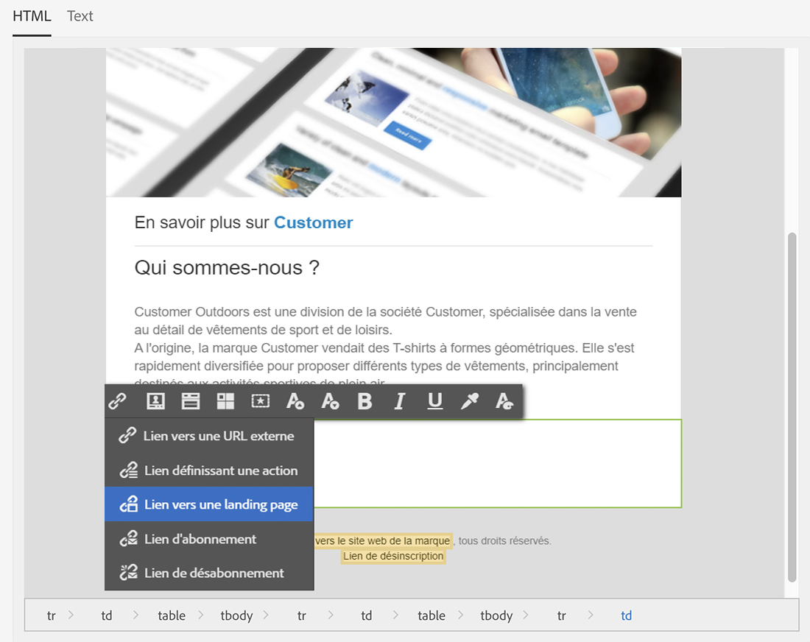

# Synchronisation des applications web{#synchronizing-web-applications}

Dans ce cas pratique, nous allons envoyer une communication, à l&#39;aide de Campaign Standard, comprenant un lien vers une application web de Campaign v7. Lorsqu&#39;un destinataire clique sur le lien dans l&#39;email, l&#39;application web affiche un formulaire contenant plusieurs champs préchargés avec les données du destinataire en question ainsi qu&#39;un lien d&#39;inscription à une newsletter. Le destinataire peut mettre à jour ses informations et s&#39;inscrire au service. Son profil est alors mis à jour dans Campaign v7 et les informations sont répliquées dans Campaign Standard.

Si vous disposez d&#39;un grand nombre de services et d&#39;applications web dans Campaign v7, vous pouvez décider de ne pas tous les recréer dans Campaign Standard. ACS Connector vous permet d&#39;utiliser l&#39;ensemble des services et des applications web de Campaign v7 et de les associer à une diffusion envoyée par Campaign Standard.

## Prérequis {#prerequisites}

Pour ce faire, les éléments suivants sont nécessaires :

* Destinataires stockés dans la base de données Campaign v7 et synchronisés avec Campaign Standard. Reportez-vous à la section [Synchronisation des profils](../../integrations/using/synchronizing-profiles.md) .
* Un service et une application web créés et publiés dans Campaign v7.
* l’application Web doit contenir une **[!UICONTROL Pre-loading]** activité utilisant la méthode **[!UICONTROL Adobe Campaign encryption]** d’identification.

## Création de l&#39;application web et du service {#creating-the-web-application-and-service}

Dans Campaign v7, vous pouvez créer une application Web qui permet aux destinataires de s&#39;inscrire à un service. L&#39;application Web et le service sont conçus et stockés dans Campaign v7. Le service peut être mis à jour par le biais d&#39;une communication de Campaign Standard. Pour plus d&#39;informations sur les applications Web dans Campaign v7, consultez [cette section](../../web/using/adding-fields-to-a-web-form.md#subscription-checkboxes).

Dans Campaign v7, les objets suivants ont été créés :

* un service de newsletter,
* a web application containing a **[!UICONTROL Pre-loading]**, a **[!UICONTROL Page]** and a **[!UICONTROL Storage]** activity.

1. Accédez à **[!UICONTROL Resources > Online > Web applications]** et sélectionnez une application Web existante.

   

1. Modifiez l’ **[!UICONTROL Preloading]** activité. La **[!UICONTROL Auto-load data referenced in the form]** case est cochée et la méthode **[!UICONTROL Adobe Campaign encryption]** d’identification est sélectionnée. Cela permet à l’application Web de précharger les champs du formulaire avec les données stockées dans la base de données Adobe Campaign. Voir [ce document](../../web/using/publishing-a-web-form.md#pre-loading-the-form-data).

   

1. Modifiez le **[!UICONTROL Page]**. Three fields (Name, Email and Phone) have been included, as well as a check box to invite the recipient to subscribe to a newsletter (**[!UICONTROL Newsletter]** service).

   

1. Allez à **[!UICONTROL Profiles and Target > Services and subscriptions]** et ouvrez le **[!UICONTROL Newsletter]** service. Il s’agit du service qui sera mis à jour à partir de la communication Campaign Standard. Vous pouvez constater qu’aucun destinataire n’a encore souscrit à ce service.

   

1. Accédez à **[!UICONTROL Profiles and Targets > Recipient]** et sélectionnez un destinataire. Vous pouvez voir qu&#39;il n&#39;a pas encore souscrit au service.

   

## Réplication des données {#replicating-the-data}

Afin de répliquer les données nécessaires entre Campaign v7 et Campaign Standard, plusieurs modèles de processus de réplication sont disponibles. Le **[!UICONTROL Profiles replication]** processus répliquera automatiquement tous les destinataires de Campaign v7 vers Campaign Standard. See [Technical and replication workflows](../../integrations/using/acs-connector-principles-and-data-cycle.md#technical-and-replication-workflows). Le **[!UICONTROL Landing pages replication]** flux de travaux permet de reproduire les applications Web que nous voulons utiliser dans Campaign Standard.

Pour vérifier que les données ont été correctement répliquées, suivez la procédure suivante dans Campaign Standard :

1. From the home screen, click on **[!UICONTROL Customer profiles]**.

   

1. Recherchez votre destinataire Campaign v7 et vérifiez qu&#39;il apparaît dans Campaign Standard.

   

1. Dans la barre supérieure, cliquez sur **[!UICONTROL Marketing activities]**, puis recherchez l’application Web Campaign v7. Il s’affiche en tant que page d’entrée dans Campaign Standard.

   

1. Cliquez sur le logo **[!UICONTROL Adobe Campaign]**, en haut à gauche, sélectionnez **Profils &amp; audiences > Services**, puis vérifiez que le service de newsletter apparaît également.

   

## Conception et envoi de l&#39;email {#designing-and-sending-the-email}

Dans cette partie, nous allons voir comment inclure un lien vers la landing page répliquée depuis une application web de Campaign v7 dans un email Campaign Standard.

Les étapes de création, de conception et d&#39;envoi de l&#39;email sont les mêmes que pour un email classique. Pour plus d&#39;informations, consultez la document [Adobe Campaign Standard](https://helpx.adobe.com/support/campaign/standard.html).

1. Créez un nouvel email et sélectionnez un ou plusieurs profils répliqués en tant qu&#39;audience.
1. Modifiez votre contenu et insérez un **[!UICONTROL Link to a landing page]** fichier.

   

1. Sélectionnez la landing page qui a été répliquée depuis l&#39;application web de Campaign v7.

   

1. Préparez votre email, envoyez les BAT, puis l&#39;email final.
1. Un des destinataires ouvre l&#39;email et clique sur le lien d&#39;inscription à la newsletter.

   

1. Il ajoute un numéro de téléphone et coche la case d&#39;inscription à la newsletter.

   

## Récupération des informations mises à jour {#retrieving-the-updated-information}

Lorsque le destinataire met ses informations à jour via l&#39;application web, Adobe Campaign v7 récupère de manière synchrone les informations mises à jour. Celles-ci sont ensuite répliquées depuis Campaign v7 vers Campaign Standard.

1. Dans Campaign v7, accédez au **[!UICONTROL Profiles and Target > Services and subscriptions]** service et ouvrez-le **[!UICONTROL Newsletter]** . Vous pouvez constater que le destinataire apparaît désormais dans la liste des abonnés.

   

1. Accédez à **[!UICONTROL Profiles and Targets > Recipient]** et sélectionnez le destinataire. Vous pouvez voir que le numéro de téléphone est maintenant stocké.

   

1. In the **[!UICONTROL Subscriptions]** tab, we can also see that he has subscribed to the newsletter service.

   

1. Patientez quelques minutes pendant l&#39;exécution du workflow de réplication.
1. Dans Campaign Standard, accédez au profil de votre destinataire pour vérifier que les données mises à jour ont été correctement répliquées depuis Campaign v7.

   

1. Editez le profil. Vous pouvez constater que le numéro de téléphone a été mis à jour.

   

1. Cliquez sur l&#39; **[!UICONTROL Subscriptions]** onglet. Le service de newsletter s’affiche désormais.

   

