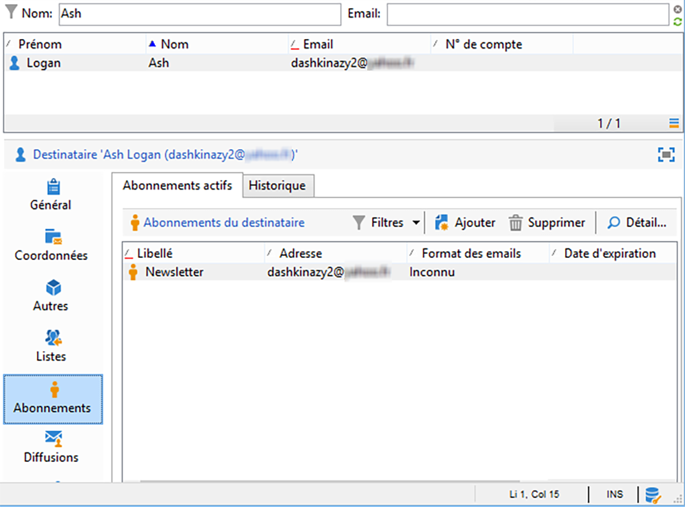

# Synchronisation des applications web{#synchronizing-web-applications}

Dans ce cas pratique, nous allons envoyer une communication, à l&#39;aide de Campaign Standard, comprenant un lien vers une application web de Campaign v7. Lorsqu&#39;un destinataire clique sur le lien dans l&#39;email, l&#39;application web affiche un formulaire contenant plusieurs champs préchargés avec les données du destinataire en question ainsi qu&#39;un lien d&#39;inscription à une newsletter. Le destinataire peut mettre à jour ses informations et s&#39;inscrire au service. Son profil est alors mis à jour dans Campaign v7 et les informations sont répliquées dans Campaign Standard.

Si vous disposez d&#39;un grand nombre de services et d&#39;applications web dans Campaign v7, vous pouvez décider de ne pas tous les recréer dans Campaign Standard. ACS Connector vous permet d&#39;utiliser l&#39;ensemble des services et des applications web de Campaign v7 et de les associer à une diffusion envoyée par Campaign Standard.

## Conditions préalables requises {#prerequisites}

Pour ce faire, les éléments suivants sont nécessaires :

* Des destinataires stockés dans la base de données de Campaign v7 et synchronisés avec Campaign Standard. Consultez la section [Synchronisation des profils](../../integrations/using/synchronizing-profiles.md).
* Un service et une application web créés et publiés dans Campaign v7.
* L&#39;application web doit contenir une activité **[!UICONTROL Pré-chargement]** utilisant la méthode d&#39;identification **[!UICONTROL Chiffrement Adobe Campaign]**.

## Création de lʼapplication web et du service {#creating-the-web-application-and-service}

Dans Campaign v7, vous pouvez créer des applications web qui permettent aux destinataires de s&#39;inscrire à un service. L&#39;application web et le service sont conçus et stockés dans Campaign v7. Vous pouvez mettre à jour ce service via une communication Campaign Standard. Pour en savoir plus sur les applications web dans Campaign v7, voir [cette section](../../web/using/adding-fields-to-a-web-form.md#subscription-checkboxes).

Dans Campaign v7, les objets suivants ont été créés :

* un service de newsletter,
* une application web contenant des activités **[!UICONTROL Pré-chargement]**, **[!UICONTROL Page]** et **[!UICONTROL Enregistrement]**.

1. Accédez à **[!UICONTROL Ressources > On-line > Applications Web]** et sélectionnez une application web existante.

   

1. Modifiez la variable **[!UICONTROL Préchargement]** activité. La variable **[!UICONTROL Chargement automatique des données référencées dans le formulaire]** est cochée et la variable **[!UICONTROL Cryptage Adobe Campaign]** la méthode d&#39;identification est sélectionnée. L&#39;application web pourra ainsi précharger les champs du formulaire avec les données stockées dans la base de données Adobe Campaign. Voir [ce document](../../web/using/publishing-a-web-form.md#pre-loading-the-form-data).

   

1. Modifiez la variable **[!UICONTROL Page]**. Trois champs (Nom, Email et Téléphone) ont été inclus, ainsi qu’une case à cocher invitant le destinataire à s’abonner à une newsletter (**[!UICONTROL Newsletter]** ).

   

1. Accédez à **[!UICONTROL Profils et Cibles > Services et abonnements]**, puis ouvrez le service **[!UICONTROL Newsletter]**. Il s&#39;agit du service qui sera mis à jour à partir du message de communication Campaign Standard. Vous pouvez voir qu&#39;aucun destinataire ne s&#39;est encore inscrit à ce service.

   

1. Accédez à **[!UICONTROL Profils et cibles > Destinataire]** et sélectionnez un destinataire. Vous pouvez constater que ce profil ne s’est pas encore inscrit au service.

   

## Réplication des données {#replicating-the-data}

Afin de répliquer les données nécessaires entre Campaign v7 et Campaign Standard, plusieurs modèles de workflow de réplication sont disponibles. La variable **[!UICONTROL Réplication des profils]** le workflow réplique automatiquement tous les destinataires de Campaign v7 vers Campaign Standard. Voir [Workflows techniques et de réplication](../../integrations/using/acs-connector-principles-and-data-cycle.md#technical-and-replication-workflows). Le workflow de **[!UICONTROL Réplication des landing pages]** permet la réplication des applications Web que nous voulons utiliser dans Campaign Standard.

Pour vérifier que les données ont été correctement répliquées, suivez la procédure suivante dans Campaign Standard :

1. Depuis l&#39;écran d&#39;accueil, cliquez sur **[!UICONTROL Profils clients]**.

   

1. Recherchez votre destinataire Campaign v7 et vérifiez qu’il apparaît dans Campaign Standard.

   

1. Dans la barre supérieure, cliquez sur **[!UICONTROL Activités marketing]**, puis cherchez l&#39;application web de Campaign v7. Elle apparaît sous forme de landing page dans Campaign Standard.

   

1. Cliquez sur le logo **[!UICONTROL Adobe Campaign]**, en haut à gauche, sélectionnez **Profils &amp; audiences > Services**, puis vérifiez que le service de newsletter apparaît également.

   

## Conception et envoi de lʼe-mail {#designing-and-sending-the-email}

Dans cette partie, nous allons voir comment inclure un lien vers la landing page répliquée depuis une application web de Campaign v7 dans un email Campaign Standard.

Les étapes de création, de conception et d&#39;envoi de l&#39;email sont les mêmes que pour un email classique. Voir [Adobe Campaign Standard](https://experienceleague.adobe.com/docs/campaign-standard/using/campaign-standard-home.html?lang=fr) la documentation.

1. Créez un nouvel email et sélectionnez un ou plusieurs profils répliqués en tant qu&#39;audience.
1. Editez le contenu et insérez un **[!UICONTROL Lien vers une landing page]**.

   

1. Sélectionnez la landing page qui a été répliquée depuis l&#39;application web de Campaign v7.

   

1. Préparez votre email, envoyez les BAT, puis l&#39;email final.
1. Un des destinataires ouvre l&#39;email et clique sur le lien d&#39;inscription à la newsletter.

   

1. Ce destinataire ajoute un numéro de téléphone et coche la case d’inscription à la newsletter.

   

## Récupération des informations mises à jour {#retrieving-the-updated-information}

Lorsque le destinataire met ses informations à jour via l&#39;application web, Adobe Campaign v7 récupère de manière synchrone les informations mises à jour. Celles-ci sont ensuite répliquées depuis Campaign v7 vers Campaign Standard.

1. Dans Campaign v7, accédez à **[!UICONTROL Profils et Cibles > Services et abonnements]**, puis ouvrez le service **[!UICONTROL Newsletter]**. Vous pouvez voir que le destinataire apparaît désormais dans la liste des abonnés.

   

1. Accédez à **[!UICONTROL Profils et Cibles > Destinataire]** et sélectionnez le destinataire. Vous pouvez voir que le numéro de téléphone est maintenant stocké.

   

1. Dans l’onglet **[!UICONTROL Abonnements]**, vous pouvez également constater que le destinataire s’est inscrit au service de newsletter.

   

1. Patientez quelques minutes pendant l&#39;exécution du workflow de réplication.
1. Dans Campaign Standard, accédez au profil de votre destinataire pour vérifier que les données mises à jour ont été correctement répliquées depuis Campaign v7.

   

1. Editez le profil. Vous pouvez constater que le numéro de téléphone a été mis à jour.

   

1. Cliquez sur l&#39;onglet **[!UICONTROL Abonnements]**. Le service de newsletter apparaît maintenant.

   
