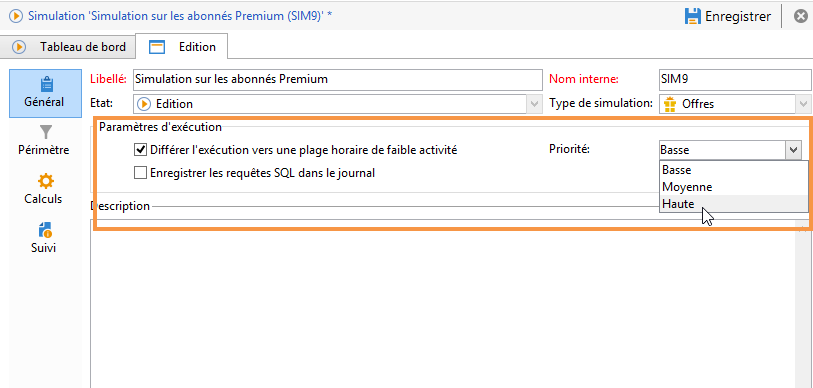
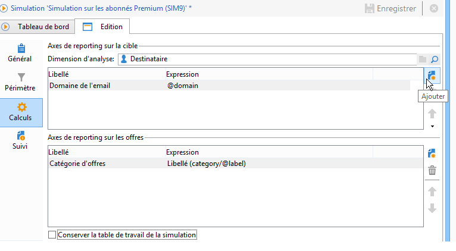
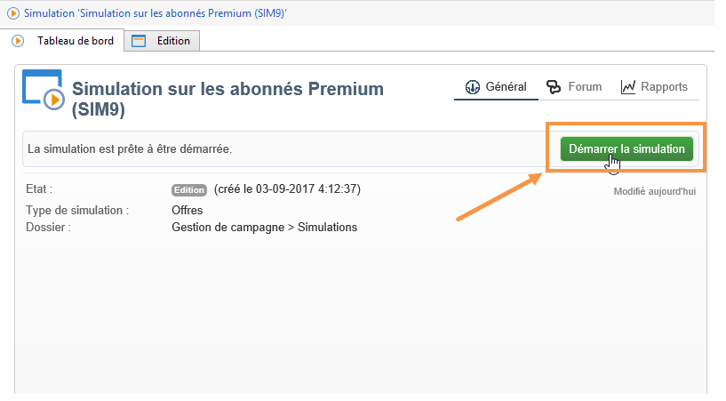
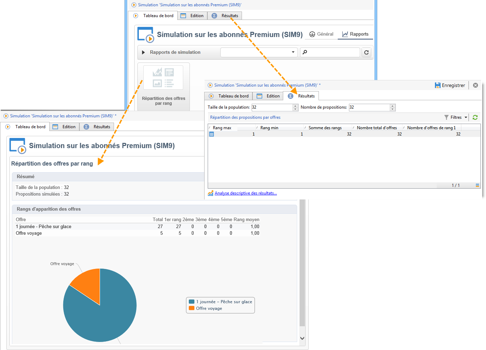

# À propos de la simulation des offres{#about-offers-simulation}

Le module **Simulation** vous permet de tester la répartition des offres d&#39;une catégorie ou d&#39;un environnement avant de lancer votre proposition auprès de vos destinataires.

La simulation prend en compte les contextes et les règles d&#39;éligibilité précédemment appliqués aux offres (voir la section [Présentation du catalogue d&#39;offres](../../interaction/using/offer-catalog-overview.md)), ainsi que leurs règles de présentation (voir la section [Gérer la présentation des offres](../../interaction/using/managing-offer-presentation.md)). Il est ainsi possible de tester et d&#39;affiner différentes versions de votre proposition sans utiliser effectivement une offre ou solliciter excessivement ou insuffisamment une cible. La simulation n&#39;a en effet aucun impact sur les destinataires ciblés.

Pour savoir comment simuler une offre, procédez comme suit.

 Vous pouvez également regarder cette [vidéo](https://helpx.adobe.com/campaign/classic/how-to/simulate-offer-in-acv6.html?playlist=/ccx/v1/collection/product/campaign/classic/segment/digital-marketers/explevel/intermediate/applaunch/introduction/collection.ccx.js&amp;ref=helpx.adobe.com).

## Etapes principales pour créer une simulation {#main-steps-for-creating-a-simulation}

Pour effectuer une simulation de vos offres, procédez de la manière suivante :

1. Dans l’onglet **[!UICONTROL Profils et cibles]**, cliquez sur le lien **[!UICONTROL Simulations]**, puis sur le bouton **[!UICONTROL Créer]**.

   

1. Enregistrez puis éditez la simulation que vous venez de créer.
1. Dans l&#39;onglet **[!UICONTROL Edition]**, spécifiez les paramètres d&#39;exécution.

   Pour plus d&#39;informations, consultez la section [Paramètres d&#39;exécution](../../interaction/using/execution-settings.md).

   

   >[!NOTE]
   >
   >Les paramètres d&#39;exécution ne sont disponibles que si vous utilisez Interaction conjointement avec Campaign.

1. Déterminez le périmètre de la simulation.

   Pour plus d&#39;informations, consultez la section [Définition du périmètre](../../interaction/using/simulation-scope.md#definition-of-the-scope).

   

1. Ajoutez des axes de reporting pour enrichir le rapport **[!UICONTROL Répartition des offres par rang]** (étape optionnelle).

   Pour plus d&#39;informations, consultez la section [Ajout d&#39;axes de reporting](../../interaction/using/simulation-scope.md#adding-reporting-axes).

   

1. Cliquez sur **[!UICONTROL Enregistrer]** pour sauvegarder les paramètres de la simulation.
1. Lancez la simulation depuis le tableau de bord.

   

1. Consultez le résultat de votre simulation et affichez le rapport d&#39;analyse de la simulation.

   Pour plus d&#39;informations, consultez la section [Suivi des simulations](../../interaction/using/simulation-tracking.md).

   
