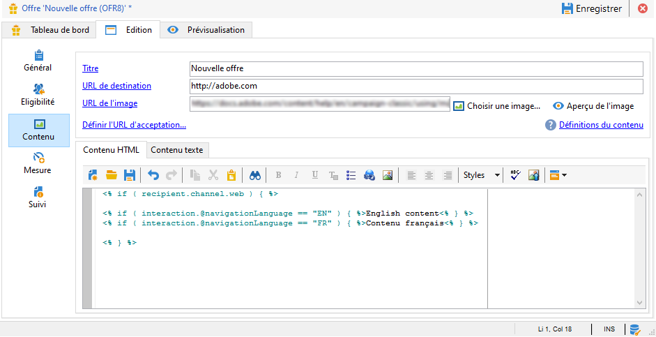

# Additional data{#additional-data}


Il est possible, lors de l&#39;appel au moteur d&#39;Interaction, de passer des données additionnelles contextuelles. Ces données peuvent provenir des données de la cible stockées dans la table de travail d&#39;un workflow (canal sortant) ou des données d&#39;appel envoyées par le site web au moment de l&#39;appel (canal entrant). Vous avez la possibilité d&#39;utiliser ces données additionnelles dans les règles d&#39;éligibilité, dans la personnalisation des offres, et vous pouvez également les stocker dans la table des propositions.

En entrant, il peut être intéressant de récupérer, par exemple, la langue de navigation de la personne qui a consulté l&#39;offre ou le nom de l&#39;agent dans le centre d&#39;appel. Vous pouvez ensuite utiliser ces données d&#39;appel (call data), dans les règles d&#39;éligibilité, pour ne proposer une offre qu&#39;à une personne visionnant la page web en anglais ou en français.

Dans un workflow de ciblage (canal sortant), vous pouvez utiliser les données de la cible (target data) lors de l&#39;appel au moteur. Vous pouvez, par exemple, enrichir la cible avec des données provenant d&#39;une transaction associée au destinataire, ou d&#39;une base externe, via le FDA.

## Configuration des données additionnelles {#additional-data-configuration}

Vous devez étendre le schéma **nms:interaction** lié à l&#39;environnement et déclarer la liste des champs supplémentaires qui seront utilisés lors d&#39;un appel au moteur d&#39;Interaction. Lors de la création de la règle d&#39;éligibilité ou de la personnalisation d&#39;une offre, ces champs deviennent accessibles depuis le nœud **Interaction** (voir la section [Utilisation des données additionnelles](#using-additional-data)).

Pour l&#39;entrant, vous devez ajouter les champs de données d&#39;appel dans le noeud **Interaction**.

```
<element label="Interactions" labelSingular="Interaction" name="interaction">
  <attribute label="Navigation language" name="navigationLanguage" type="string"/>
</element>
```

>[!NOTE]
>
>Les collections xml sont supportées pour le canal entrant, mais les liens vers d&#39;autres schémas ne le sont pas.

Pour le sortant, vous devez ajouter, dans le noeud **Interaction**, un élément **targetData** contenant les champs additionnels.

```
<element label="Interactions" labelSingular="Interaction" name="interaction">
  <element name="targetData">
    <attribute label="Date of last transaction" name="lastTransactionDate" type="datetime"/>
  </element>
</element>
```

>[!NOTE]
>
>Les collections ne sont pas supportées pour le canal sortant. Cependant, vous pouvez créer des liens vers d&#39;autres schémas.

Si vous souhaitez stocker ces données dans la table des propositions, vous devez également étendre le schéma **nms:propositionRcp** et déclarer ces champs.

```
<element label="Recipient offer propositions" labelSingular="Recipient offer proposition" name="propositionRcp">
  <attribute label="Last transaction date" name="lastTransactionDate" type="datetime"/>
  <attribute label="Navigation language" name="navigationLanguage" type="string"/>
</element>
```

## Implémentation des données additionnelles {#additional-data-implementation}

### Canal entrant (page Web) {#input-channel--web-page-}

Pour passer des données additionnelles lors de l&#39;appel au moteur, vous devez ajouter la variable **interactionGlobalCtx** dans le code Javascript de la page web. Insérez, dans cette variable, le nœud **Interaction** contenant les données d&#39;appel. Vous devez respecter la même structure xml que dans l&#39;extension du schéma **nms:interaction**. Voir à ce sujet la section [Configuration des données additionnelles](#additional-data-configuration).

```
interactionGlobalCtx = "<interaction navigationLanguage='"+myLanguage+"'/>";
```

### Canal sortant {#output-channel}

Vous devez créer un workflow de ciblage chargeant des données additionnelles dans la table de travail en respectant la même structure xml et les mêmes noms internes que dans le schéma **nms:interaction**. Voir à ce sujet la section [Configuration des données additionnelles](#additional-data-configuration).

## Utilisation des données additionnelles {#using-additional-data}

### Règles d’éligibilité {#eligibility-rules}

Il est possible d&#39;utiliser les données additionnelles dans les règles d&#39;éligibilité au niveau des offres, des catégories et des poids.

Par exemple, vous pouvez choisir de ne présenter l&#39;offre qu&#39;aux personnes visionnant la page en anglais.


>[!NOTE]
>
>Vous devez limiter la règle aux canaux pour lesquels les données sont définies. Dans notre exemple, nous limitons la règle au canal web entrant (champ **[!UICONTROL Pris en compte si]**).

### Personnalisation      {#personalization}

Il est également possible d&#39;utiliser ces données additionnelles lors de la personnalisation d&#39;une offre. Vous pouvez, par exemple, ajouter une condition sur la langue de navigation.



>[!NOTE]
>
>Vous devez limiter la personnalisation aux canaux pour lesquels les données sont définies. Dans notre exemple, nous limitons la règle au canal web entrant.

Si vous avez personnalisé une offre sur des données additionnelles, celles-ci ne s&#39;afficheront pas par défaut dans la prévisualisation car elles ne sont pas disponibles en base. Sur l&#39;onglet **[!UICONTROL Exemple de données d&#39;appel]** de l&#39;environnement, vous devez ajouter les échantillons de valeurs à utiliser dans la prévisualisation. Veillez à respecter la même structure xml que dans l&#39;extension du schéma **nms:interaction**. Voir à ce sujet la section [Configuration des données additionnelles](#additional-data-configuration).


Lors de la prévisualisation, cliquez sur **[!UICONTROL Options de personnalisation du contenu pour l&#39;aperçu]** et sélectionnez une valeur dans le champ **[!UICONTROL Données d&#39;appel]**.


### Stockage {#storage}

Au moment de l&#39;appel au moteur, il est possible de stocker les données additionnelles dans la table des propositions afin d&#39;enrichir la base. Ces données pourront, par exemple, être utilisée dans les rapports, dans le calcul du ROI, ou dans des processus ultérieurs.

>[!NOTE]
>
>Vous devez avoir étendu le schéma **nms:propositionRcp** et déclaré les champs qui contiendront les données à stocker. Voir à ce sujet la section [Configuration des données additionnelles](#additional-data-configuration).

Au niveau de l&#39;emplacement, positionnez-vous sur l&#39;onglet **[!UICONTROL Stockage]** et cliquez sur le bouton **[!UICONTROL Ajouter]**.

Dans la colonne **[!UICONTROL Chemin de stockage]**, sélectionnez le champ de stockage dans la table des propositions. Dans la colonne **[!UICONTROL Expression]**, sélectionnez le champ additionnel dans le noeud **[!UICONTROL Interaction]**.

Il est possible de récupérer les données d&#39;appel au moment de la génération de la proposition ou au moment de son acceptation (lorsque la personne clique sur l&#39;offre).


