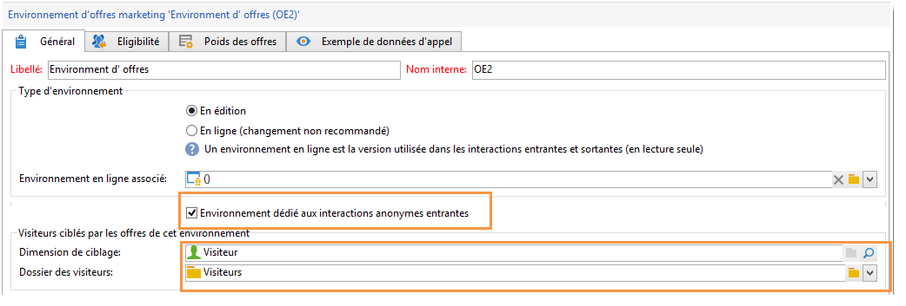
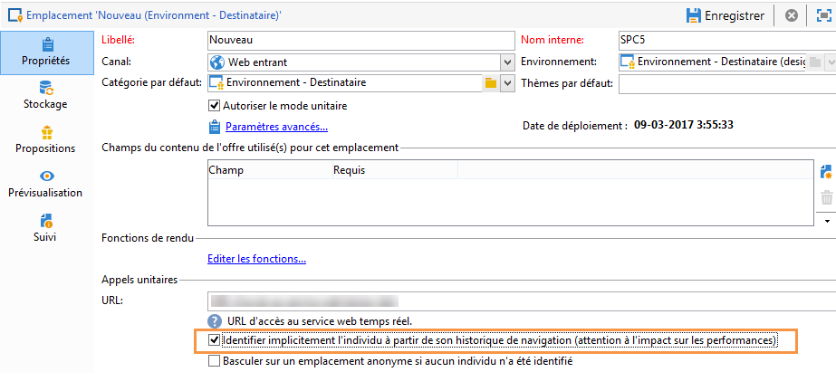
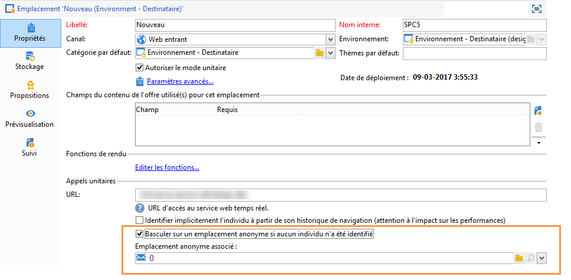

# Interactions anonymes{#anonymous-interactions}

 Regardez cette [vidéo](https://helpx.adobe.com/campaign/classic/how-to/indetified-and-anonymous-interaction-in-acv6.html?playlist=/ccx/v1/collection/product/campaign/classic/segment/digital-marketers/explevel/intermediate/applaunch/get-started/collection.ccx.js&amp;ref=helpx.adobe.com) pour une vue générale de la diffusion des offres vers des cibles identifiées et anonymes.

## Ciblage et stockage d&#39;un environnement pour interactions anonymes {#targeting-and-storing-an-environment-for-anonymous-interactions}

Par défaut, Interaction est livré avec un environnement pré-paramétré pour cibler la table des destinataires (offres identifiées). Si vous souhaitez cibler une autre table (table des visiteurs pour les offres anonymes par exemple), vous devez utiliser l&#39;assistant de création de mapping de ciblage pour créer l&#39;environnement. Pour plus d&#39;informations, consultez la section [Créer un environnement d&#39;offres](../../interaction/using/live-design-environments.md#creating-an-offer-environment).

Lorsque vous créez l&#39;environnement anonyme via l&#39;assistant de création de mapping, la case **[!UICONTROL Environnement dédié aux interactions anonymes entrantes]** est automatiquement cochée dans l&#39;onglet **[!UICONTROL Général]** de l&#39;environnement.

La **[!UICONTROL Dimension de ciblage]** est automatiquement préremplie. Elle pointe par défaut sur la table des visiteurs.

La variable **[!UICONTROL Dossier du visiteur]** s’affiche. Il est automatiquement renseigné pour établir un lien vers la variable **[!UICONTROL Visiteurs]** dossier. Ce champ vous permet de choisir l’emplacement de stockage des profils du visiteur.

>[!NOTE]
>
>Si vous souhaitez trier plusieurs types de visiteurs, par exemple dans le cas d&#39;offres anonymes proposées pour plusieurs marques, vous devez créer un environnement pour chaque marque puis un dossier de type **[!UICONTROL Visiteurs]** pour chaque environnement.

## Catalogue d&#39;offres pour interactions anonymes {#offer-catalog-for-anonymous-interactions}

Tout comme les interactions sortantes, les interactions entrantes sont organisées au sein d&#39;un catalogue d&#39;offres composé de catégories et d&#39;offres.

Pour créer des catégories et des emplacements, appliquez le même processus que pour les visiteurs identifiés (voir les sections [Créer des catégories d&#39;offres](../../interaction/using/creating-offer-categories.md) et [Créer un environnement d&#39;offres](../../interaction/using/live-design-environments.md#creating-an-offer-environment)).

## Les visiteurs anonymes {#anonymous-visitors}

Les visiteurs anonymes peuvent être soumis à un processus d&#39;identification par cookies intervenant au moment de la connexion. Cette reconnaissance implicite s&#39;effectue à partir de l&#39;historique de navigation du visiteur.

Ce processus consiste à comparer les données récupérées par les cookies avec celles de votre base de données. Dans certains cas, les visiteurs sont reconnus (ils sont alors identifiés implicitement) ; dans d&#39;autres cas, ils ne le sont pas (et restent donc anonymes).

Afin d&#39;effectuer cette analyse, au niveau de l&#39;emplacement, cochez la case **[!UICONTROL Identifier implicitement l&#39;individu à partir de son historique de navigation]**.

## Traitement des visiteurs anonymes non identifiés {#processing-unidentified-anonymous-visitors}

Après analyse, si un visiteur anonyme n&#39;est pas identifié, il vous est possible de stocker ses données dans un emplacement donné, ce qui vous permettra de proposer des offres spécifiquement destinées à ce type de visiteurs, répondant à des règles de typologie précises.

En cas d&#39;absence d&#39;élément permettant d&#39;identifier un contact ou si vous ne souhaitez pas proposer d&#39;offre identifiée à un contact pouvant être identifié implicitement, vous pouvez choisir d&#39;effectuer un basculement vers un environnement anonyme.

Pour cela, cochez la case **[!UICONTROL Basculer sur un emplacement anonyme si aucun individu n&#39;a été identifié]**, puis spécifiez l&#39;environnement dédié à ces visiteurs non identifiés dans la zone **[!UICONTROL Emplacement anonyme associé]** de la définition d&#39;un emplacement.

