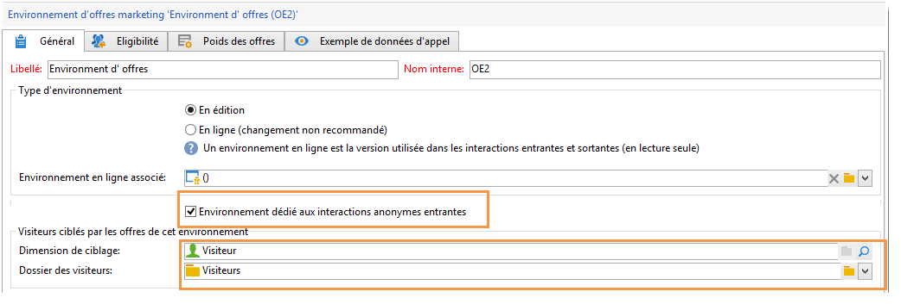
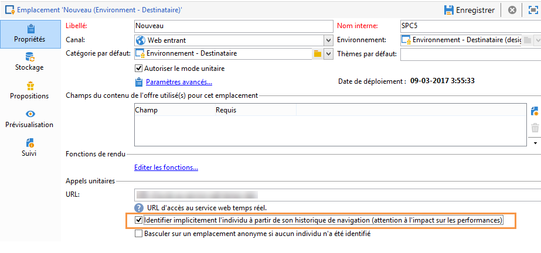
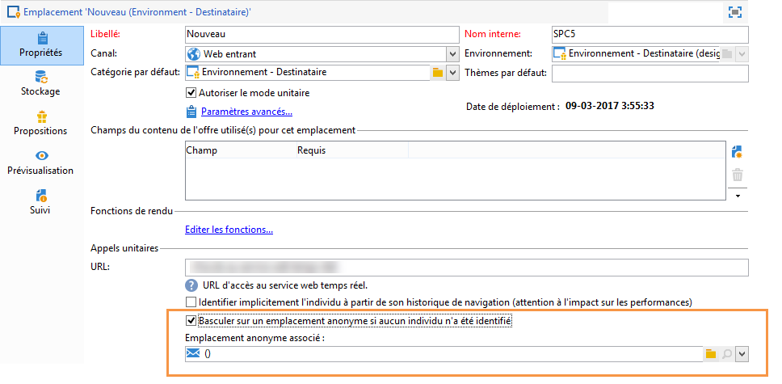

# Interactions anonymes{#anonymous-interactions}

 Regardez cette [vidéo](https://helpx.adobe.com/campaign/classic/how-to/indetified-and-anonymous-interaction-in-acv6.html?playlist=/ccx/v1/collection/product/campaign/classic/segment/digital-marketers/explevel/intermediate/applaunch/get-started/collection.ccx.js&ref=helpx.adobe.com) pour une vue générale de la diffusion des offres vers des cibles identifiées et anonymes.

## Ciblage et stockage d&#39;un environnement pour interactions anonymes {#targeting-and-storing-an-environment-for-anonymous-interactions}

Par défaut, Interaction est livré avec un environnement pré-paramétré pour cibler le tableau des destinataires (offres identifiées). Si vous souhaitez cibler un autre tableau (tableau des visiteurs et visiteuses pour les offres anonymes par exemple), vous devez utiliser l’assistant de mapping de ciblage pour créer l’environnement. Pour plus d’informations, consultez la section [Créer un environnement d’offre](../../interaction/using/live-design-environments.md#creating-an-offer-environment).

Lorsque vous créez l’environnement anonyme via l’assistant de création de mapping, la case **[!UICONTROL Environnement dédié aux interactions anonymes entrantes]** est automatiquement cochée dans l’onglet **[!UICONTROL Général]** de l’environnement.

La **[!UICONTROL dimension de ciblage]** est automatiquement renseignée. Par défaut, il est lié au tableau des visiteurs.

Le champ **[!UICONTROL Dossier des visiteurs]** s&#39;affiche. Il est automatiquement prérempli pour pointer sur le dossier **[!UICONTROL Visiteurs]**. Ce champ permet de spécifier l&#39;endroit où sont stockés les profils des visiteurs.

>[!NOTE]
>
>Si vous souhaitez trier plusieurs types de visiteurs, par exemple dans le cas d&#39;offres anonymes proposées pour plusieurs marques, vous devez créer un environnement pour chaque marque puis un dossier de type **[!UICONTROL Visiteurs]** pour chaque environnement.

## Catalogue d&#39;offres pour interactions anonymes {#offer-catalog-for-anonymous-interactions}

Tout comme les interactions sortantes, les interactions entrantes sont organisées au sein d&#39;un catalogue d&#39;offres composé de catégories et d&#39;offres.

Pour créer des catégories et des emplacements, appliquez le même processus que pour les visiteurs identifiés (voir les sections [Créer des catégories d&#39;offres](../../interaction/using/creating-offer-categories.md) et [Créer un environnement d&#39;offres](../../interaction/using/live-design-environments.md#creating-an-offer-environment)).

## Les visiteurs anonymes {#anonymous-visitors}

Les visiteurs anonymes peuvent être soumis à un processus d’identification par cookies lorsqu’ils se connectent. Cette reconnaissance implicite s’effectue à partir de l’historique de navigation du visiteur.

Ce processus consiste à comparer les données récupérées par les cookies avec celles de votre base de données. Dans certains cas, les visiteurs sont reconnus (ils sont alors identifiés implicitement) ; dans d&#39;autres cas, ils ne le sont pas (et restent donc anonymes).

Afin d&#39;effectuer cette analyse, au niveau de l&#39;emplacement, cochez la case **[!UICONTROL Identifier implicitement l&#39;individu à partir de son historique de navigation]**.

## Traitement des visiteurs anonymes non identifiés {#processing-unidentified-anonymous-visitors}

Après analyse, si un visiteur anonyme n’est pas identifié, vous pouvez stocker ses données dans un emplacement donné. Vous pouvez ainsi proposer des offres destinées spécifiquement à ce type de visiteur et correspondant aux règles de typologie spécifiées.

En cas d&#39;absence d&#39;élément permettant d&#39;identifier un contact ou si vous ne souhaitez pas proposer d&#39;offre identifiée à un contact pouvant être identifié implicitement, vous pouvez choisir d&#39;effectuer un basculement vers un environnement anonyme.

Pour cela, cochez la case **[!UICONTROL Basculer sur un emplacement anonyme si aucun individu n&#39;a été identifié]**, puis spécifiez l&#39;environnement dédié à ces visiteurs non identifiés dans la zone **[!UICONTROL Emplacement anonyme associé]** de la définition d&#39;un emplacement.

