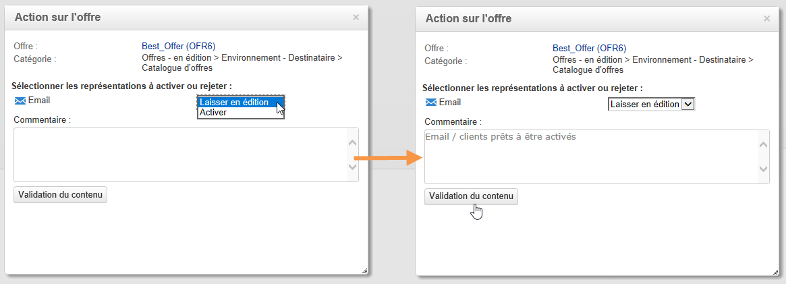

# Validation et activation d&#39;une offre{#approving-and-activating-an-offer}

Une fois le contenu de l&#39;offre terminé, vous devez procéder à sa validation afin qu&#39;elle soit dupliquée dans l&#39;environnement en ligne pour être diffusée par la suite. La validation porte sur le contenu de l&#39;offre et sur son éligibilité.

Un bandeau dans le tableau de bord de l&#39;offre vous permet de voir si l&#39;offre doit passer par le cycle de validation ou non.

## Valider le contenu d&#39;une offre {#approving-offer-content}

Valider le contenu d&#39;une offre consiste à choisir la ou les représentations que vous souhaitez rendre disponibles dans l&#39;environnement en ligne.

Le contenu d&#39;une offre a une représentation par emplacement. Chaque emplacement disposant de sa propre structure et ses propres fonctions de rendu, la représentation des offres peut varier.

Vous pouvez ainsi choisir de valider le contenu d&#39;une offre sur certains emplacements disponibles et ne pas le valider sur d&#39;autres.

>[!IMPORTANT]
>
>Lorsque le contenu et l&#39;éligibilité d&#39;une offre sont validés, le workflow de publication (Notification des offres) se lance automatiquement et l&#39;offre est ainsi mise en ligne et rendue disponible sur les emplacements activés.

Pour valider le contenu d&#39;une offre, procédez comme suit :

1. Cliquez sur le bouton **[!UICONTROL Validation]** et sélectionnez **[!UICONTROL Valider le contenu]** dans le menu contextuel.

   

1. A l&#39;aide de la liste déroulante, sélectionnez les représentations que vous souhaitez laisser en édition ou activer dans l&#39;environnement en ligne, puis cliquez sur **[!UICONTROL Validation du contenu]**.

   

   Lorsque le contenu de l&#39;offre est validé, les informations sont mises à jour dans le tableau de bord de l&#39;offre.

   

   >[!NOTE]
   >
   >La mention **[!UICONTROL Contenu validé]** ne signifie pas que toutes les représentations de l&#39;offre ont été activées et approuvées. Elle indique que le processus d&#39;approbation de contenu a été réalisé, que toutes les offres aient été activées/approuvées ou non.

## Valider l&#39;éligibilité d&#39;une offre {#approving-offer-eligibility}

Approuver l’éligibilité d’une offre signifie accepter ou rejeter les pondérations de l’offre et les règles d’éligibilité également configurées dans l’offre ou héritées des règles créées dans la catégorie parente.

>[!IMPORTANT]
>
>Lorsque le contenu et l&#39;éligibilité d&#39;une offre sont validés, le workflow de publication (Notification des offres) se lance automatiquement et l&#39;offre est ainsi mise en ligne et rendue disponible sur les emplacements activés.

* La liste complète des règles peut être consultée lorsque vous cliquez sur **[!UICONTROL Planning et règle d&#39;éligibilité de l&#39;offre]**.

  

* Si vous souhaitez modifier les règles d&#39;éligibilité, cliquez sur **[!UICONTROL Rejeter]**, puis sur **[!UICONTROL Validation de l&#39;éligibilité]**.

  

  Les différents statuts sont mis à jour dans le tableau de bord de l&#39;offre.

  

* Pour accepter l&#39;éligibilité de l&#39;offre, cliquez sur **[!UICONTROL Valider l&#39;éligibilité]**.

  

  Approuvez l&#39;éligibilité, ajoutez un commentaire le cas échéant, puis cliquez sur **[!UICONTROL Validation de l&#39;éligibilité]**.

  

  Les différents statuts sont mis à jour dans le tableau de bord de l&#39;offre.

  

## Suivi des validations {#approval-tracking}

Le suivi des validations est disponible dans le tableau de bord de l&#39;offre. Cliquez sur **[!UICONTROL Afficher/cacher le journal]** pour y accéder.

>[!NOTE]
>
>Le suivi est également disponible dans l&#39;onglet **[!UICONTROL Suivi]** de l&#39;offre, avec le détail des commentaires des validants.

## Redémarrer la validation {#restart-the-approval}

Une fois la validation lancée, il est possible de la réinitialiser. Pour ce faire, suivez les instructions suivantes :

1. Sur le tableau de bord de l&#39;offre, cliquez sur **[!UICONTROL Contenu validé]**.
1. Dans la fenêtre **[!UICONTROL Édition]** qui apparait, sélectionnez la validation à redémarrer, puis cliquez sur **[!UICONTROL Réinitialiser la validation pour la soumettre à nouveau]**.
1. Confirmez en cliquant sur **[!UICONTROL Ok]**.

## Publication de l&#39;offre {#publishing-the-offer}

Une fois le contenu et l&#39;éligibilité d&#39;une offre approuvés, l&#39;offre est publiée par un workflow qui s&#39;exécute automatiquement pour chaque offre dont le cycle d’approbation est terminé. Le workflow **[!UICONTROL Notification d’offre]** s’exécute également toutes les heures afin de synchroniser (si nécessaire) les emplacements et catégories contenus dans le catalogue d’offres de l’environnement en édition avec l’environnement en ligne.

Le tableau de bord de l&#39;offre disponible dans l&#39;environnement en édition contient les informations relatives à la mise en ligne, notamment le nom de l&#39;offre correspondante dans l&#39;environnement en ligne.

Pour afficher l&#39;offre disponible dans l&#39;environnement en ligne, cliquez sur le libellé de l&#39;offre : l&#39;offre en ligne dispose d&#39;un tableau de bord dans lequel se trouvent toutes les informations qui lui sont relatives.

## Désactiver une offre {#disabling-an-offer}

Une fois une offre validée, il est possible de la désactiver.

Pour ce faire, rendez-vous sur le tableau de bord d&#39;une offre en ligne ou en attente de mise en ligne, puis cliquez sur **[!UICONTROL Désactiver l&#39;offre]**.

Vous pouvez également désactiver directement une catégorie en vous rendant dans l&#39;onglet **[!UICONTROL Eligibilité]** d&#39;une catégorie puis en décochant la case **[!UICONTROL Activée]**.

>[!NOTE]
>
>Lorsqu&#39;une offre est supprimée dans un environnement en édition, elle est automatiquement désactivée dans l&#39;environnement en ligne associé. Après un délai de rétention des propositions, les offres désactivées sont supprimées de l&#39;environnement en ligne.

