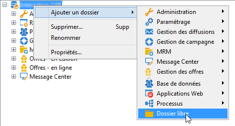
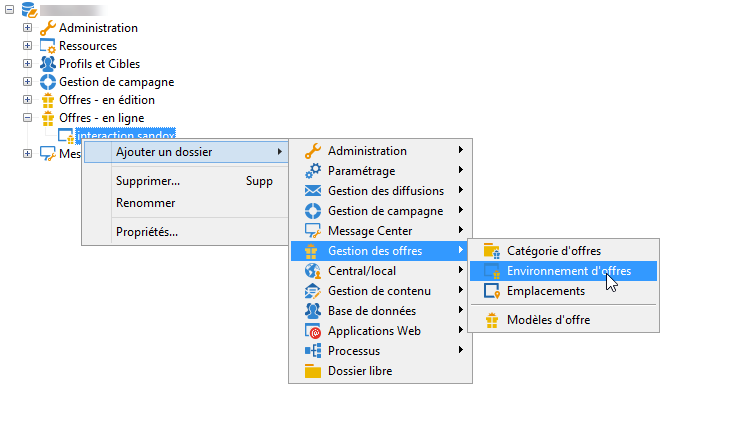
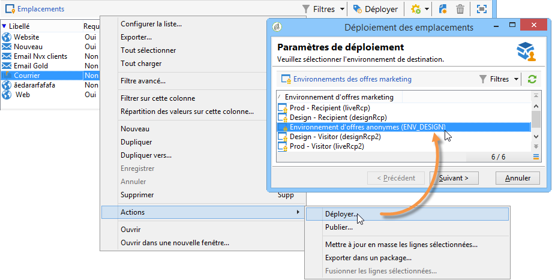

# Création d&#39;un environnement de test{#creating-a-test-environment}

Pour créer un environnement de test (mode sandbox), procédez comme suit :

>[!IMPORTANT]
>
>Utilisez exclusivement cette méthode de création d&#39;environnement pour les environnements de test. Dans tous les autres cas, utilisez l&#39;assistant de mapping de ciblage. Voir à ce sujet la section [Créer un environnement d&#39;offres](../../interaction/using/live-design-environments.md#creating-an-offer-environment).

1. Lancez l&#39;explorateur Adobe Campaign et positionnez-vous au niveau du noeud racine de l&#39;instance.
1. Cliquez avec le bouton droit et ajoutez un **[!UICONTROL Dossier libre]** à l&#39;aide des menus contextuels.

   

1. Positionnez-vous ensuite sur le dossier que vous venez de créer, et ajoutez un dossier **[!UICONTROL Environnement d&#39;offres]** à l&#39;aide des menus contextuels.

   

1. Procédez de la même manière pour créer les sous-dossiers et éléments de l&#39;environnement.
1. Lorsque vos tests sont terminés et que vous souhaitez utiliser l&#39;environnement en production, dupliquez les offres et emplacements dans votre environnement en édition (clic droit > **[!UICONTROL Actions]** > **[!UICONTROL Déployer]** ).

   
