# Création d&#39;une offre{#creating-an-offer}


## Créer l&#39;offre {#creating-the-offer}

Pour créer une offre, procédez comme suit :

1. Accédez à l’onglet **[!UICONTROL Campagnes]** et cliquez sur le lien **[!UICONTROL Offres]**.

   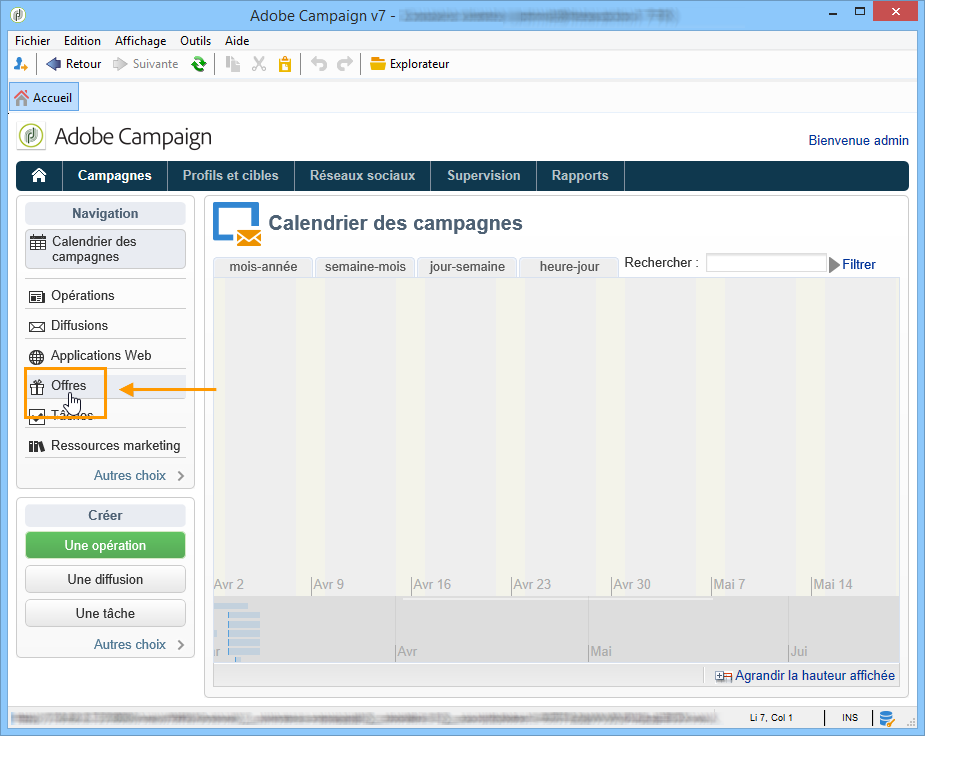

1. Cliquez sur le bouton **[!UICONTROL Créer]**.

   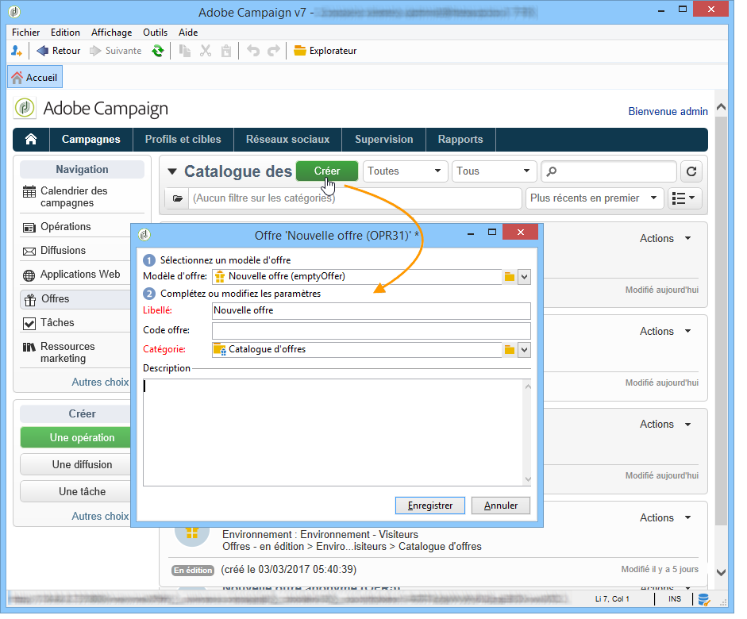

1. Modifiez le libellé et sélectionnez la catégorie à laquelle doit appartenir l&#39;offre.

   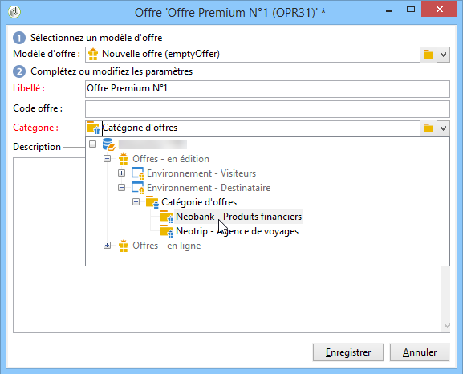

1. Cliquez sur **[!UICONTROL Enregistrer]** pour créer l&#39;offre.

   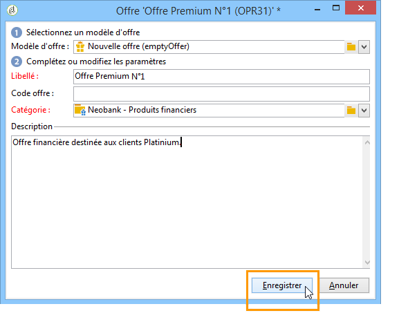

   L&#39;offre est disponible dans la plateforme et son contenu peut être paramétré.

   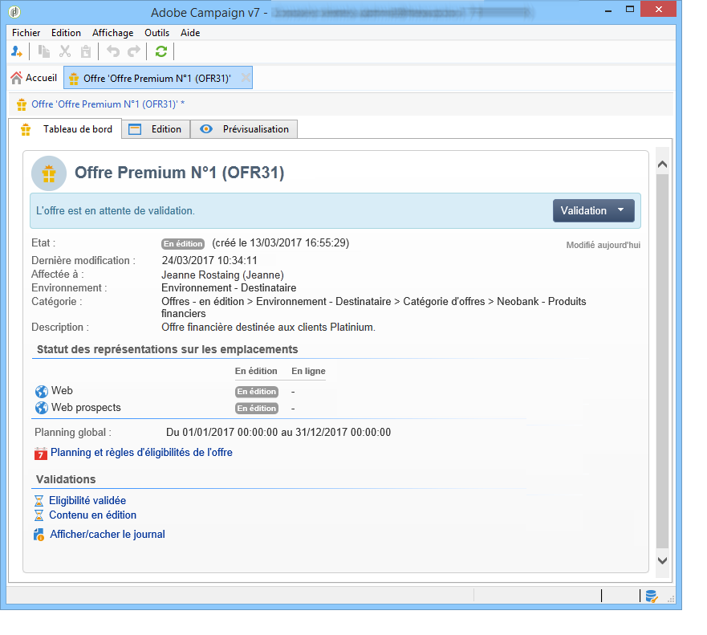

## Paramétrer l&#39;éligibilité d&#39;une offre {#configuring-offer-eligibility}

Dans l&#39;onglet **[!UICONTROL Eligibilité de l&#39;offre]**, vous définissez la période pendant laquelle l&#39;offre est valable et peut être présentée, les filtres à appliquer à la cible et le poids de l&#39;offre.

### Définir la période d&#39;éligibilité d&#39;une offre {#defining-the-eligibility-period-of-an-offer}

Pour définir la période d&#39;éligibilité de l&#39;offre, utilisez les listes déroulantes et sélectionnez une date de début et de fin dans le calendrier.

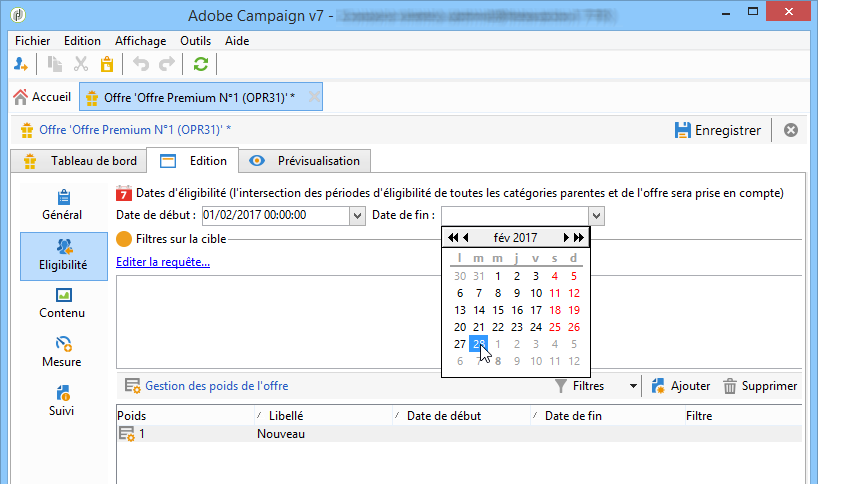

En dehors de ces dates, l&#39;offre ne sera pas sélectionnée par le moteur d&#39;Interaction. Si vous avez également paramétré des dates d&#39;éligibilité au niveau de la catégorie de l&#39;offre, la période la plus restrictive s&#39;appliquera.

### Filtres sur la cible {#filters-on-the-target}

Vous pouvez appliquer des filtres sur la cible de l&#39;offre.

Pour cela, cliquez sur le lien **[!UICONTROL Edition de la requête]** et sélectionnez le filtre que vous souhaitez appliquer. (Reportez-vous à [cette section](../../platform/using/steps-to-create-a-query.md#step-4---filter-data)).

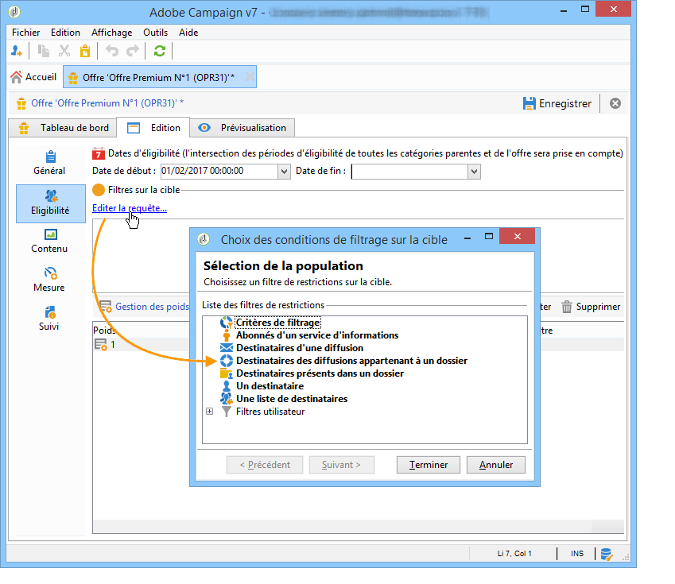

Si des filtres prédéfinis ont déjà été créés, vous pouvez les sélectionner dans la liste des filtres utilisateur. Voir à ce sujet la section [Créer des filtres prédéfinis](../../interaction/using/creating-predefined-filters.md).

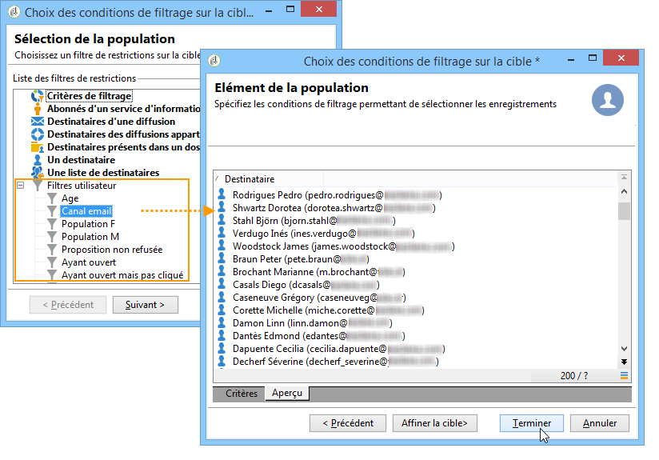

### Poids de l&#39;offre {#offer-weight}

Pour permettre au moteur d&#39;arbitrer entre plusieurs offres auxquelles la personne ciblée serait éligible, vous devez attribuer un ou plusieurs poids à l&#39;offre. Vous pouvez également appliquer des filtres sur la cible si nécessaire ou restreindre l&#39;emplacement auquel doit s&#39;appliquer le poids. Une offre dont le poids est plus important sera préférée à une offre avec un poids moindre.

Vous pouvez paramétrer plusieurs poids pour une même offre, notamment en fonction d&#39;une période, d&#39;une cible ou encore d&#39;un emplacement.

Par exemple, une offre peut avoir un poids A pour les contacts âgés de 18 à 25 ans et un poids B pour les contacts plus âgés. Ou, si une offre est éligible tout l&#39;été, elle peut avoir un poids A au mois de juillet, et un poids B au mois d&#39;août.

>[!NOTE]
>
>Le poids affecté peut être temporairement modifié en fonction des paramètres de la catégorie de l&#39;offre. Voir à ce sujet la section [Créer des catégories d&#39;offres](../../interaction/using/creating-offer-categories.md).

Pour créer un poids dans une offre, procédez comme suit :

1. Cliquez sur **[!UICONTROL Ajouter]**.

   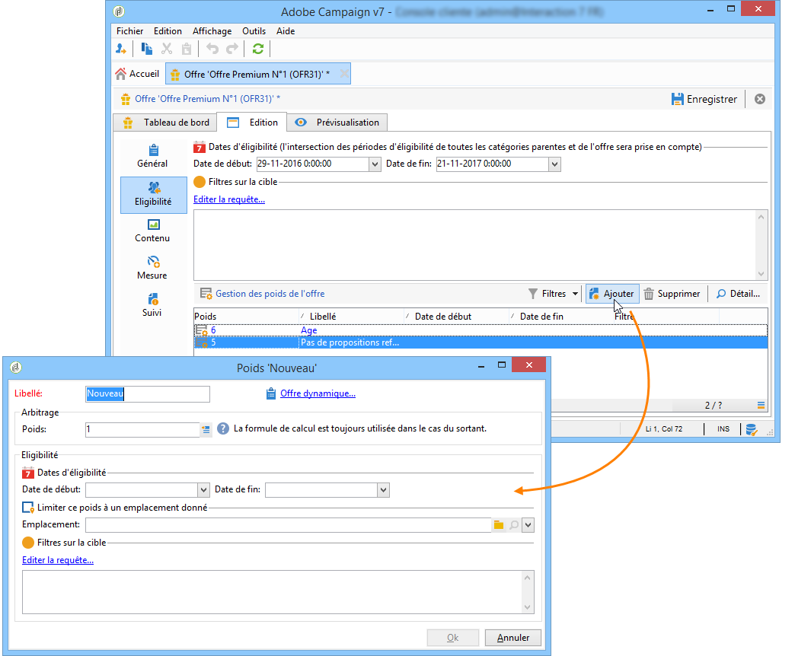

1. Modifiez le libellé et attribuez un poids. Par défaut, celui-ci est de 1.

   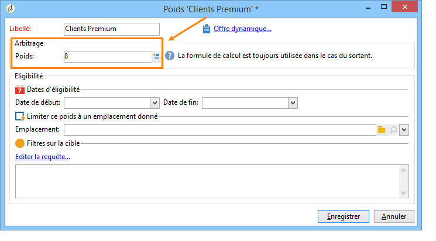

   >[!IMPORTANT]
   >
   >Si aucun poids n&#39;est renseigné (0), la cible est considérée comme inéligible à l&#39;offre.

1. Définissez des dates d&#39;éligibilité si vous souhaitez que le poids ne s&#39;applique que pendant une période donnée.

   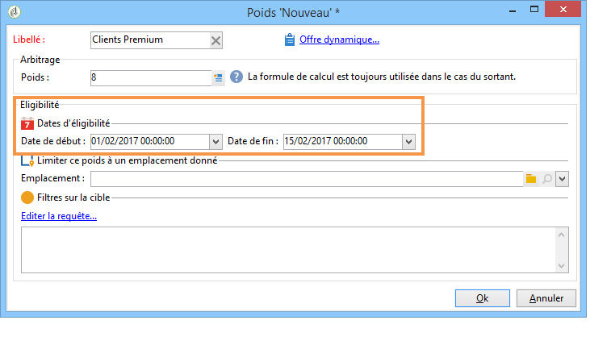

1. Si besoin est, choisissez un emplacement auquel se limitera le poids.

   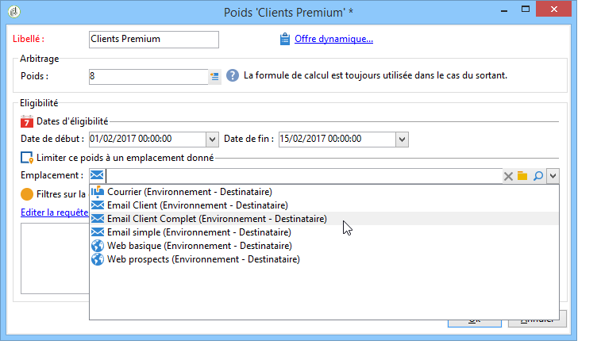

1. Appliquez un filtre sur la cible.

   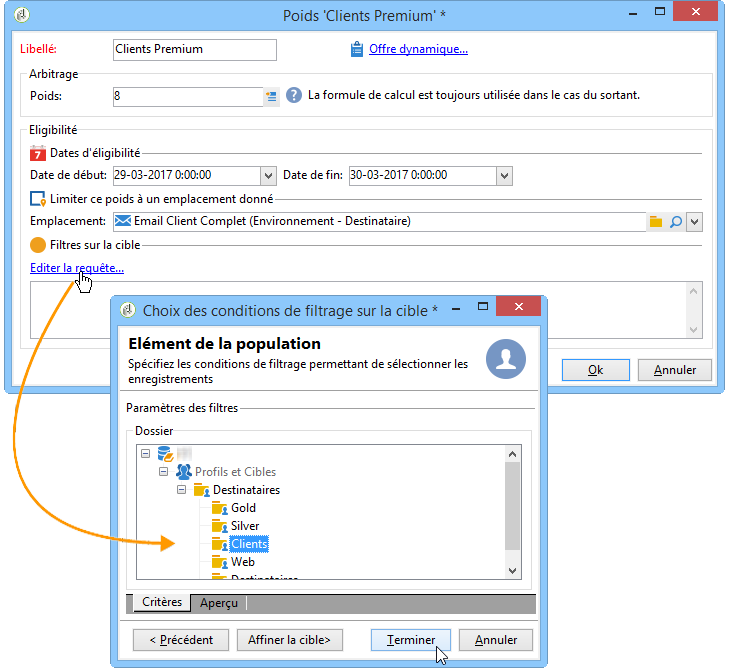

1. Cliquez sur **[!UICONTROL OK]** pour enregistrer le poids.

   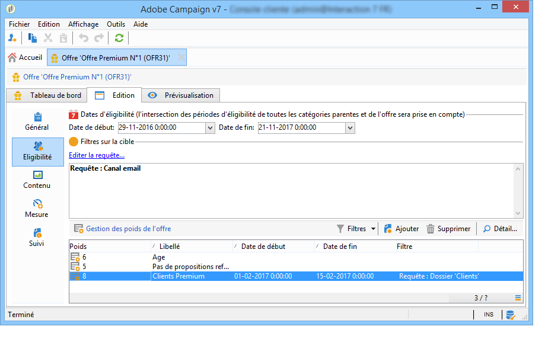

   >[!NOTE]
   >
   >Si un contact est éligible à plusieurs poids pour une offre sélectionnée, le moteur garde le meilleur poids (le plus grand). Lors d&#39;un appel au moteur, une offre ne sort qu&#39;une seule fois maximum par contact.

### Résumé des règles d&#39;éligibilité d&#39;une offre {#a-summary-of-offer-eligibility-rules}

Une fois le paramétrage terminé, un résumé des règles d&#39;éligibilité est disponible dans le tableau de bord de l&#39;offre.

Pour le visualiser, cliquez sur le lien **[!UICONTROL Planning et règles d&#39;éligibilités de l&#39;offre]**.

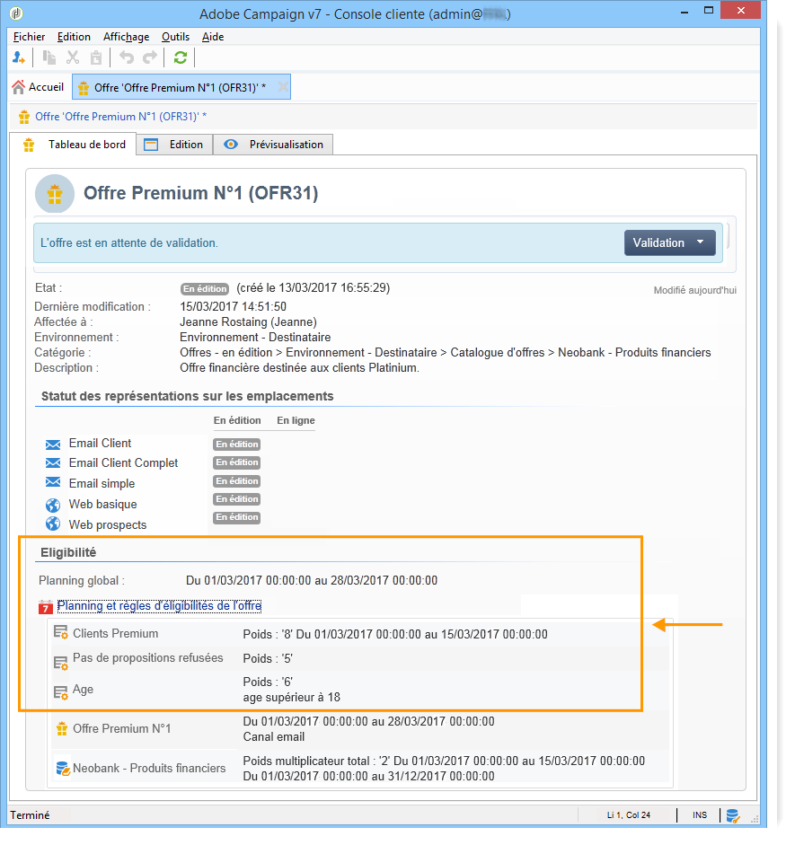

## Créer le contenu de l&#39;offre {#creating-the-offer-content}

1. Cliquez sur l&#39;onglet **[!UICONTROL Edition]** de l&#39;offre, puis sur l&#39;onglet **[!UICONTROL Contenu]**.

   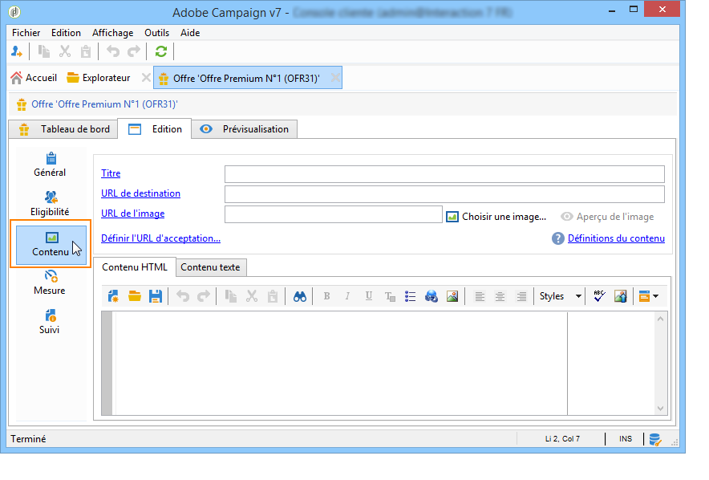

1. Complétez les différents champs du contenu de l&#39;offre.

   * **[!UICONTROL Titre]** : indiquez le titre que vous souhaitez faire apparaître dans votre offre. Attention, il ne s’agit pas du libellé de l’offre, celui-ci étant défini dans l’onglet **[!UICONTROL Général]**.
   * **[!UICONTROL URL de destination]** : indiquez l&#39;URL de votre offre. Pour être traitée correctement, elle doit impérativement débuter par &quot;http://&quot; ou &quot;https://&quot;.
   * **[!UICONTROL URL de l&#39;image]** : indiquez une URL ou un chemin d&#39;accès vers l&#39;image de votre offre.
   * **[!UICONTROL Contenu HTML]** / **[!UICONTROL Contenu texte]** : saisissez le corps de votre offre dans l&#39;onglet de votre souhait. Pour générer le tracking, le **[!UICONTROL contenu HTML]** doit être constitué d&#39;éléments HTML intégrables dans un élément de type `<div>`. Par exemple, le résultat d&#39;un élément `<table>` dans la page HTML sera le suivant :

   ```
      <div> 
       <table>
        <tr>
         <th>Month</th>
         <th>Savings</th>   
        </tr>   
        <tr>    
         <td>January</td>
         <td>$100</td>   
        </tr> 
       </table> 
      </div>
   ```

   La définition de l&#39;URL d&#39;acceptation est présentée dans la section [Paramétrer l&#39;état à l&#39;acceptation de la proposition d&#39;offre](../../interaction/using/creating-offer-spaces.md#configuring-the-status-when-the-proposition-is-accepted).

   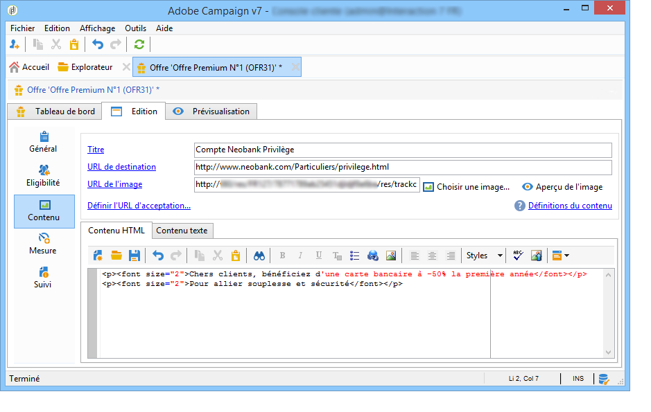

   Pour retrouver les champs requis tels qu&#39;ils ont été définis lors du paramétrage des emplacements, cliquez sur le lien **[!UICONTROL Définitions du contenu]** pour afficher la liste. Voir à ce sujet la section [Créer des emplacements d&#39;offres](../../interaction/using/creating-offer-spaces.md).

   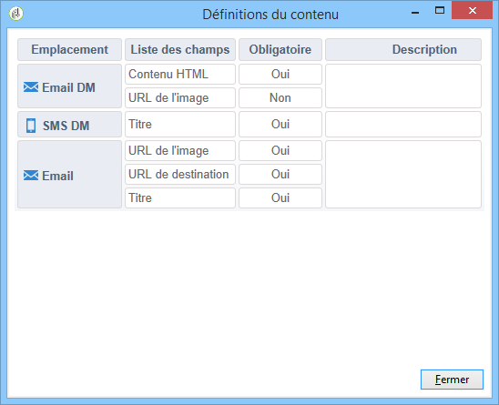

   Dans notre exemple, l&#39;offre doit être constituée d&#39;un titre, d&#39;une image, d&#39;un contenu en HTML et d&#39;une URL de destination.

## Prévisualiser l&#39;offre {#previewing-the-offer}

Dès lors que le contenu de votre offre a été paramétré, vous pouvez prévisualiser l&#39;offre telle qu&#39;elle apparaîtra pour son destinataire. Pour cela :

1. Cliquez sur l&#39;onglet **[!UICONTROL Aperçu]**.

   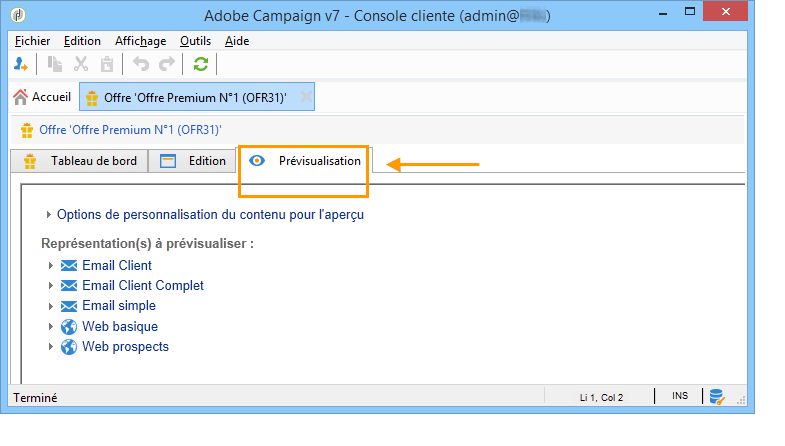

1. Sélectionnez la représentation de l&#39;offre que vous souhaitez voir.

   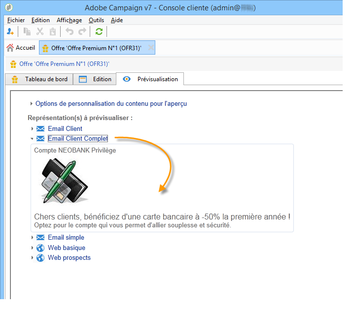

1. Si vous avez personnalisé le contenu de l&#39;offre, sélectionnez la cible de l&#39;offre afin de visualiser la personnalisation.

   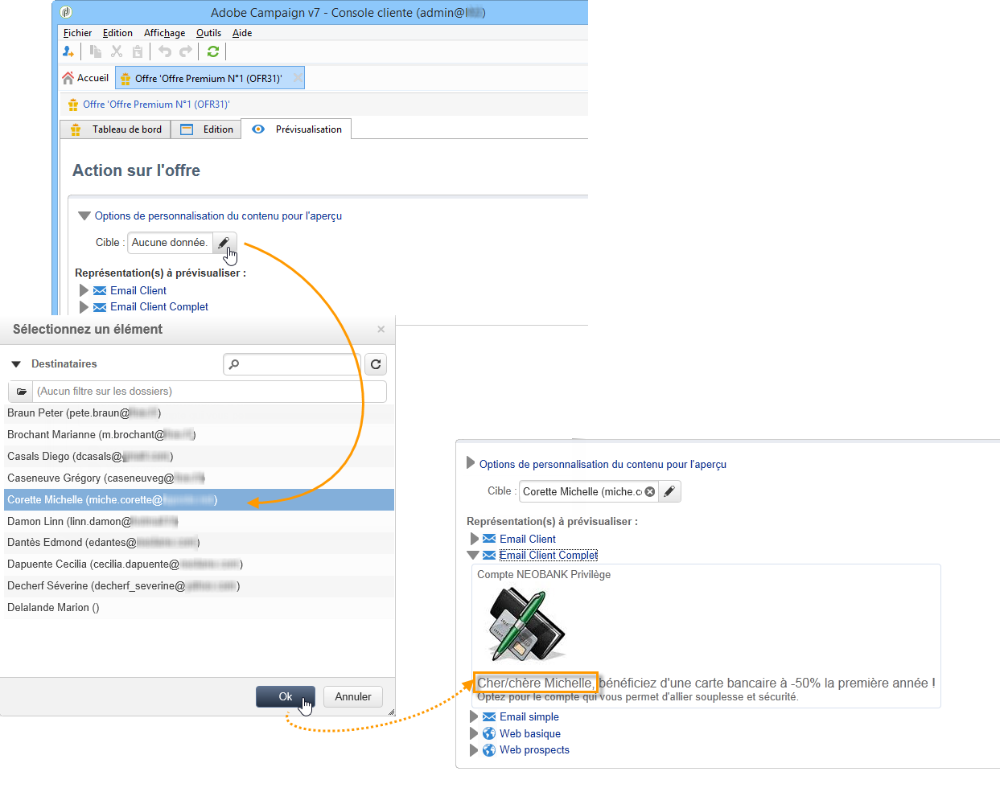

## Créer une hypothèse sur une offre {#creating-a-hypothesis-on-an-offer}

Vous avez la possibilité de créer des hypothèses sur vos propositions d&#39;offres. Cela vous permet de déterminer l&#39;impact de vos offres sur les ventes réalisées pour le produit concerné.

>[!NOTE]
>
>Ces hypothèses sont réalisées à l&#39;aide du module Response Manager. Vérifiez votre contrat de licence.

Les hypothèses réalisées sur une proposition d&#39;offre sont référencées au niveau de leur onglet **[!UICONTROL Mesure]**.

La création des hypothèses est expliquée dans le détail sur [cette page](../../response/using/about-response-manager.md).

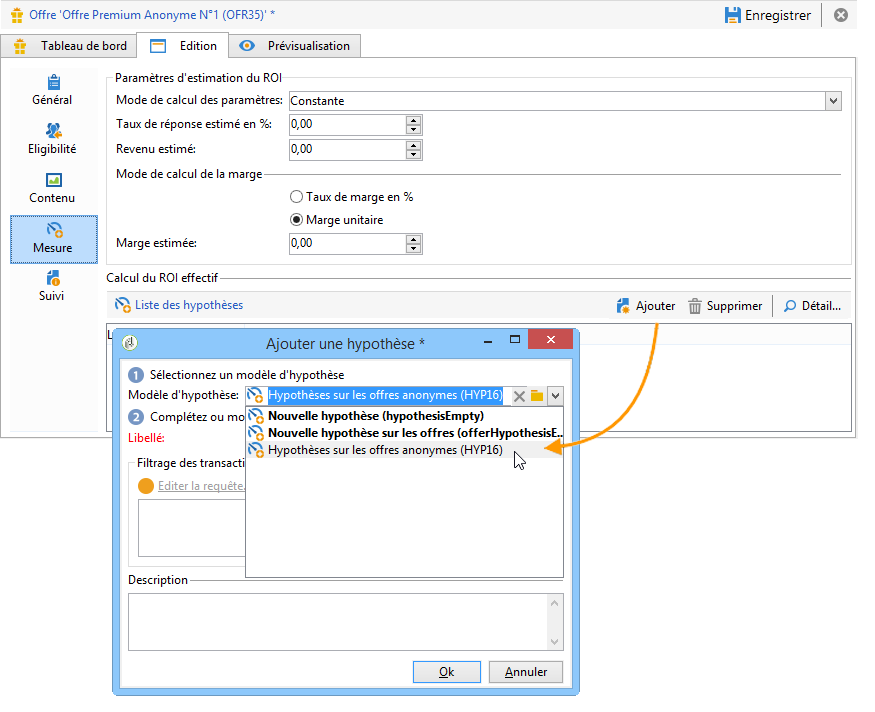
