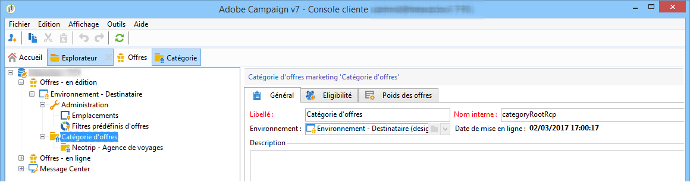
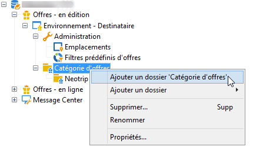
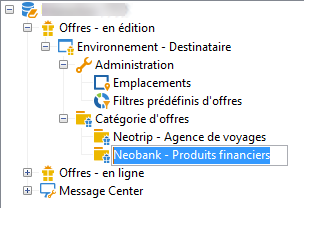
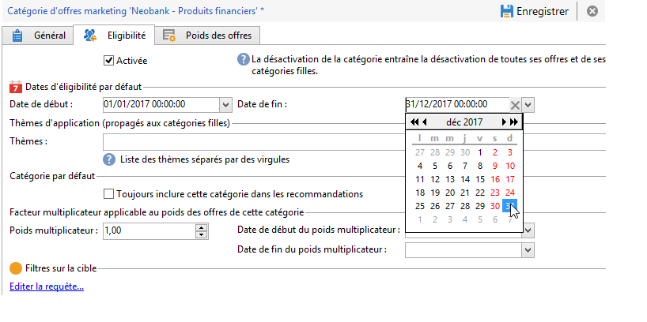
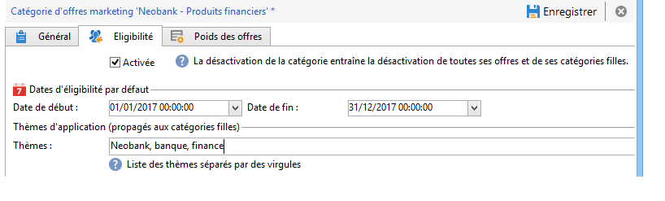
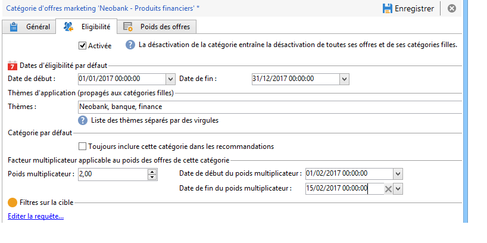
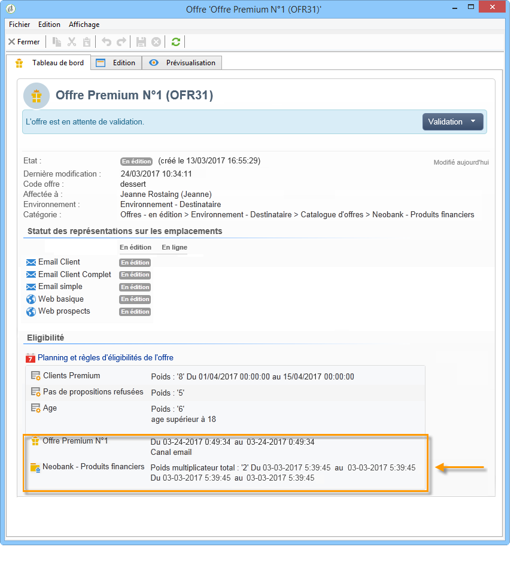

# Créer des catégories d&#39;offres{#creating-offer-categories}

La création des catégories d&#39;offres s&#39;effectue uniquement dans l&#39;environnement **[!UICONTROL En édition]**. Elles sont automatiquement déployées dans l&#39;environnement **[!UICONTROL En ligne]** (c.-à.-d. rendues disponibles pour être proposées) lorsque la ou les offres créées/modifiées qu&#39;elles contiennent sont validées. Par défaut, l&#39;environnement **[!UICONTROL En édition]** contient une catégorie destinée à recevoir l&#39;ensemble des offres. Il est possible de créer des sous-catégories afin de hiérarchiser les offres du catalogue.

Pour chaque catégorie il est possible de définir des dates d&#39;éligibilité, soit une période au-delà de laquelle les offres contenues dans la catégorie ne pourront plus être présentées à leur cible. Si vous souhaitez que les offres d&#39;une catégorie particulière soient sélectionnées en priorité par le moteur d&#39;offres, par exemple pour mieux exposer un produit, vous pouvez augmenter leur poids pendant une période donnée grâce à un poids multiplicateur au niveau de la catégorie.

Pour créer une catégorie supplémentaire, procédez comme suit :

1. Positionnez-vous sur le dossier **[!UICONTROL Catalogue d&#39;offres]**.

   

1. Cliquez avec le bouton droit de la souris et sélectionner **[!UICONTROL Ajouter un dossier &quot;Catégorie d&#39;offres&quot;]** dans le menu contextuel.

   

1. Renommez la catégorie. Vous pourrez modifier le libellé ultérieurement via l&#39;onglet **[!UICONTROL Général]** de la catégorie.

   

   >[!NOTE]
   >
   >Répétez ces étapes pour créer autant de catégories que nécessaire.

   Par la suite, il vous est possible, selon vos besoins :

   * D&#39;attribuer des dates d&#39;éligibilité, depuis l&#39;onglet **[!UICONTROL Éligibilité]**.

     

   * D&#39;entrer des mots-clés qui pourront être utilisés pour sélectionner les offres de cette catégorie, depuis le champ **[!UICONTROL Thèmes]**.

     

     >[!NOTE]
     >
     >Lors de l&#39;appel au moteur d&#39;offres, seule la partie du catalogue dont les thèmes ou les catégories correspondent aux paramètres est sélectionnée.

   * &quot;Boostez&quot; temporairement le poids des offres de la catégorie pour une période donnée, depuis le champ **[!UICONTROL Poids multiplicateur]**.

     

Un récapitulatif des règles d&#39;éligibilité est disponible sur le tableau de bord des offres faisant partie de la catégorie. Pour les visualiser, cliquez sur le lien **[!UICONTROL Planning et règles d&#39;éligibilité de l&#39;offre]**.

