# Créer des emplacements d&#39;offres{#creating-offer-spaces}


La création d&#39;un emplacement ne peut être effectuée que par un **administrateur technique** ayant accès au sous-dossier de l&#39;emplacement. Les emplacements ne peuvent être créés que dans l&#39;environnement en édition et sont automatiquement dupliqués dans l&#39;environnement en ligne lors de la validation des offres.

Le contenu des offres du catalogue est configuré dans les emplacements. Par défaut, le contenu peut contenir les champs suivants : **[!UICONTROL Titre]**, **[!UICONTROL URL de destination]**, **[!UICONTROL URL d&#39;image]**, **[!UICONTROL Contenu HTML]** et **[!UICONTROL Contenu texte]**. La séquence des champs est paramétrée dans l&#39;emplacement.

Des paramètres avancés vous permettent de définir une clé d&#39;identification du contact (qui peut être composée de plusieurs éléments, comme par exemple le champ nom et le champ email à la fois). Voir à ce sujet la section [Présenter une offre identifiée](../../interaction/using/integration-via-javascript-client-side.md#presenting-an-identified-offer).

Le rendu HTML ou XML est réalisé depuis une fonction de rendu. L&#39;ordre des champs définis dans la fonction de rendu doit être identique à celui paramétré dans le contenu.

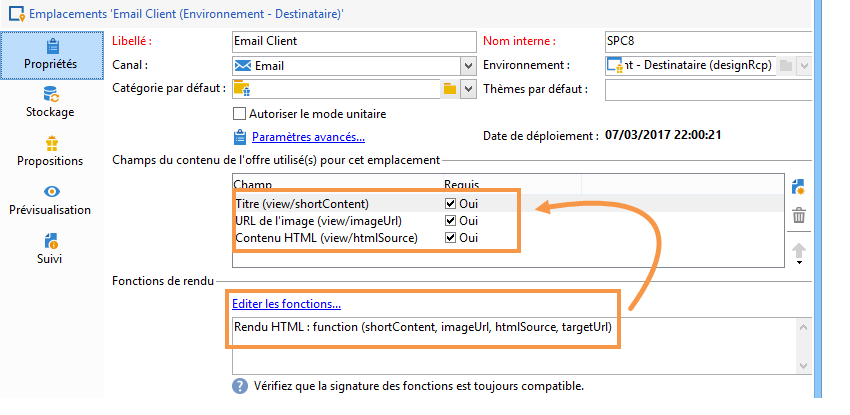

Pour créer un nouvel emplacement, procédez comme suit :

1. Dans la liste des emplacements, cliquez sur **[!UICONTROL Nouveau]**.

   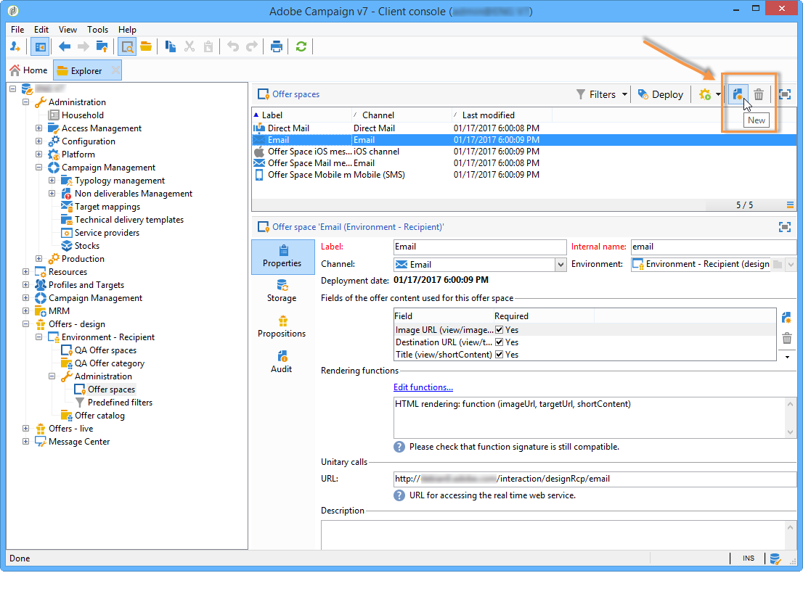

1. Sélectionnez le canal de votre choix et modifiez le libellé de l&#39;emplacement.

   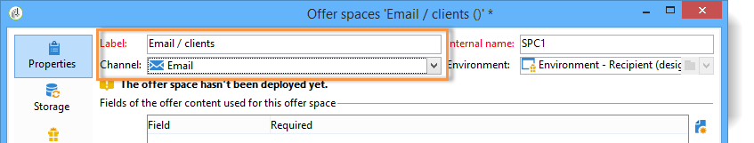

1. Cochez la case **[!UICONTROL Activer le mode unitaire]** si vous êtes dans l’un des deux cas suivants :

   * utilisation d&#39;Interaction avec Message Center
   * si vous utilisez le mode unitaire d&#39;Interaction (interactions entrantes)

1. Dans la fenêtre **[!UICONTROL Champs de contenu]**, cliquez sur **[!UICONTROL Ajouter]**.

   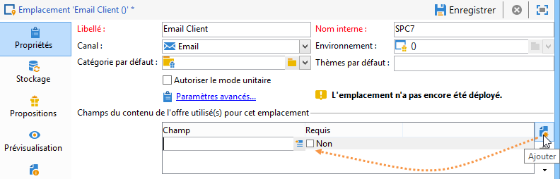

1. Depuis le noeud **[!UICONTROL Contenu]** sélectionnez successivement les champs dans l&#39;ordre suivant : **[!UICONTROL Titre]**, puis **[!UICONTROL URL de l&#39;image]**, puis **[!UICONTROL Contenu HTML]**, puis **[!UICONTROL URL de destination]**.

   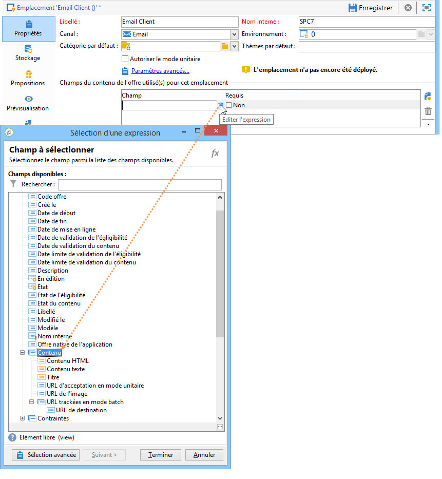

1. Sélectionnez la case **[!UICONTROL Requis]** afin de rendre chaque champ obligatoire.

   >[!NOTE]
   >
   >Cette configuration est utilisée lors de la prévisualisation et rend les emplacements non valides lors de la publication si l&#39;un des éléments obligatoires est manquant dans l&#39;offre concernée. Toutefois, si une offre est déjà en ligne sur un emplacement, ces critères ne sont pas pris en compte.

   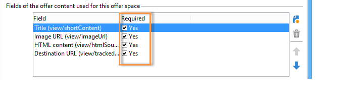

1. Cliquez sur **[!UICONTROL Editer les fonctions]** pour créer une fonction de rendu.

   Ces fonctions sont utilisées pour générer des représentations d&#39;offres sur un emplacement. Il existe plusieurs formats possibles : HTML ou texte pour les interactions sortantes et XML pour les interactions entrantes.

   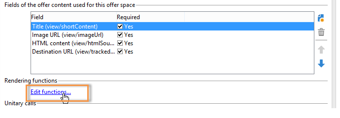

1. Positionnez-vous sur l&#39;onglet **[!UICONTROL Rendu HTML]** et sélectionnez **[!UICONTROL Surcharger la fonction de rendu HTML]**.
1. Insérez votre fonction de rendu.

   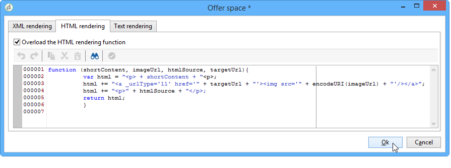

Au besoin, vous pouvez surcharger les fonctions de rendu XML pour les interactions entrantes. Vous pouvez également surcharger les fonctions d’HTML et de rendu texte pour les interactions sortantes. Voir à ce sujet la section [À propos des canaux entrants](../../interaction/using/about-inbound-channels.md).

## États de la proposition d&#39;offre {#offer-proposition-statuses}

Une proposition d&#39;offre peut avoir différents statuts en fonction des interactions avec la population ciblée. Interaction s&#39;accompagne d&#39;un ensemble de valeurs qui peuvent être appliquées à la proposition d&#39;offre tout au long de son cycle de vie. Cependant, vous devez configurer la plateforme afin que l&#39;état de la proposition d&#39;offre soit modifié lors de sa création et de son acceptation.

>[!NOTE]
>
>L&#39;état de la proposition d&#39;offre n&#39;est pas mis à jour immédiatement. Elle est réalisée par le workflow de tracking qui se déclenche toutes les heures.

### Liste des états {#status-list}

Interaction fournit d&#39;usine les valeurs suivantes qui peuvent être utilisées pour marquer l&#39;état d&#39;une proposition d&#39;offre :

* **[!UICONTROL Acceptée]**.
* **[!UICONTROL Différée]**.
* **[!UICONTROL Générée]**.
* **[!UICONTROL Intéressante]**.
* **[!UICONTROL Présentée]**.
* **[!UICONTROL Rejetés]**.

Ces valeurs ne sont pas appliquées par défaut et doivent donc être paramétrées.

>[!NOTE]
>
>Le statut d&#39;une proposition d&#39;offre est automatiquement changée en &quot;Présentée&quot; si l&#39;offre est associée à une diffusion avec le statut &quot;Envoyé&quot;.

### Paramétrer l&#39;état à la création de la proposition {#configuring-the-status-when-the-proposition-is-created}

Lorsqu&#39;une proposition d&#39;offre est créée par le moteur d&#39;interaction, son état est modifié, qu&#39;il s&#39;agisse d&#39;une interaction entrante ou sortante. Le choix entre ces deux valeurs dépend de la configuration des emplacements dans l&#39;environnement **[!UICONTROL Conception]**.

Pour chaque emplacement, vous pouvez configurer l’état que vous souhaitez appliquer lors de la création de la proposition, selon les informations que vous voulez voir apparaître dans les rapports d’offre.

Pour cela :

1. Positionnez-vous dans l&#39;onglet **[!UICONTROL Stockage]** de l&#39;emplacement de votre choix.
1. Sélectionnez l&#39;état que vous souhaitez voir s&#39;appliquer lors de la création de la proposition.

   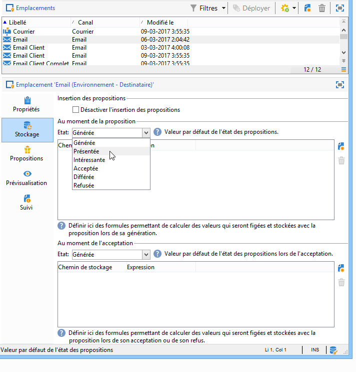

### Paramétrer l&#39;état à l&#39;acceptation de la proposition d&#39;offre {#configuring-the-status-when-the-proposition-is-accepted}

Une fois qu&#39;une proposition d&#39;offre a été acceptée, vous pouvez utiliser l&#39;une des valeurs fournies par défaut pour configurer le nouvel état de la proposition. La mise à jour est effective lorsqu&#39;un destinataire clique sur un lien de l&#39;offre, ce qui appelle le moteur d&#39;Interaction.

Pour cela :

1. Positionnez-vous dans l&#39;onglet **[!UICONTROL Stockage]** de l&#39;emplacement de votre choix.
1. Sélectionnez l&#39;état que vous souhaitez appliquer à la proposition lorsqu&#39;elle est acceptée.

   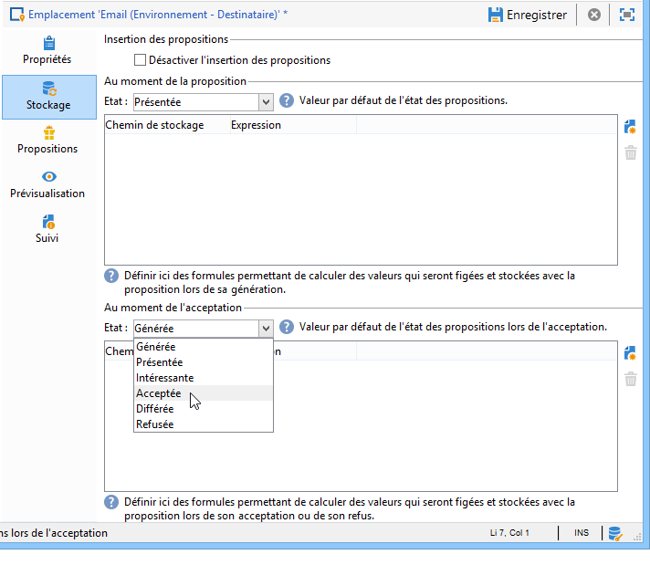

**Interaction entrante**

L&#39;onglet **[!UICONTROL Stockage]** permet de définir les statuts des propositions d&#39;offre **proposées** et **acceptées** uniquement. Dans le cas d&#39;une interaction entrante, le statut des propositions d&#39;offre doit être spécifié directement dans l&#39;URL d&#39;appel du moteur d&#39;offres, plutôt que via l&#39;interface. Vous serez ainsi en mesure de spécifier l&#39;état à appliquer dans d&#39;autres cas, par exemple si une proposition d&#39;offre est rejetée.

```
<BASE_URL>?a=UpdateStatus&p=<PRIMARY_KEY_OF_THE_PROPOSITION>&st=<NEW_STATUS_OF_THE_PROPOSITION>&r=<REDIRECT_URL>
```

Par exemple, la proposition (identifiant **40004**) correspondant à l’offre **Assurance habitation** et diffusée sur la page du site **Neobank** contient l’URL suivante :

```
<BASE_URL>?a=UpdateStatus&p=<40004>&st=<3>&r=<"http://www.neobank.com/insurance/subscribe.html">
```

Dès lors qu&#39;un visiteur clique sur l&#39;offre, et donc sur l&#39;URL, le statut **[!UICONTROL Acceptée]**, (correspondant à la valeur **3**), est appliqué à la proposition et le visiteur est redirigé sur une nouvelle page du site **Neobank** pour souscrire à l&#39;assurance.

>[!NOTE]
>
>Si vous souhaitez indiquer un autre statut dans l’URL (par exemple, si une proposition d’offre est refusée), utilisez la valeur correspondant au statut souhaité. Exemple : **[!UICONTROL Rejetée]** = « 5 », **[!UICONTROL Présentée]** = « 1 », etc.
>
>Les statuts et leurs valeurs peuvent être récupérés dans le schéma de données **[!UICONTROL Propositions d’offres (nms)]**. Pour plus d’informations, consultez [cette page](../../configuration/using/data-schemas.md).

**Interaction sortante**

Dans le cas d’une interaction sortante, vous pouvez appliquer automatiquement le statut **[!UICONTROL Intéressante]** à une proposition d&#39;offre lorsque la diffusion contient un lien. Ajoutez simplement la valeur **_urlType=&quot;11&quot;** au lien :

```
<a _urlType="11" href="<DEST_URL>">Link inserted into the delivery</a>
```

## Prévisualisation des offres par emplacement {#offer-preview-per-space}

Dans cet onglet, vous pouvez visualiser les offres auxquelles le destinataire est éligible via une méthode sélectionnée. Dans l&#39;exemple ci-dessous, le destinataire est éligible à trois propositions d&#39;offres par mail.

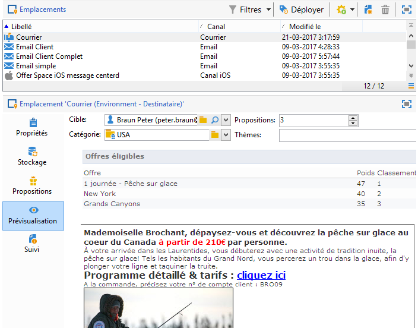

Dans le cas où le destinataire n&#39;est éligible à aucune offre, la prévisualisation vous permet d&#39;en faire la vérification.

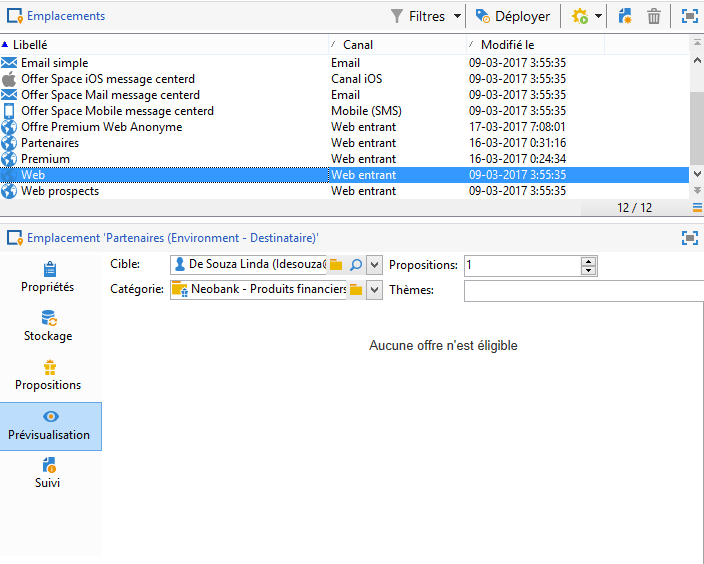

L’aperçu peut ignorer les contextes lorsqu’ils sont limités à un espace. C’est le cas lorsque le schéma d’interaction a été étendu pour ajouter des champs référencés dans un espace à l’aide d’un canal entrant (voir à ce sujet la section [Exemple d’extension](../../interaction/using/extension-example.md)).
