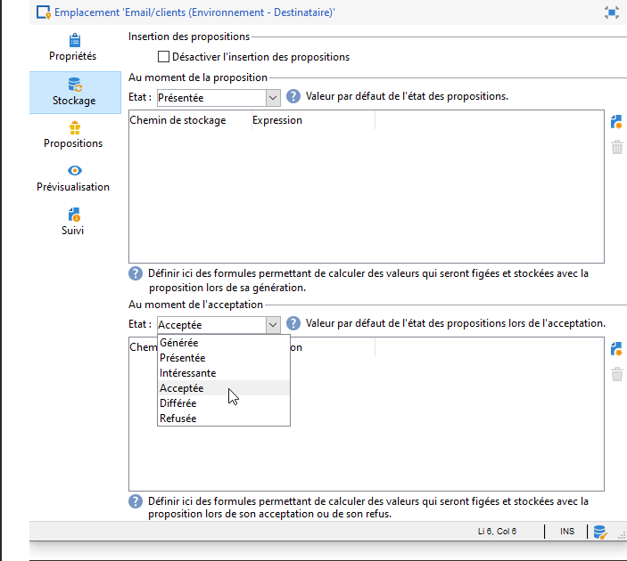

# Créer des emplacements d&#39;offres{#creating-offer-spaces}


La création des emplacements ne peut être effectuée que par un **administrateur technique** qui a accès au sous-dossier des emplacements. Elle ne s&#39;effectue que dans l&#39;environnement en édition. Les emplacements sont automatiquement dupliqués dans l&#39;environnement en ligne lors de la validation des offres.

Le contenu des offres du catalogue est paramétré dans les emplacements. Par défaut, le contenu peut être composé des champs suivants : **[!UICONTROL Titre]**, **[!UICONTROL URL de destination]**, **[!UICONTROL URL de l&#39;image]**, **[!UICONTROL Contenu HTML]** et **[!UICONTROL Contenu Texte]**. L&#39;ordre des champs est paramétré au niveau de l&#39;emplacement.

Des paramètres avancés vous permettent de définir une clé d&#39;identification du contact (qui peut être composée de plusieurs éléments, comme par exemple le champ nom et le champ email à la fois). Voir à ce sujet la section [Présenter une offre identifiée](../../interaction/using/integration-via-javascript--client-side-.md#presenting-an-identified-offer).

Le rendu HTML ou XML est créé via une fonction de rendu. L&#39;ordre des champs définis dans la fonction de rendu doit être identique à celui paramétré dans le contenu.


Pour créer un nouvel emplacement, procédez comme suit :

1. Dans la liste des emplacements, cliquez sur **[!UICONTROL Nouveau]**.

   

1. Sélectionnez le canal de votre choix et modifiez le libellé de l&#39;emplacement.

   

1. Cochez la case **[!UICONTROL Autoriser le mode unitaire]** si vous êtes dans l&#39;un des deux cas suivants :

   * utilisation d&#39;Interaction avec Message Center
   * si vous utilisez le mode unitaire d&#39;Interaction (interactions entrantes)

1. Dans la fenêtre **[!UICONTROL Champs de contenu]**, cliquez sur **[!UICONTROL Ajouter]**.

   

1. Depuis le noeud **[!UICONTROL Contenu]** sélectionnez successivement les champs dans l&#39;ordre suivant : **[!UICONTROL Titre]**, puis **[!UICONTROL URL de l&#39;image]**, puis **[!UICONTROL Contenu HTML]**, puis **[!UICONTROL URL de destination]**.

   

1. Sélectionnez la case **[!UICONTROL Requis]** afin de rendre chaque champ obligatoire.

   >[!NOTE]
   >
   >Ce paramètre est utilisé lors de la prévisualisation et rend les emplacements invalides à la mise en ligne si l&#39;un des éléments obligatoires est manquant dans l&#39;offre concernée. Cependant, si une offre est déjà en ligne sur un emplacement, ce critère n&#39;est pas pris en compte.

   

1. Cliquez sur **[!UICONTROL Editer les fonctions]** pour créer une fonction de rendu.

   Ces fonctions sont utilisées pour générer la représentation des offres sur un emplacement. Plusieurs formats sont possibles : le HTML ou le texte pour les interactions sortantes et le XML pour les interactions entrantes.

   

1. Positionnez-vous sur l&#39;onglet **[!UICONTROL Rendu HTML]** et sélectionnez **[!UICONTROL Surcharger la fonction de rendu HTML]**.
1. Insérez votre fonction de rendu.

   

Pour les interactions entrantes, vous pouvez surcharger les fonctions de rendu XML, si besoin. Pour les interactions sortantes, vous pouvez surcharger les fonctions de rendu HTML et texte. Voir à ce sujet la section [À propos des canaux entrants](../../interaction/using/about-inbound-channels.md).

## États de la proposition d&#39;offre {#offer-proposition-statuses}

Une proposition d&#39;offre peut avoir différents états en fonction des interactions avec la population ciblée. Interaction fournit d&#39;usine un ensemble de valeurs qui peuvent être appliquées à la proposition d&#39;offre tout au long de son cycle de vie. Vous devez cependant paramétrer la plateforme afin que l&#39;état soit modifié lorsque la proposition d&#39;offre est créée, puis acceptée.

>[!NOTE]
>
>La mise à jour de l&#39;état des propositions d&#39;offre n&#39;est pas immédiate. Elle est réalisée par le workflow de tracking qui se déclenche toutes les heures.

### Liste des états {#status-list}

Interaction fournit d&#39;usine les valeurs suivantes qui peuvent être utilisées pour marquer l&#39;état d&#39;une proposition d&#39;offre :

* **[!UICONTROL Acceptée]**.
* **[!UICONTROL Différée]**.
* **[!UICONTROL Générée]**.
* **[!UICONTROL Intéressante]**.
* **[!UICONTROL Présentée]**.
* **[!UICONTROL Rejetés]**.

Ces valeurs ne sont pas appliquées par défaut et doivent donc être paramétrées.

>[!NOTE]
>
>Le statut d&#39;une proposition d&#39;offre est automatiquement changée en &quot;Présentée&quot; si l&#39;offre est associée à une diffusion avec le statut &quot;Envoyé&quot;.

### Paramétrer l&#39;état à la création de la proposition {#configuring-the-status-when-the-proposition-is-created}

Lorsqu&#39;une proposition d&#39;offre est créée par le moteur d&#39;interaction, son état est modifié, qu&#39;il s&#39;agisse d&#39;une interaction entrante ou sortante. Le choix entre les différentes valeurs dépend de la façon dont auront été configurés les emplacements des offres dans l&#39;environnement **[!UICONTROL En édition]**.

Pour chaque emplacement, vous pouvez paramétrer l&#39;état que vous souhaitez appliquer lors de la création de la proposition, selon l&#39;information que vous voulez voir apparaître dans les rapports d&#39;offre.

Pour cela :

1. Positionnez-vous dans l&#39;onglet **[!UICONTROL Stockage]** de l&#39;emplacement de votre choix.
1. Sélectionnez l&#39;état que vous souhaitez voir s&#39;appliquer lors de la création de la proposition.

   

### Paramétrer l&#39;état à l&#39;acceptation de la proposition d&#39;offre {#configuring-the-status-when-the-proposition-is-accepted}

Lorsqu&#39;une proposition d&#39;offre est acceptée, vous pouvez utiliser une des valeurs fournies par défaut pour configurer le nouvel état de la proposition. La mise à jour est effective lorsqu&#39;un destinataire clique sur un lien contenu dans l&#39;offre, ce qui a pour effet d&#39;appeler le moteur d&#39;interaction.

Pour cela :

1. Positionnez-vous dans l&#39;onglet **[!UICONTROL Stockage]** de l&#39;emplacement de votre choix.
1. Sélectionnez l&#39;état que vous souhaitez appliquer à la proposition lorsqu&#39;elle est acceptée.

   

**Interaction entrante**

L&#39;onglet **[!UICONTROL Stockage]** permet de définir les états des propositions d&#39;offre **présentée** et **acceptée** uniquement. Dans le cas d&#39;une interaction entrante, vous devez préciser directement l&#39;état de la proposition d&#39;offre dans l&#39;URL d&#39;appel plutôt que dans l&#39;interface. Vous serez ainsi en mesure de spécifier l&#39;état à appliquer dans d&#39;autres cas, par exemple si une proposition d&#39;offre est refusée.

```
<BASE_URL>?a=UpdateStatus&p=<PRIMARY_KEY_OF_THE_PROPOSITION>&st=<NEW_STATUS_OF_THE_PROPOSITION>&r=<REDIRECT_URL>
```

Par exemple, la proposition (identifiant **40004**) correspondant à l&#39;offre **Assurance habitation** et diffusée sur la page du site **Neobank** contient l&#39;URL suivante :

```
<BASE_URL>?a=UpdateStatus&p=<40004>&st=<3>&r=<"http://www.neobank.com/insurance/subscribe.html">
```

Dès lors qu&#39;un visiteur clique sur l&#39;offre, et donc sur l&#39;URL, le statut **[!UICONTROL Acceptée]**, (correspondant à la valeur **3**), est appliqué à la proposition et le visiteur est redirigé sur une nouvelle page du site **Neobank** pour souscrire à l&#39;assurance.

>[!NOTE]
>
>Si vous souhaitez appliquer un autre état dans l&#39;URL (par exemple, si une proposition d&#39;offre est refusée), utilisez la valeur correspondant à l&#39;état souhaité. Par exemple, **[!UICONTROL Refusée]** = &quot;5&quot;, **[!UICONTROL Présentée]** = &quot;1&quot;, etc.
>
>Les états et leur valeur peuvent être récupérés dans le schéma de données **[!UICONTROL Offer propositions (nms)]**. Voir à ce propos [cette page](../../configuration/using/data-schemas.md).

**Interaction sortante**

Dans le cas d&#39;une interaction sortante, vous pouvez appliquer automatiquement le statut **[!UICONTROL Intéressante]** à une proposition d&#39;offre lorsque la diffusion contient un lien. Il suffit d&#39;ajouter la valeur **_urlType=&quot;11&quot;** dans le lien :

```
<a _urlType="11" href="<DEST_URL>">Link inserted into the delivery</a>
```

## Prévisualisation des offres par emplacement {#offer-preview-per-space}

Dans cet onglet vous pouvez visualiser les offres auxquelles un destinataire est éligible sur un emplacement choisi. Dans l&#39;exemple ci-dessous, le destinataire est éligible à trois propositions d&#39;offres sur l&#39;emplacement courrier.


Dans le cas où le destinataire n&#39;est éligible à aucune offre, la prévisualisation vous permet d&#39;en faire la vérification.


L’aperçu peut ignorer les contextes lorsqu’ils sont limités à un espace. C’est le cas lorsque le schéma d’interaction a été étendu pour ajouter des champs référencés dans un espace à l’aide d’un canal entrant (voir à ce sujet la section [Exemple d’extension](../../interaction/using/extension-example.md)).
