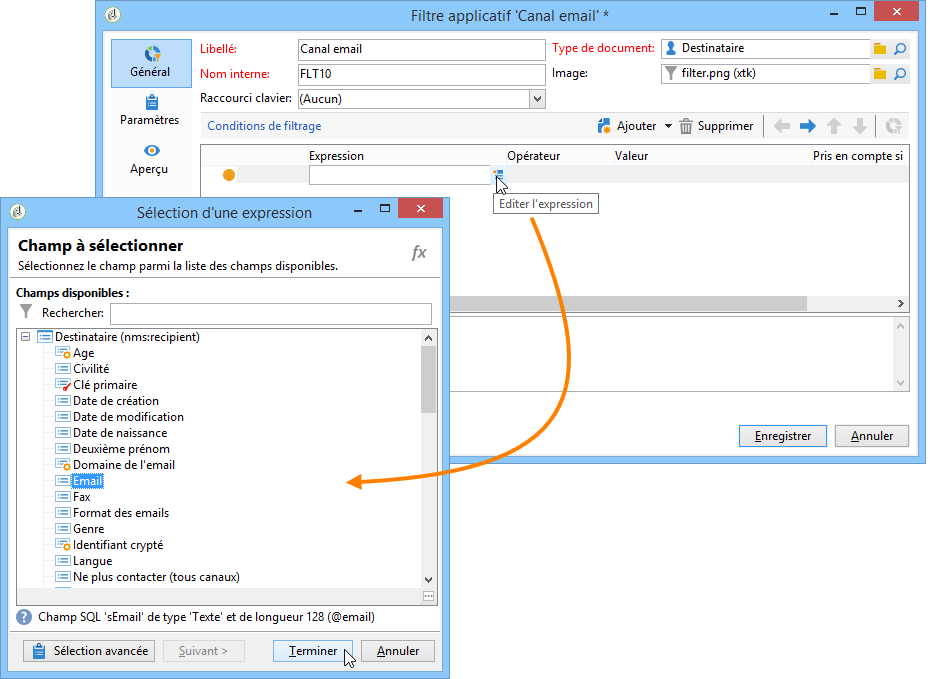

# Création de filtres prédéfinis{#creating-predefined-filters}

Les filtres prédéfinis permettent de créer des règles d&#39;éligibilité sur la population ciblée qui pourront être facilement réutilisées lors de la création des offres. Ils sont propres à chaque environnement et permettent de prendre en compte les paramètres des offres.

Pour créer un filtre, procédez comme suit :

1. Dans le dossier **[!UICONTROL Administration]**, positionnez-vous sur **[!UICONTROL Filtres prédéfinis d&#39;offres]**.

   

1. Cliquez sur **[!UICONTROL Nouveau]**.

   

1. Modifiez le libellé afin de pouvoir identifier le filtre ultérieurement.

   

1. Choisissez le champ sur lequel doit porter la condition de filtrage.

   

1. Choisissez un opérateur et si nécessaire une valeur, puis enregistrez la requête.

   

1. Cliquez sur **[!UICONTROL Aperçu]** pour visualiser le résultat du filtre.

   
