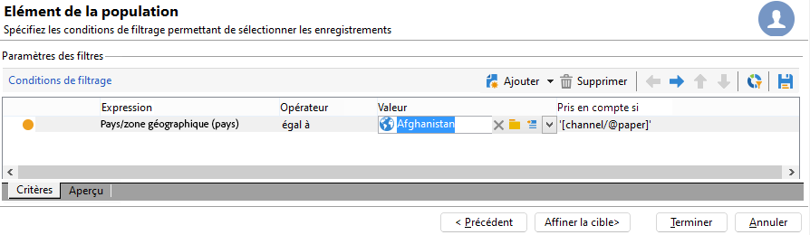

# Architectures réparties{#distributed-architectures}


## Principe {#principle}

Afin de supporter les montées en charge et assurer un service en continu sur le canal entrant, il est possible d&#39;utiliser Interaction avec une architecture répartie. Ce type d&#39;architecture, déjà utilisé avec Message Center, est constituée de plusieurs instances :

* une ou plusieurs instances de pilotage dédiées au canal sortant et contenant la base marketing et l&#39;environnement en édition
* une ou plusieurs instances d&#39;exécution dédiées au canal entrant


>[!NOTE]
>
>Les instances d&#39;exécution sont dédiées au canal entrant et contiennent la version en ligne du catalogue. Chaque instance d&#39;exécution est indépendante et dédiée à un segment de contacts (par exemple, une instance d&#39;exécution par pays). Les appels au moteur d&#39;offres doivent être effectués directement sur les instances d&#39;exécution (une URL spécifique par instance d&#39;exécution). La synchronisation entre plusieurs instances d&#39;exécution n&#39;étant pas automatique, les interactions d&#39;un même contact doivent être envoyées vers une même instance.

## Synchronisation des propositions {#proposition-synchronization}

La synchronisation des offres s&#39;effectue par packages. Sur les instances d&#39;exécution, tous les objets du catalogue sont préfixés par le nom du compte externe. Cela permet le support de plusieurs instances de pilotage (instances de développement et de production par exemple) sur une même instance d&#39;exécution.

>[!IMPORTANT]
>
>Nous vous recommandons fortement d&#39;utiliser des noms internes courts et explicites.

Les offres sont automatiquement déployées puis publiées sur les instances d&#39;exécution et l&#39;instance de pilotage.

Les offres supprimées dans l&#39;environnement en édition sont désactivées sur toutes les instances en ligne. Les propositions et les offres obsolètes sont automatiquement supprimées de toutes les instances lorsque la période de purge (définie dans l&#39;assistant de déploiement sur chaque instance) et la période glissante (définie dans les règles de typologie des propositions entrantes) sont dépassées.


Un workflow est créé pour chaque compte externe et environnement pour la synchronisation des propositions. La fréquence de synchronisation peut être ajustée pour chaque environnement et compte externe.

## Limites {#limitations}

* Si vous utilisez la fonction de basculement (fall back) d&#39;un environnement anonyme vers un environnement identifié, ces deux environnements doivent être sur la même instance d&#39;exécution.
* La synchronisation entre plusieurs instances d&#39;exécution ne s&#39;effectue pas en temps réel. Les interactions d&#39;un même contact doivent être envoyées vers une même instance. L&#39;instance de pilotage doit être dédiée au canal sortant (pas de temps réel).
* La synchronisation de la base marketing n&#39;est pas automatique. Les données marketing utilisées dans le cadre des règles d&#39;éligibilité et des poids doivent être dupliquées sur les instances d&#39;exécution. Ce processus n&#39;est pas fourni en standard, vous devez le développer pendant la phase d&#39;intégration.
* La synchronisation des propositions s&#39;effectue exclusivement par connexion FDA.
* Si vous utilisez Interaction et Message Center sur une même instance, la synchronisation s&#39;effectuera par protocole FDA dans les deux cas.

## Configuration des packages {#packages-configuration}

Les éventuelles extensions de schémas directement liées à **Interaction** (offres, propositions, destinataires, etc.) doivent être déployées sur les instances d&#39;exécution.

Le package Interaction doit être installé sur toutes les instances (pilotage et exécution). Deux packages supplémentaires sont disponibles : un package dédié à installer sur les instances de pilotage, et un package dédié à installer sur chaque instance d&#39;exécution.

>[!NOTE]
>
>Lors de l&#39;installation du package, les champs de type **long** de la table **nms:proposition**, tels que l&#39;identifiant de la proposition, deviennent de type **int64**. Les types de données sont décrits dans [cette section](../../configuration/using/schema-structure.md#mapping-the-types-of-adobe-campaign-dbms-data).

La durée de rétention des données doit être paramétrée sur chaque instance (via la fenêtre **[!UICONTROL Purge des données]** de l&#39;assistant de déploiement). Sur les instances d&#39;exécution, cette période doit correspondre à la profondeur d&#39;historique nécessaire au calcul des règles de typologie (période glissante) et aux règles d&#39;éligibilité.

Sur les instances de pilotage :

1. Créez un compte externe par instance d&#39;exécution :

   

   * Renseignez le libellé et un nom interne court et explicite.
   * Sélectionnez le type **[!UICONTROL Instance d&#39;exécution]**.
   * Cochez l&#39;option **[!UICONTROL Activé]**.
   * Renseignez les paramètres de connexion à l&#39;instance d&#39;exécution.
   * Chaque instance d&#39;exécution doit être associée à un identifiant. Cet identifiant est attribué lorsque vous cliquez sur le bouton **[!UICONTROL Initialiser la connexion]**.
   * Cochez le type d&#39;application utilisée : **[!UICONTROL Message Center]**, **[!UICONTROL Interaction]**, ou les deux.
   * Renseignez le compte FDA utilisé. Un opérateur doit être créé sur les instances d&#39;exécution et doit posséder les droits de lecture et de modification suivants au niveau de la base de données de l&#39;instance en question :

      ```
      grant SELECT ON nmspropositionrcp, nmsoffer, nmsofferspace, xtkoption, xtkfolder TO user;
      grant DELETE, INSERT, UPDATE ON nmspropositionrcp TO user;
      ```

   >[!NOTE]
   >
   >L&#39;adresse IP de l&#39;instance de pilotage doit être autorisée sur les instances d&#39;exécution.

1. Configurez l&#39;environnement :

   

   * Ajoutez la liste des instances d&#39;exécutions.
   * Définissez pour chacune la fréquence de synchronisation et les critères de filtrage (par exemple par pays).

      >[!NOTE]
      >
      >En cas d&#39;erreur, vous pouvez consulter les workflows de synchronisation et de notification des offres, disponibles dans les workflows techniques de l&#39;application.

Si, pour des raisons d&#39;optimisation, seulement une partie de la base marketing est dupliquée sur les instances d&#39;exécution, il est possible de définir un schéma restreint associé à l&#39;environnement afin de permettre aux utilisateurs de n&#39;utiliser que les données disponibles sur les instances d&#39;exécution. Il est possible de créer une offre utilisant des données non disponibles sur les instances d&#39;exécution. Pour cela, vous devez désactiver la règle sur les autres canaux en limitant cette règle au canal sortant (champ **[!UICONTROL Pris en compte si]**).



## Options de maintenance {#maintenance-options}

Voici la liste des options de maintenance disponibles sur l&#39;instance de pilotage :

>[!IMPORTANT]
>
>Ces options ne doivent être utilisées que dans des cas de maintenance spécifiques.

* **`NmsInteraction_LastOfferEnvSynch_<offerEnvId>_<executionInstanceId>`** : date de dernière synchronisation d&#39;un environnement sur une instance donnée.
* **`NmsInteraction_LastPropositionSynch_<propositionSchema>_<executionInstanceIdSource>_<executionInstanceIdTarget>`** : date de dernière synchronisation des propositions d&#39;un schéma donné d&#39;une instance vers une autre.
* **`NmsInteraction_MapWorkflowId`** : option contenant la liste de tous les workflows de synchronisation générés.

L&#39;option suivante est disponible sur les instances d&#39;exécution :

**NmsExecutionInstanceId** : option contenant l&#39;identifiant de l&#39;instance.

## Installation des packages {#packages-installation}

Lors de l&#39;installation des packages Interaction de pilotage et d&#39;exécution, la taille en base de données des identifiants des propositions passe de 32 à 64 bits.

>[!IMPORTANT]
>
>Selon le volume de propositions existantes dans votre instance, cette opération peut être très longue.

* Si votre instance ne comporte pas ou peu de propositions, aucune modification manuelle de la table des propositions n&#39;est nécessaire. La modification sera faite au moment de l&#39;installation des packages.
* Si votre instance comporte un grand nombre de propositions, il est préférable de changer la structure de la table des propositions avant l&#39;installation des packages de pilotage et d&#39;exécution. Nous vous conseillons d&#39;exécuter les requêtes à une période creuse.

>[!NOTE]
>
>Si vous avez effectué des paramétrages spécifiques dans la table des propositions, adaptez les requêtes en conséquence.

### PostgreSQL {#postgresql}

Deux méthodes sont possibles. La première (utilisation d&#39;une table de travail) est un peu plus rapide.

**Table de travail**

```
CREATE TABLE NmsPropositionRcp_tmp AS SELECT * FROM nmspropositionrcp WHERE 0=1;
ALTER TABLE nmspropositionrcp_tmp
  ALTER COLUMN ipropositionid TYPE bigint,
  ALTER COLUMN iinteractionid TYPE bigint;
INSERT INTO nmspropositionrcp_tmp SELECT * FROM nmspropositionrcp;
DROP TABLE nmspropositionrcp;
CREATE INDEX proposition_id ON NmsPropositionRcp (ipropositionid);
CREATE INDEX nmspropositionrcp_deliveryid ON NmsPropositionRcp (ideliveryid);
CREATE INDEX nmspropositionrcp_lastmodified ON NmsPropositionRcp (tslastmodified);
CREATE INDEX nmspropositionrcp_offerid ON NmsPropositionRcp (iofferid);
CREATE INDEX nmspropositionrcp_offerspaceid ON NmsPropositionRcp (iofferspaceid);
CREATE INDEX nmspropositionrcp_recipientidid ON NmsPropositionRcp (irecipientid);
ALTER TABLE nmspropositionrcp_tmp RENAME TO nmspropositionrcp;
```

**Alter Table**

```
ALTER TABLE nmspropositionrcp
  ALTER COLUMN ipropositionid TYPE bigint,
  ALTER COLUMN iinteractionid TYPE bigint;
```

### Oracle {#oracle}

La modification de la taille d&#39;un type **Number** n&#39;entraîne pas la réécriture des valeurs ou des index. Elle est donc immédiate.

La requête à exécuter est la suivante :

```
ALTER TABLE nmspropositionrcp MODIFY (
ipropositionid NUMBER(19, 0),
iinteractionid NUMBER(19, 0)
);
```

### MSSQL {#mssql}

Les requêtes à exécuter sont les suivantes :

```
SELECT * INTO NmsPropositionRcp_tmp FROM NmsPropositionRcp WHERE 1 = 0;
GO
ALTER TABLE NmsPropositionRcp_tmp ALTER COLUMN ipropositionid BIGINT;
GO
ALTER TABLE NmsPropositionRcp_tmp ALTER COLUMN iinteractionid BIGINT;
GO
INSERT INTO NmsPropositionRcp_tmp SELECT * FROM NmsPropositionRcp;
GO
DROP TABLE NmsPropositionRcp;
GO
sp_rename 'NmsPropositionRcp_tmp', NmsPropositionRcp
GO
ALTER TABLE NmsPropositionRcp ADD DEFAULT ((0)) FOR dWeight
GO
ALTER TABLE NmsPropositionRcp ADD DEFAULT ((0)) FOR iDeliveryId
GO
ALTER TABLE NmsPropositionRcp ADD DEFAULT ((0)) FOR iEngineType
GO
ALTER TABLE NmsPropositionRcp ADD DEFAULT ((0)) FOR iInteractionId
GO
ALTER TABLE NmsPropositionRcp ADD DEFAULT ((0)) FOR iOfferId
GO
ALTER TABLE NmsPropositionRcp ADD DEFAULT ((0)) FOR iOfferSpaceId
GO
ALTER TABLE NmsPropositionRcp ADD DEFAULT ((0)) FOR iPropositionId
GO
ALTER TABLE NmsPropositionRcp ADD DEFAULT ((0)) FOR iRank
GO
ALTER TABLE NmsPropositionRcp ADD DEFAULT ((0)) FOR iRecipientId
GO
ALTER TABLE NmsPropositionRcp ADD DEFAULT ((0)) FOR iStatus
GO
CREATE NONCLUSTERED INDEX NmsPropositionRcp_deliveryId ON NmsPropositionRcp (iDeliveryId)
GO
CREATE NONCLUSTERED INDEX NmsPropositionRcp_eventDate ON NmsPropositionRcp (tsEvent)
GO
CREATE UNIQUE NONCLUSTERED INDEX NmsPropositionRcp_id ON NmsPropositionRcp (iPropositionId)
GO
CREATE NONCLUSTERED INDEX NmsPropositionRcp_lastModified ON NmsPropositionRcp (tsLastModified)
GO
CREATE NONCLUSTERED INDEX NmsPropositionRcp_offerId ON NmsPropositionRcp (iOfferId)
GO
CREATE NONCLUSTERED INDEX NmsPropositionRcp_offerSpaceI ON NmsPropositionRcp (iOfferSpaceId)
GO
CREATE NONCLUSTERED INDEX NmsPropositionRcp_recipientId ON NmsPropositionRcp (iRecipientId)
GO
```
