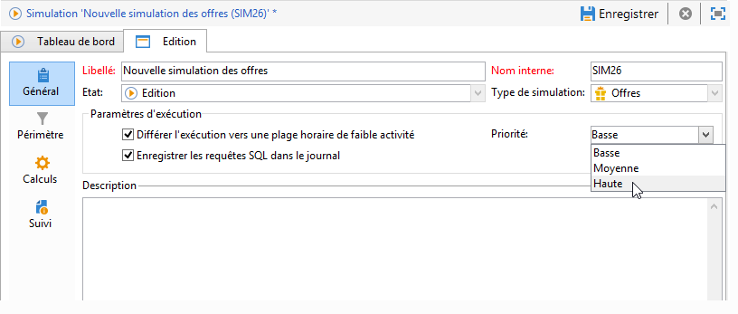

# Paramètres d&#39;exécution{#execution-settings}

Lors de la création d&#39;une simulation, vous pouvez, si besoin est, spécifier les paramètres d&#39;exécution. Ces paramètres permettent d&#39;exécuter la simulation pendant une plage horaire de moindre activité selon son niveau de priorité ou d&#39;enregistrer les requêtes SQL dans le journal. Cette étape est optionnelle.

Ces paramètres peuvent être modifiés par la suite depuis l&#39;onglet **[!UICONTROL Général]** de la fenêtre de simulation.

* **[!UICONTROL Différer l&#39;exécution vers une plage horaire de faible activité]** : permet de décaler le lancement de la simulation en fonction de la priorité choisie (Basse, Moyenne ou Haute), ceci pour optimiser les performances d&#39;Adobe Campaign.
* **[!UICONTROL Priorité]** : niveau appliqué à la simulation pour différer le déclenchement de la simulation. Lorsque l&#39;option **[!UICONTROL Différer l&#39;exécution vers une plage horaire de faible activité]** est sélectionnée, le workflow de traitement sur les opérations choisit une plage horaire de moindre activité pour lancer l&#39;opération.
* **[!UICONTROL Enregistrer les requêtes SQL dans le journal]** : cette fonctionnalité est réservée aux utilisateurs experts. Elle permet d&#39;ajouter un onglet au journal dans lequel les requêtes en SQL sont visibles. Ceci permet de détecter un éventuel dysfonctionnement si la simulation se termine en erreur.

