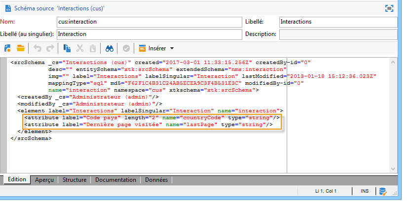
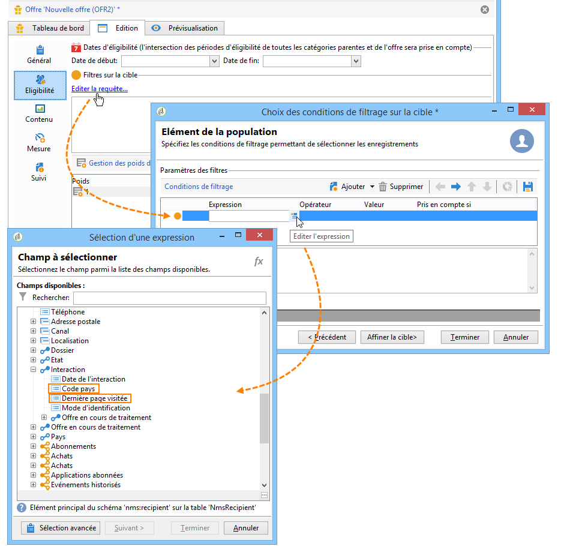

# Exemple d&#39;extension{#extension-example}

Dans le cas d&#39;un contact entrant (centre d&#39;appel ou site web), les offres les plus pertinentes sont proposées à un contact donné grâce à un ensemble de règles d&#39;éligibilité. Pour enrichir les critères d&#39;éligibilité de vos offres, il est nécessaire d&#39;étendre le schéma **nms:interaction**.

* Pour ajouter un nouveau contexte d&#39;interaction, étendez le schéma **nms:interaction** et créez autant d&#39;éléments **attribute** que nécessaire dans le schéma.

   Dans l&#39;exemple suivant, les critères ajoutés sont le code du pays et la dernière page visitée.

   

* Vous pourrez ensuite utiliser les attributs précédemment créés lors de la définition des critères d&#39;éligibilité.

   Dans l&#39;exemple suivant, il est possible de créer des critères d&#39;éligibilité pour afficher une offre en fonction du pays de l&#39;internaute ou de la dernière page sur laquelle il se sera rendu lors de sa navigation sur le site web concerné.

   

* Lors du paramétrage des appels SOAP, insérez l&#39;élément XML **context** pour référencer les informations contextuelles ajoutées dans le schéma d&#39;interaction. Pour plus d&#39;informations, voir la section [Intégration via SOAP (côté serveur)](../../interaction/using/integration-via-soap--server-side-.md).
