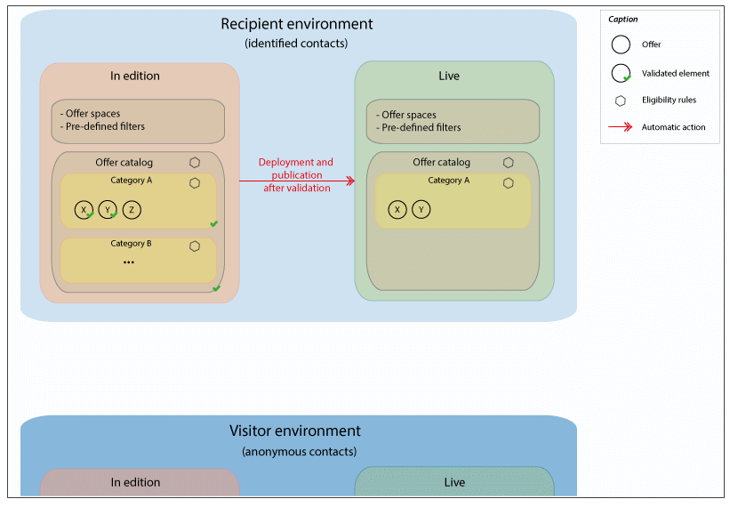
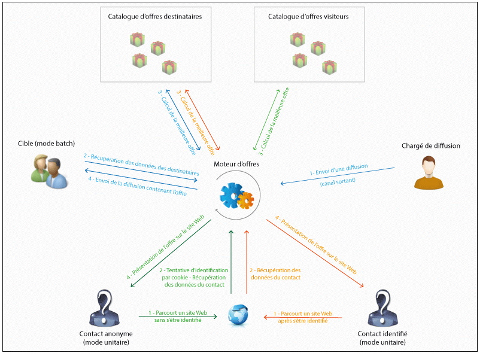

# Principes fondamentaux{#fundamental-principles}

## Déploiement des environnements {#deploying-environments}

Pour chaque dimension de ciblage utilisée dans le cadre de la gestion des offres existe un duo d&#39;environnements :

* Un environnement en édition , dans lequel le chargé d&#39;offres s&#39;occupe de créer et catégoriser les offres, de les modifier, de lancer le processus de validation afin qu&#39;elles puissent être utilisées. Les règles de chaque catégorie, les emplacements sur lesquels les offres peuvent être présentées et les filtres prédéfinis utilisés pour définir l&#39;éligibilité d&#39;une offre sont également définis dans cet environnement.

  Les catégories peuvent également être publiées manuellement dans l&#39;environnement en ligne.

  Le processus de validation des offres est détaillé dans la section [Valider et activer une offre](../../interaction/using/approving-and-activating-an-offer.md).

* Un environnement en ligne , dans lequel se trouvent les offres approuvées de l’environnement en édition, ainsi que les différents emplacements, filtres, catégories et règles configurés dans l’environnement en édition. Lors d&#39;un appel au moteur d&#39;offres, ce dernier utilisera toujours les offres de l&#39;environnement en ligne.

Une offre n&#39;est déployée que sur les emplacements sélectionnés lors de la validation. Par conséquent, une offre peut être en ligne, mais inutilisable sur un emplacement qui est également en ligne.

## Types d&#39;interactions et modes de contact {#interaction-types-and-contact-methods}

On distingue deux types d’interactions possibles : les interactions entrantes, provoquées par un contact, et les interactions sortantes, provoquées par le concepteur d’offres.

Ces deux types d&#39;interactions peuvent être réalisés soit en mode unitaire (l&#39;offre est calculée pour un seul contact), soit en mode batch (l&#39;offre est calculée pour un ensemble de contacts). Généralement, les interactions entrantes sont réalisées en mode unitaire et les interactions sortantes en mode batch. Néanmoins, des exceptions peuvent exister, par exemple pour des messages transactionnels, où l&#39;interaction sortante est réalisée en mode unitaire (voir [cette section](../../message-center/using/about-transactional-messaging.md)).

Dès lors qu&#39;une offre peut ou doit être présentée (en fonction des paramétrages réalisés), le moteur d&#39;offre joue le rôle d&#39;intermédiaire : il calcule automatiquement la meilleure offre possible pour un contact parmi celles disponibles, en combinant les données recueillies sur le contact et les différentes règles applicables définies dans l&#39;application.

