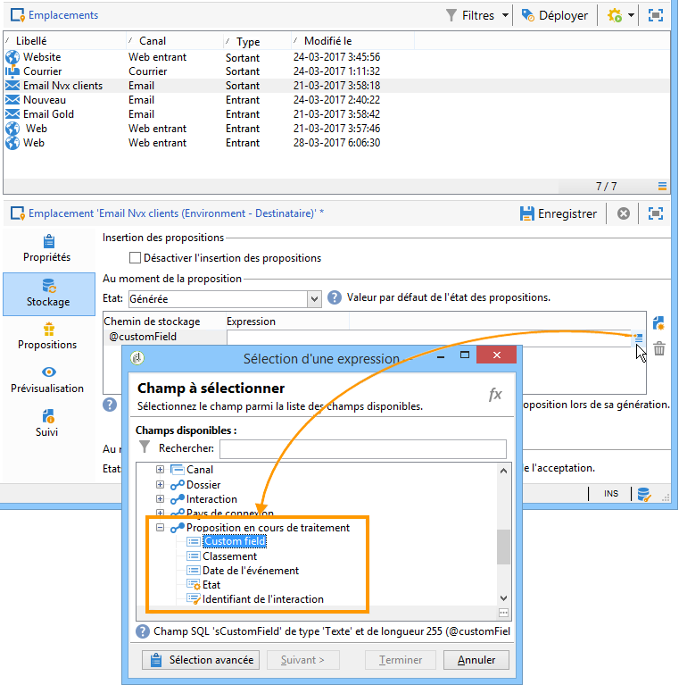

# Modifier le comportement standard du moteur{#hooks}


Les points d&#39;extension (hooks) permettent de modifier le **comportement standard du moteur**.

Les points d&#39;extension **[!UICONTROL Chargement de la cible]** et **[!UICONTROL Post-traitement des propositions]** sont configurés, dans Adobe Campaign, au niveau de l&#39;emplacement :


Le point d&#39;extension **[!UICONTROL Offre dynamique]** est configuré, dans Adobe Campaign, au niveau du poids de l&#39;offre :


## Chargement de la cible {#target-loading}

Ce point d&#39;extension permet d&#39;enrichir le profil du contact (qui a été chargé par la requête d&#39;usine) avec des données additionnelles provenant d&#39;un système externe.

Les données collectées doivent être insérées dans le nœud des données d&#39;appel (noeud Interaction). L&#39;intégrateur doit, au préalable, avoir étendu le schéma des données d&#39;appel pour définir la structure des données collectées. L&#39;utilisateur peut accéder à ces données de la même façon que pour des données d&#39;appel standard (au niveau des règles d&#39;éligibilité et au niveau de la personnalisation).

**Paramètres d&#39;entrée:**

* xmlInteraction (type xml) : noeud Interaction
* aTargetId (type tableau) : identifiant de la cible
* sUuid230 (type chaîne) : valeur du cookie permanent uuid230
* sNlid (type chaîne) : valeur du cookie de session nlid

**Paramètres de retour :**

* noeud Interaction enrichi (premier paramètre du point d&#39;extension)

>[!NOTE]
>
>Le paramètre **xmlInteraction** contient à la fois les données d&#39;appel et le profil du contact qui a été chargé par la requête d&#39;usine.

**Exemple:**

```
// Call an external system to get additional data for the target
  var additionalData  = getUrl("https://EXTERNAL_SYSTEM?target=" + encodeURIComponent(aTargetId.join("|")));
  // Enrich the context with this data
  interaction.@additionalData = additionalData;
```

## Post-traitement des propositions {#proposition-post-processing-}

Ce point d&#39;extension permet de vérifier la cohérence et la compatibilité des propositions éligibles au sein d&#39;une même interaction. Il permet également de définir une nouvelle fonction de calcul d&#39;un score ou d&#39;une probabilité.

Exemple d&#39;utilisation des règles de cohérence :

* Limiter le nombre de propositions, au sein d&#39;un même appel, associées à un même produit ou une même catégorie.
* Proposer uniquement les offres relatives à un produit dans une même interaction.

Le post-traitement est exécuté après l&#39;application des règles de typologie et le tri des propositions éligibles, et avant l&#39;étape de priorisation.

**Paramètres d&#39;entrée:**

* aProposition : tableau des propositions éligibles. Voici un exemple de structure d&#39;un élément de ce tableau :

   ```
   { offer_id:1234,
     weight:2}
   ```

* dicOffer (type xml) : dictionnaire de tous les attributs des offres éligibles (code de l&#39;offre, identifiant de la catégorie, nom complet de la catégorie, date de début, date de fin, libellé, nom interne, identifiant de l&#39;offre, champs additionnels de l&#39;offre). Exemple :

   ```
   { "1242": <offer category-id="61242" categoryFullName="/FULL/PATH/TO/CATEGORY/" code="CODE" endDate="" id="62473" label="LABEL" name="OFR38_OE4" product-id="43" startDate=""/>,
     "1243": ...}
   ```

* xmlTarget : noeud des données de profil (type xml)
* xmlInteraction : noeud des données d&#39;appel (type xml)
* iPropNumber : nombre d&#39;offres attendues (type entier)

**Paramètres de retour :**

* liste des propositions modifiée (premier paramètre du point d&#39;extension)
* noeud Interaction modifié

**Exemple:**

```
var aReturnedProps = [];

if( aProposition.length > 0 )
{
  var iReturnedProps = 0;
  for( var iPropIdx = 0; iPropIdx < aProposition.length && iReturnedProps < iPropNumber; iPropIdx ++ )
  {
    // Check a consistency rule for instance
    if( true )
    {
      aReturnedProps.push(aProposition[iPropIdx]);
      iReturnedProps++;
    }
  }
}

return aReturnedProps;
```

## Offre dynamique {#dynamic-offer}

Ce point d&#39;extension permet d&#39;appeler un moteur externe pour sélectionner une liste de produits associés à une offre. L&#39;exécution s&#39;effectue dans l&#39;offre après l&#39;application des règles d&#39;éligibilité, et avant l&#39;application des règles de typologie.

L&#39;intégrateur doit, au préalable, avoir étendu le schéma des propositions **PropositionRcp** avec les données additionnelles du produit qu&#39;il souhaite stocker avec la proposition. Pour définir le stockage de ces données (code produit, par exemple), un lien **[!UICONTROL Proposition en cours de traitement]** est disponible dans l&#39;onglet **[!UICONTROL Stockage]** de l&#39;emplacement.



**Paramètres d&#39;entrée:**

* xmlOffer (type xml) : offre (code de l&#39;offre, identifiant de la catégorie, nom complet de la catégorie, date de début, date de fin, libellé, nom interne, identifiant de l&#39;offre, champs additionnels de l&#39;offre)
* dWeight : poids du contexte (type double)
* xmlTarget : noeud des données de profil (type xml)
* xmlInteraction : noeud des données d&#39;appel (type xml)

**Paramètres de retour :**

Un tableau des propositions à générer est retourné. Chaque élément de ce tableau est composé des informations suivantes :

* identifiant de l&#39;offre
* données additionnelles du produit (par exemple, code produit)
* poids

>[!NOTE]
>
>Le système vérifie que l&#39;identifiant de l&#39;offre est le même en entrée et en sortie.

**Exemple:**

```
var product = getUrl("https://EXTERNAL_SYSTEM?offerCode=" + encodeURIComponent(xmlOffer.@code));
if( product )
  return [{offer_id: parseInt(String(xmlOffer.@id)), weight: dWeight, productId: product}];
```
