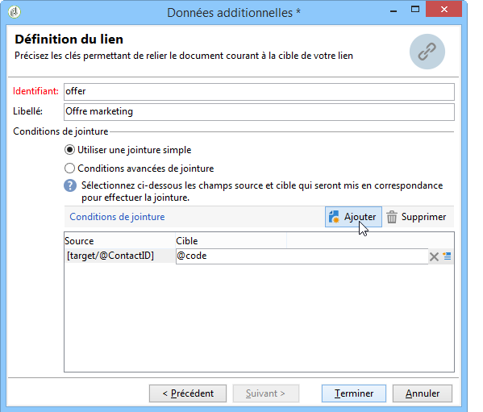

# Intégration d&#39;une offre via un workflow{#integrating-an-offer-via-a-workflow}

En dehors de l&#39;activité de diffusion elle-même, plusieurs activités des workflows vous permettent de définir la présentation d&#39;offres :

* Composition de diffusion
* Enrichissement
* Moteur d’offres
* Offres par cellule

## Composition de diffusion {#delivery-outline}

L&#39;activité de composition de diffusion, disponible dans les workflows de campagne, vous permet de présenter des offres référencées dans une composition de diffusion de la campagne en cours.

1. Dans un workflow, placez une activité de composition de diffusion avant une activité de diffusion.
1. Dans l&#39;activité de composition, définissez la composition que vous souhaitez utiliser.

   Pour plus d&#39;informations sur la définition des compositions de diffusion, consultez le guide [Campaign - MRM](../../campaign/using/marketing-campaign-deliveries.md#associating-and-structuring-resources-linked-via-a-delivery-outline).

1. Complétez les champs disponibles en fonction de votre diffusion.
1. Deux cas se présentent :

   * Si vous souhaitez appeler le moteur d&#39;offres, cochez la case **[!UICONTROL Limiter le nombre de propositions sélectionnées]**. Définissez l&#39;emplacement et le nombre d&#39;offres qui seront présentées dans la diffusion.

     Les poids et règles d&#39;éligibilité des offres seront pris en compte par le moteur d&#39;offres.

   * Si vous ne cochez pas la case, toutes les offres de la composition de diffusion seront présentées, sans appel au moteur d&#39;offres.

   >[!NOTE]
   >
   >La prévisualisation prend en compte le nombre d&#39;offres défini dans la diffusion. Lors de l&#39;exécution du workflow, c&#39;est le nombre défini dans la composition de diffusion qui est pris en compte.

   

## Enrichissement {#enrichment}

L’activité d’enrichissement vous permet d’ajouter des offres ou des liens vers des offres pour les destinataires d’une diffusion.

>[!NOTE]
>
>Pour plus d’informations sur l’activité d’enrichissement, consultez la documentation dédiée dans le [Guide des Workflows](../../workflow/using/enrichment.md).

Vous pouvez par exemple enrichir les données d&#39;une requête sur les destinataires, avant une diffusion.

Deux méthodes permettent de définir des propositions d&#39;offre.

* En définissant une offre ou un appel au moteur d&#39;offres.
* En référençant un lien vers une offre.

### Définir une offre ou un appel au moteur {#specifying-an-offer-or-a-call-to-the-offer-engine}

Après avoir paramétré votre requête (voir le [Guide des Workflows](../../workflow/using/query.md)) :

1. Placez et ouvrez une activité d’enrichissement.
1. Dans l&#39;onglet **[!UICONTROL Enrichissement]**, sélectionnez **[!UICONTROL Ajouter des données]**.
1. Sélectionnez **[!UICONTROL Une proposition d&#39;offre]** dans les types de données à ajouter.

   

1. Indiquez un identifiant ainsi qu&#39;un libellé pour la proposition qui sera ajoutée.
1. Définissez la sélection de l&#39;offre. Deux options sont possibles :

   * **[!UICONTROL Rechercher la meilleure offre dans une catégorie]** : cochez cette option et définissez les paramètres d’appel du moteur dʼoffres (emplacement, catégorie ou thèmes, date de contact, nombre dʼoffres à conserver). Le moteur calcule automatiquement la ou les offres à ajouter en fonction de ces paramètres. Nous vous recommandons de renseigner soit le champ **[!UICONTROL Catégorie]**, soit le champ le **[!UICONTROL Thème]**, plutôt que les deux à la fois.

     

   * **[!UICONTROL Une offre prédéfinie]** : cochez cette option et définissez un emplacement, une offre précise, ainsi qu&#39;une date de contact afin de directement paramétrer l&#39;offre que vous souhaitez ajouter, sans appeler le moteur d&#39;offres.

     

1. Paramétrez ensuite une activité de diffusion correspondant au canal de votre choix. Pour plus d’informations, voir la section [Insérer une proposition d’offres dans une diffusion](../../interaction/using/integrating-an-offer-via-the-wizard.md#inserting-an-offer-proposition-into-a-delivery).

   >[!NOTE]
   >
   >Le nombre de propositions disponibles pour la prévisualisation dépend du paramétrage réalisé dans l’activité d’enrichissement et non d’un éventuel paramétrage directement dans la diffusion.

### En référençant un lien vers une offre {#referencing-a-link-to-an-offer}

Vous avez également la possibilité de référencer un lien vers une offre dans une activité d’enrichissement.

Pour cela :

1. Dans l&#39;onglet **[!UICONTROL Enrichissement]** de l&#39;activité, sélectionnez **[!UICONTROL Ajouter des données]**.
1. Dans la fenêtre de sélection du type de données à ajouter, choisissez **[!UICONTROL Un lien]**.
1. Sélectionnez le type du lien que vous souhaitez établir ainsi que sa cible. Dans le cas présent, la cible est le schéma des offres.

   

1. Définissez la jointure entre les données de la table entrante dans l’activité d’enrichissement (ici la table des destinataires) et la table des offres. Vous pouvez par exemple associer un code offre à un destinataire.

   

1. Paramétrez ensuite une activité de diffusion correspondant au canal de votre choix. Pour plus d’informations, voir la section [Insérer une proposition d’offres dans une diffusion](../../interaction/using/integrating-an-offer-via-the-wizard.md#inserting-an-offer-proposition-into-a-delivery).

   >[!NOTE]
   >
   >Le nombre de propositions disponibles pour la prévisualisation dépend du paramétrage réalisé dans la diffusion.

### Stocker le rang et le poids des offres {#storing-offer-rankings-and-weights}

Par défaut, lorsque l&#39;activité d&#39;**enrichissement** est utilisée pour diffuser des offres, leur rang ainsi que leur poids ne sont pas stockés dans la table des propositions.

>[!NOTE]
>
>Rappel : L&#39;activité **[!UICONTROL Moteur d&#39;offres]** stocke bien ces informations par défaut.

Cependant, il est possible de stocker ces informations de la manière suivante :

1. Créez un appel au moteur d’offre dans une activité d’enrichissement placée après une requête et avant une activité de diffusion. Pour plus d&#39;informations, consultez la section [Définir une offre ou un appel au moteur](../../interaction/using/integrating-an-offer-via-a-workflow.md#specifying-an-offer-or-a-call-to-the-offer-engine).
1. Dans la fenêtre principale de l&#39;activité, sélectionnez **[!UICONTROL Editer les données additionnelles]**.

   

1. Ajoutez les colonnes **[!UICONTROL @rank]** pour le rang et **[!UICONTROL @weight]** pour le poids des offres.

   

1. Validez votre ajout et enregistrez votre workflow.

La diffusion stocke automatiquement le rang et le poids des offres. Ces informations sont visibles dans l’onglet **[!UICONTROL Offres]** de la diffusion.

## Moteur d’offres {#offer-engine}

L&#39;activité **[!UICONTROL Moteur d&#39;offres]** vous permet également de définir un appel au moteur d&#39;offres en amont d&#39;une diffusion.

Cette activité fonctionne sur le même principe que l’activité d’enrichissement avec un appel au moteur, en enrichissant les données de la population entrante avec une offre calculée par le moteur, avant une diffusion.

Après avoir paramétré votre requête (voir le [Guide des Workflows](../../workflow/using/query.md)) :

1. Placez et ouvrez une activité **[!UICONTROL Moteur d&#39;offres]**.
1. Renseignez les différents champs disponibles afin de définir les paramètres d&#39;appel au moteur (emplacement, catégorie ou thème(s), date de contact, nombre d&#39;offres à conserver). Le moteur calculera automatiquement la ou les offres à ajouter en fonction de ces paramètres.

   >[!NOTE]
   >
   >Attention, si vous utilisez cette activité, seules les propositions utilisées dans la diffusion sont stockées.

   

1. Paramétrez ensuite une activité de diffusion correspondant au canal de votre choix. Pour plus d’informations, voir la section [Insérer une proposition d’offres dans une diffusion](../../interaction/using/integrating-an-offer-via-the-wizard.md#inserting-an-offer-proposition-into-a-delivery).

## Offres par cellule {#offers-by-cell}

L&#39;activité **[!UICONTROL Offres par cellules]** vous permet de répartir la population entrante (par exemple issue d&#39;une requête) en plusieurs segments, et de définir une offre à proposer pour chacun de ces segments.

Pour cela :

1. Placez l&#39;activité **[!UICONTROL Offres par cellules]** après avoir défini la population cible, puis ouvrez-là.
1. Dans l&#39;onglet **[!UICONTROL Général]**, sélectionnez l&#39;emplacement sur lequel vous souhaitez proposer les offres.
1. Dans l&#39;onglet **[!UICONTROL Cellules]**, définissez les différents sous-ensembles via le bouton **[!UICONTROL Ajouter]** :

   * Définissez la population du sous-ensemble grâce aux règles de filtrage et de limitation disponibles.
   * Sélectionnez ensuite l&#39;offre que vous souhaitez proposer au sous-ensemble. Les offres disponibles sont celles éligibles sur l&#39;emplacement sélectionné à l&#39;étape précédente.

     

1. Paramétrez ensuite une activité de diffusion correspondant au canal de votre choix. Pour plus d’informations, voir la section [Insérer une proposition d’offres dans une diffusion](../../interaction/using/integrating-an-offer-via-the-wizard.md#inserting-an-offer-proposition-into-a-delivery).
