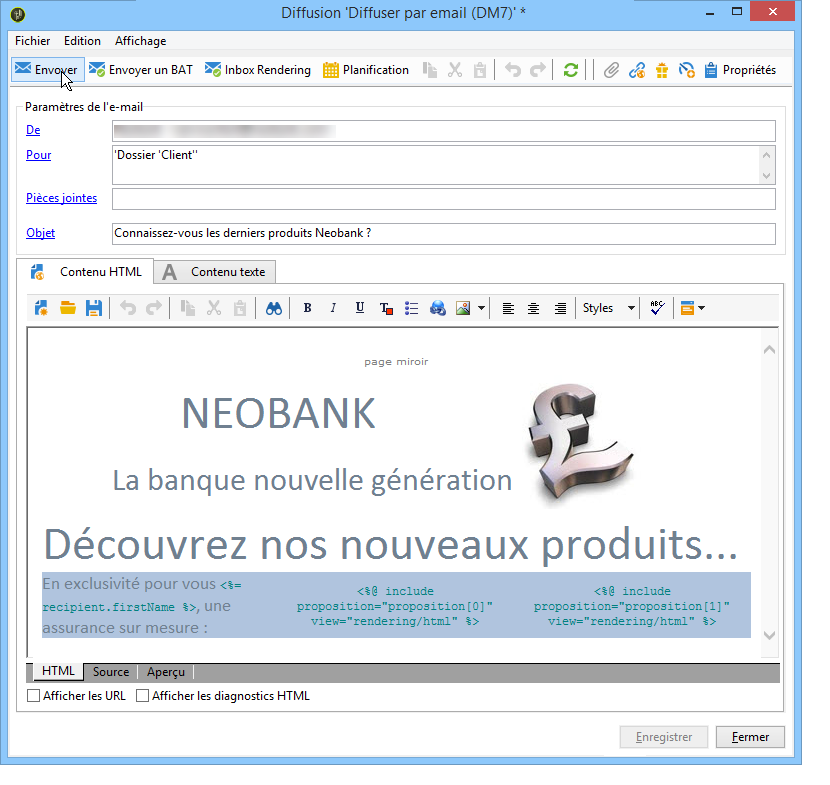

# Intégrer une offre via l&#39;assistant{#integrating-an-offer-via-the-wizard}

Pour intégrer des offres lors de la création d&#39;une diffusion, deux méthodes sont possibles :

* En appelant le moteur d&#39;offres dans le corps d&#39;une diffusion.
* En référençant des offres via les compositions de diffusion d&#39;une campagne. Cette méthode est généralement utilisée dans le cadre d&#39;une campagne papier.

## Diffusion avec appel au moteur d&#39;offres {#delivering-with-a-call-to-the-offer-engine}

Pour présenter une offre au cours d’une campagne marketing, il vous suffit de créer une action de diffusion classique basée sur le canal choisi. Le moteur d’offre est appelé lorsque le contenu de remise est défini en cliquant sur l’ **[!UICONTROL Offers]** icône disponible dans la barre d’outils.

Voir, aux sujets des diffusions et des campagnes marketing, les guides [Delivery](../../delivery/using/about-direct-mail-channel.md) et [Campaign](../../campaign/using/setting-up-marketing-campaigns.md).

### Etapes principales pour insérer une offre dans une diffusion {#main-steps-for-inserting-an-offer-into-a-delivery}

Les étapes successives pour insérer des propositions d&#39;offres dans vos diffusions sont les suivantes :

1. Dans la fenêtre de diffusion, cliquez sur l&#39;icône d&#39;offres.

   

1. Sélectionnez l&#39;emplacement correspondant à votre environnement d&#39;offres.

   

1. Choisissez la catégorie dont la ou les offres à présenter font partie ou un ou plusieurs thèmes pour affiner le choix des offres réalisé par le moteur. Il est conseillé de ne pas utiliser ces deux champs conjointement afin de ne pas surcharger les restrictions.

   

   

1. Indiquez le nombre d&#39;offres que vous souhaitez insérer dans le corps de la diffusion.

   

1. Sélectionnez l’ **[!UICONTROL Exclude non-eligible recipients]** option si nécessaire. Pour plus d’informations, reportez-vous à la section [Paramètres d’appel du moteur](#parameters-for-calling-offer-engine)d’offres.

   

1. Si nécessaire, sélectionnez l’ **[!UICONTROL Do not display anything if no offers are selected]** option. Pour plus d’informations, reportez-vous à la section [Paramètres d’appel du moteur](#parameters-for-calling-offer-engine)d’offres.

   

1. Insérez la ou les propositions dans le contenu de la diffusion à l&#39;aide des champs de fusion. Le nombre de propositions disponibles dépend du paramétrage de l&#39;appel au moteur et leur ordre dépend de la priorité des offres.

   

1. Finalisez le contenu puis envoyez votre diffusion selon la procédure habituelle.

   

### Paramètres d&#39;appel au moteur d&#39;offres {#parameters-for-calling-offer-engine}

* **[!UICONTROL Space]** : espace de l’environnement de l’offre qui doit être sélectionné pour activer le moteur d’offre.
* **[!UICONTROL Category]** : dossier spécifique dans lequel les offres sont triées. Si aucune catégorie n’est spécifiée, toutes les offres contenues dans l’environnement sont prises en compte par le moteur d’offre, sauf si un thème est sélectionné.
* **[!UICONTROL Themes]** : mots-clés définis en amont dans les catégories. Ces filtres vous permettent d’affiner le nombre d’offres à présenter en les sélectionnant dans un ensemble de catégories.
* **[!UICONTROL Number of propositions]** : nombre d’offres renvoyées par le moteur pouvant être insérées dans le corps de livraison. S’ils ne sont pas insérés dans le message, les offres sont toujours générées, mais pas présentées.
* **[!UICONTROL Exclude non-eligible recipients]** : Cette option vous permet d’activer ou de désactiver l’exclusion des destinataires pour lesquels il n’existe pas suffisamment d’offres éligibles. Le nombre de propositions admissibles peut être inférieur au nombre de propositions demandées. Si cette case est cochée, les destinataires qui n’ont pas assez de propositions seront exclus de la remise. Si vous ne sélectionnez pas cette option, ces destinataires ne seront pas exclus, mais ils n’auront pas le nombre de propositions demandé.
* **[!UICONTROL Do not display anything if no offer is selected]** : cette option vous permet de choisir le mode de traitement du message au cas où l’une des propositions n’existerait pas. Lorsque cette case est cochée, la représentation de la proposition manquante n’est pas affichée et aucun contenu n’apparaît dans le message pour cette proposition. Si la case n’est pas cochée, le message lui-même est annulé pendant l’envoi et les destinataires ne recevront plus de messages.

### Insérer une proposition d&#39;offres dans une diffusion {#inserting-an-offer-proposition-into-a-delivery}

La représentation de la ou des offres destinées à être présentées est insérée dans le corps de la diffusion par l&#39;intermédiaire des champs de fusion. Le nombre de propositions est déterminé dans les paramètres d&#39;appel au moteur d&#39;offres.

La personnalisation peut être réalisée grâce à l&#39;utilisation des champs de l&#39;offre ou des fonctions de rendu, dans le cas de l&#39;e-mail.

## Diffusion avec composition de diffusion {#delivering-with-delivery-outlines}

Vous avez également la possibilité de présenter des offres dans une diffusion à l&#39;aide des compositions de diffusion.

Pour plus d&#39;informations sur les compositions de diffusion, consultez le guide [Campaign - MRM](../../campaign/using/marketing-campaign-deliveries.md#associating-and-structuring-resources-linked-via-a-delivery-outline).

1. Créez une nouvelle opération ou accédez à une opération existante.
1. Access the delivery outlines via the campaign&#39;s **[!UICONTROL Edit]** > **[!UICONTROL Documents]** tab.
1. Add an outline then insert as many offers as you like into it by right-clicking on the outline and selecting **[!UICONTROL New]** > **[!UICONTROL Offer]**, then save the campaign.

   

1. Créez une diffusion dans laquelle vous avez accès aux compositions de diffusion (par exemple une diffusion de type courrier).
1. Lors de la modification de la diffusion, cliquez sur **[!UICONTROL Select a delivery outline]**.

   >[!NOTE]
   >
   >Depending on the type of delivery, this option can be found in the **[!UICONTROL Properties]** > **[!UICONTROL Advanced]** menu (for email deliveries for example).

   

1. Using the **[!UICONTROL Offers]** button, you can then configure the offer space as well as the number of offers to present in the delivery.

   

1. Add the propositions into the delivery body using the personalization fields (for more on this, refer to the [Inserting an offer proposition into a delivery](#inserting-an-offer-proposition-into-a-delivery) section), or in the case of a direct mail delivery, by editing the extraction file format.

   Les propositions seront sélectionnées parmi les offres référencées dans la composition de diffusion.

   >[!NOTE]
   >
   >Les informations sur le rang et le poids des offres ne sont enregistrées dans la table des propositions que si les offres sont générées directement dans la diffusion.

