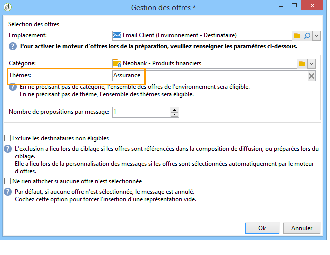

# Intégrer une offre via l&#39;assistant{#integrating-an-offer-via-the-wizard}

Pour intégrer des offres lors de la création d&#39;une diffusion, deux méthodes sont possibles :

* En appelant le moteur d&#39;offres dans le corps d&#39;une diffusion.
* En référençant des offres via les compositions de diffusion d&#39;une campagne. Cette méthode est généralement utilisée dans le cadre d&#39;une campagne papier.

## Diffusion avec appel au moteur d&#39;offres {#delivering-with-a-call-to-the-offer-engine}

Pour présenter une offre lors d&#39;une campagne marketing, il vous suffit de créer une action de diffusion classique selon le canal choisi. L&#39;appel du moteur d&#39;offres se fait au moment de la définition du contenu de la diffusion, en cliquant sur l&#39;icône **[!UICONTROL Offres]**, disponible dans la barre d&#39;outils.

En savoir plus sur les diffusions courrier [dans cette section](../../delivery/using/about-direct-mail-channel.md). En savoir plus sur les campagnes marketing [dans cette section](../../campaign/using/setting-up-marketing-campaigns.md).

### Etapes principales pour insérer une offre dans une diffusion {#main-steps-for-inserting-an-offer-into-a-delivery}

Les étapes successives pour insérer des propositions d&#39;offres dans vos diffusions sont les suivantes :

1. Dans la fenêtre de diffusion, cliquez sur l&#39;icône d&#39;offres.

   

1. Sélectionnez l&#39;emplacement correspondant à votre environnement d&#39;offres.

   

1. Choisissez la catégorie dont la ou les offres à présenter font partie ou un ou plusieurs thèmes pour affiner le choix des offres réalisé par le moteur. Il est conseillé de ne pas utiliser ces deux champs conjointement afin de ne pas surcharger les restrictions.

   

   

1. Indiquez le nombre d&#39;offres que vous souhaitez insérer dans le corps de la diffusion.

   

1. Sélectionnez l&#39;option **[!UICONTROL Exclure les destinataires non éligibles]**, si nécessaire. Pour plus d&#39;informations, voir la section [Paramètres d&#39;appel au moteur d&#39;offres](#parameters-for-calling-offer-engine).

   

1. Si nécessaire, sélectionnez l&#39;option **[!UICONTROL Ne rien afficher si aucune offre n&#39;est sélectionnée]**. Pour plus d&#39;informations, voir la section [Paramètres d&#39;appel au moteur d&#39;offres](#parameters-for-calling-offer-engine).

   

1. Insérez la ou les propositions dans le contenu de la diffusion à l&#39;aide des champs de fusion. Le nombre de propositions disponibles dépend du paramétrage de l&#39;appel au moteur et leur ordre dépend de la priorité des offres.

   

1. Finalisez le contenu puis envoyez votre diffusion selon la procédure habituelle.

   

### Paramètres d&#39;appel au moteur d&#39;offres {#parameters-for-calling-offer-engine}

* **[!UICONTROL Emplacement]** : emplacement de l&#39;environnement des offres à choisir obligatoirement afin d&#39;activer le moteur d&#39;offres.
* **[!UICONTROL Catégorie]** : dossier spécifique dans lequel les offres sont classées. Si aucune catégorie n&#39;est spécifiée, c&#39;est la totalité des offres contenues dans l&#39;environnement qui seront prises en compte par le moteur d&#39;offres, sauf si un thème est sélectionné.
* **[!UICONTROL Thèmes]** : mots-clés définis préalablement au niveau des catégories. Ils agissent comme un filtre et permettent d&#39;affiner les offres à présenter en les sélectionnant dans un ensemble de catégories.
* **[!UICONTROL Nombre de propositions]** : nombre d&#39;offres renvoyées par le moteur qui pourront être insérées dans le corps de la diffusion. Si elles ne sont pas insérées dans le message, les offres seront néanmoins générées, mais non présentées.
* **[!UICONTROL Exclure les destinataires non éligibles]** : cette option permet d&#39;activer ou non l&#39;exclusion des destinataires pour lesquels il n&#39;y a pas assez d&#39;offres éligibles. Pour chaque destinataire, il se peut que le nombre de propositions éligibles soit inférieur au nombre de propositions requis. En cochant cette case, les destinataires pour lesquels le nombre de propositions requis n&#39;est pas atteint seront exclus de la diffusion. Si vous ne sélectionnez pas cette option, ces destinataires seront conservés, mais ils auront un nombre de propositions inférieur au nombre demandé.
* **[!UICONTROL Ne rien afficher si aucune offre n&#39;est sélectionnée]** : cette option permet de choisir le traitement du message au cas où l&#39;une des propositions n&#39;existerait pas. En cochant cette case, la représentation de la proposition manquante ne s&#39;affichera pas et aucun contenu n&#39;apparaîtra dans le message pour cette proposition. Si la case est décochée, le message lui-même est annulé au moment de l&#39;envoi et les destinataires ne recevront aucun message.

### Insérer une proposition d&#39;offres dans une diffusion {#inserting-an-offer-proposition-into-a-delivery}

La représentation de la ou des offres destinées à être présentées est insérée dans le corps de la diffusion par l&#39;intermédiaire des champs de fusion. Le nombre de propositions est déterminé dans les paramètres d&#39;appel au moteur d&#39;offres.

La personnalisation peut être réalisée grâce à l&#39;utilisation des champs de l&#39;offre ou des fonctions de rendu, dans le cas de l&#39;e-mail.

## Diffusion avec composition de diffusion {#delivering-with-delivery-outlines}

Vous avez également la possibilité de présenter des offres dans une diffusion à l&#39;aide des compositions de diffusion.

Pour plus d&#39;informations sur les compositions de diffusion, consultez le guide [Campaign - MRM](../../campaign/using/marketing-campaign-deliveries.md#associating-and-structuring-resources-linked-via-a-delivery-outline).

1. Créez une nouvelle opération ou accédez à une opération existante.
1. Accédez aux compositions de diffusion via l&#39;onglet **[!UICONTROL Edition]** > **[!UICONTROL Documents]** de l&#39;opération.
1. Ajoutez une composition puis insérez autant d&#39;offres que vous souhaitez dans cette composition en cliquant droit sur cette dernière et en sélectionnant **[!UICONTROL Nouveau]** > **[!UICONTROL Offre]**, puis enregistrez l&#39;opération.

   

1. Créez une diffusion dans laquelle vous avez accès aux compositions de diffusion (par exemple une diffusion de type courrier).
1. Dans l&#39;édition de la diffusion, sélectionnez **[!UICONTROL Choisir une composition de diffusion]**.

   >[!NOTE]
   >
   >Selon le type de diffusion, cette option peut se trouver dans le menu **[!UICONTROL Propriétés]** > **[!UICONTROL Avancé]** (par exemple pour les diffusions par e-mail).

   

1. Via le bouton **[!UICONTROL Offres]**, vous pouvez ensuite paramétrer l&#39;emplacement ainsi que le nombre d&#39;offres à présenter dans la diffusion.

   

1. Ajoutez les propositions dans le corps de la diffusion, via les champs de personnalisation (voir à ce sujet la section [Insérer une proposition d&#39;offres dans une diffusion](#inserting-an-offer-proposition-into-a-delivery)), ou en éditant le format du fichier d&#39;extraction dans le cas d&#39;une diffusion par courrier.

   Les propositions seront sélectionnées parmi les offres référencées dans la composition de diffusion.

   >[!NOTE]
   >
   >Les informations sur le rang et le poids des offres ne sont enregistrées dans la table des propositions que si les offres sont générées directement dans la diffusion.
