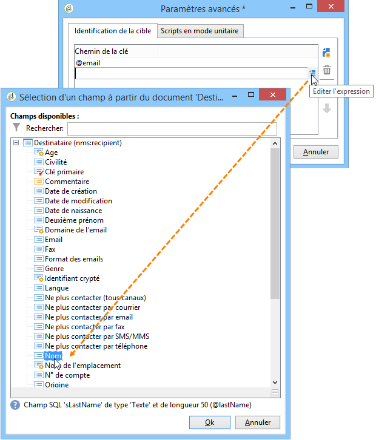
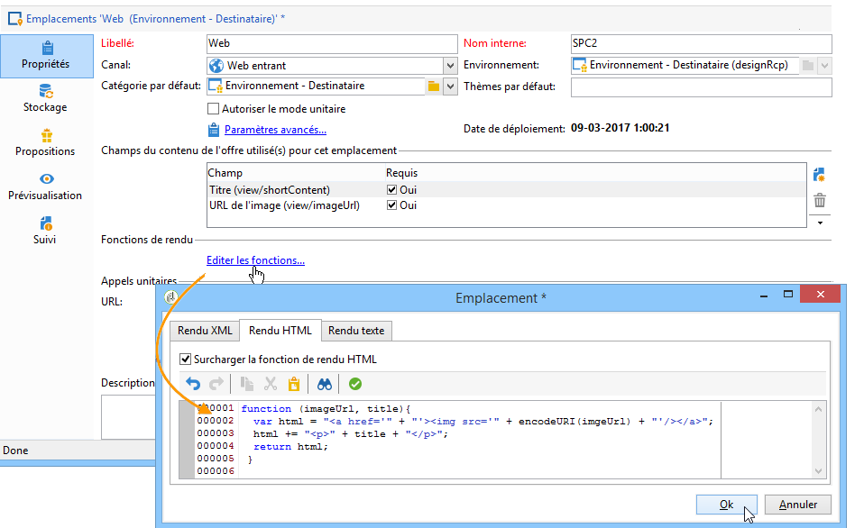
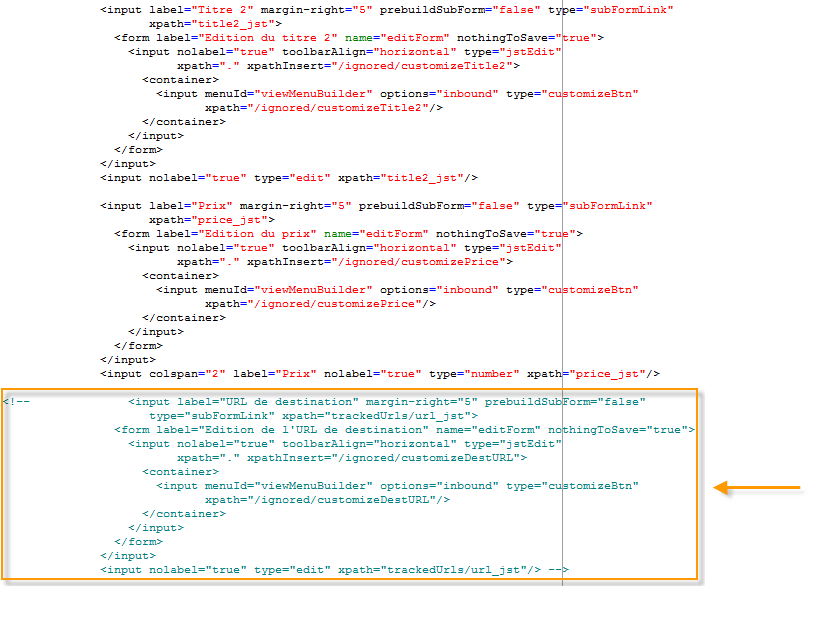
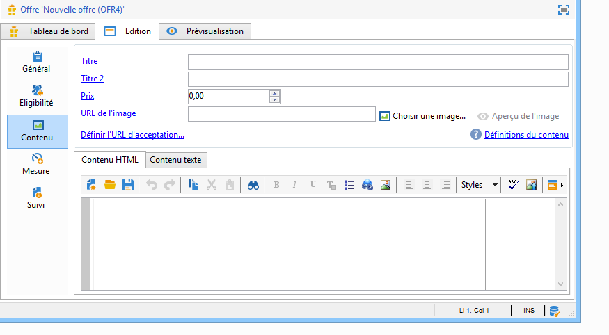
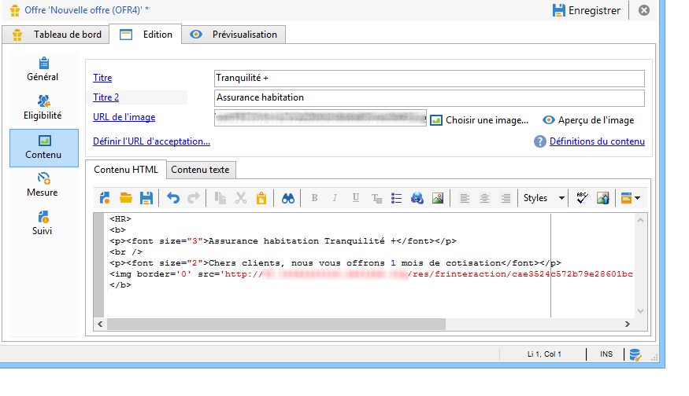
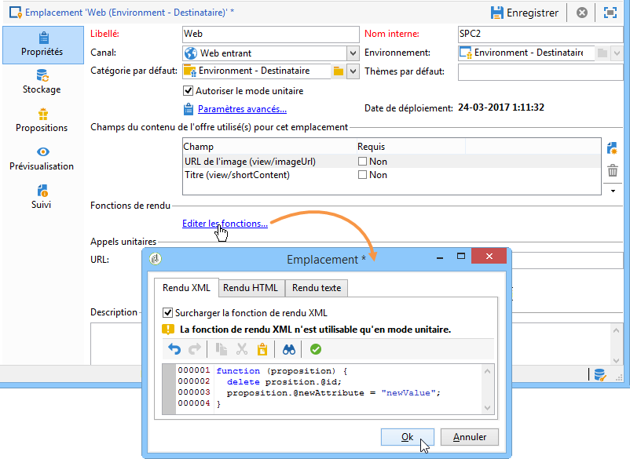

# Intégration via JavaScript (côté client){#integration-via-javascript-client-side}


L&#39;appel du moteur d&#39;Interaction dans une page web est effectué par l&#39;insertion d&#39;un appel à un code JavaScript directement dans la page. Cet appel renvoie le contenu de l&#39;offre dans un élément ciblé

element.

Adobe recommande d&#39;utiliser la méthode d&#39;intégration JavaScript.

L&#39;URL d&#39;appel au script est de la forme suivante :

```
<script id="interactionProposalScript" src="https://<SERVER_URL>/nl/interactionProposal.js?env=" type="text/javascript"></script>
```

Le paramètre &quot;**env**&quot; reçoit le nom interne de l&#39;environnement en ligne dédié aux interactions anonymes.

Pour présenter une offre, il faut donc créer un environnement ainsi qu&#39;un emplacement pour l&#39;offre dans Adobe Campaign, puis configurer la page HTML.

Les cas d&#39;utilisations suivants présentent les différentes options possibles dans l&#39;intégration d&#39;offres via Javascript.

## Mode HTML {#html-mode}

### Présenter une offre anonyme {#presenting-an-anonymous-offer}

1. **Préparation du moteur d&#39;interaction**

   Dans l&#39;interface d&#39;Adobe Campaign, préparez un environnement anonyme.

   Créez un emplacement rattaché à l&#39;environnement anonyme.

   Créez une offre et sa représentation associée à l&#39;emplacement.

1. **Contenu de la page HTML**

   La page HTML doit inclure un

   élément avec un attribut @id avec la valeur du nom interne de l’espace d’offre créé (&quot;i_internal name space&quot;). L’offre sera insérée dans cet élément par Interaction.

   Dans l&#39;exemple, l&#39;attribut @id reçoit la valeur &quot;i_SPC12&quot; où &quot;SPC12&quot; est le nom interne de l&#39;emplacement précédemment créé :

   ```
   <div id="i_SPC12"></div>
   ```

   Dans l&#39;exemple, l&#39;URL d&#39;appel au script est la suivante (&quot;OE3&quot; est le nom interne de l&#39;environnement en ligne) :

   ```
   <script id="interactionProposalScript" src="https://instance.adobe.org:8080/nl/interactionProposal.js?env=OE3" type="text/javascript"></script>
   ```

   >[!IMPORTANT]
   >
   >La balise `<script>` ne doit pas être auto-fermante.

   Cet appel statique va automatiquement générer un appel dynamique contenant tous les paramètres nécessaires au moteur d&#39;Interaction.

   Ce comportement permet par exemple d&#39;avoir plusieurs emplacements sur la même page gérés par un seul appel au moteur.

1. **Résultat dans la page HTML**

   Le contenu de la représentation de l&#39;offre est renvoyé à la page HTML par le moteur d&#39;Interaction :

   ```
   <div id="banner_header">
     <div id="i_SPC12">
       <table>
         <tbody>
           <tr>
             <td><h3>Fly to Japan!</h3></td>
           </tr>
           <tr>
             <td></td>
             <td>
               <p>Discover Japan for 2 weeks at an unbelievable price!!</p>
               <p><b>2345 Dollars - All inclusive</b></p>
             </td>
           </tr>
         </tbody>
       </table>
     </div>
     <script src="https://instance.adobe.org:8080/nl/interactionProposal.js?env=OE3" id="interactionProposalScript" type="text/javascript"></script>
   </div>
   ```

### Présenter une offre identifiée {#presenting-an-identified-offer}

Pour présenter une offre à un contact identifié, le processus est similaire à celui détaillé ici : [Présenter une offre anonyme](#presenting-an-anonymous-offer). Dans le contenu de la page web, vous devez ajouter le script suivant qui identifie le contact lors de l’appel au moteur :

```
<script type="text/javascript">
  interactionTarget = <contact_identifier>;
</script>
```

1. Dans l&#39;emplacement destiné à être appelé par la page web, cliquez sur **[!UICONTROL Paramètres avancés]** et ajoutez une ou plusieurs clés d&#39;identification.

   

   Dans cet exemple, la clé d&#39;identification est composite puisqu&#39;elle s&#39;appuie à la fois sur l&#39;email et le nom du destinataire.

1. Lors de l&#39;affichage de la page web, l&#39;évaluation du script permet de passer l&#39;identifiant du destinataire au moteur d&#39;offres. Si l&#39;identifiant est composite, les clés sont affichées dans le même ordre que celui utilisé dans les paramètres avancés et sont séparées par un |.

   Dans l&#39;exemple suivant, le contact s&#39;est identifié sur le site web et a été reconnu lors de l&#39;appel au moteur d&#39;Interaction via son email et son nom de famille.

   ```
   <script type="text/javascript">
     interactionTarget = myEmail|myName;
   </script>
   ```

### Utiliser une fonction de rendu HTML {#using-an-html-rendering-function}

Vous pouvez utiliser une fonction de rendu afin que la représentation HTML de l&#39;offre soit automatiquement générée.

1. Dans l&#39;emplacement de l&#39;offre, cliquez sur le lien **[!UICONTROL Editer les fonctions]**.
1. Sélectionnez **[!UICONTROL Surcharger la fonction de rendu HTML]**.
1. Dans l&#39;onglet **[!UICONTROL Rendu HTML]**, insérez les variables correspondant aux champs définis pour le contenu de l&#39;offre dans l&#39;emplacement.

   

   Dans cet exemple, l&#39;offre s&#39;affiche sous forme de bannière dans une page web et est composée d&#39;une image cliquable sous laquelle se trouve un titre conformément aux champs définis dans le contenu de l&#39;offre.

## Mode XML {#xml-mode}

### Présenter une offre {#presenting-an-offer}

Interaction permet de renvoyer un noeud XML à la page HTML qui appelle le moteur d&#39;offres. Ce noeud XML peut être traité par des fonctions à développer côté client.

L&#39;appel au moteur d&#39;Interaction est de la forme suivante :

```
<script type="text/javascript" id="interactionProposalScript" src="https://<SERVER_URL>/nl/interactionProposal.js?env=&cb="></script>
```

Le paramètre &quot;**env**&quot; reçoit le nom interne de l&#39;environnement en ligne.

Le paramètre &quot;**cb**&quot; reçoit le nom de la fonction qui va interpréter le noeud XML renvoyé par le moteur contenant la ou les propositions (callback). Ce paramètre est optionnel.

Le paramètre &quot;**t**&quot; reçoit l&#39;identifiant de la cible, pour une interaction identifiée uniquement. Ce paramètre peut également être passé avec la variable **interactionTarget**. Ce paramètre est optionnel.

le paramètre &quot;**c**&quot; reçoit la liste des noms internes des catégories. Ce paramètre est optionnel.

Le paramètre &quot;**th**&quot; reçoit la liste des thèmes. Ce paramètre est optionnel.

Le paramètre &quot;**gctx**&quot; reçoit les données d&#39;appel globales (contexte) à toute la page. Ce paramètre est optionnel.

Le noeud XML retourné est de la forme suivante :

```
<propositions>
 <proposition id="" offer-id="" weight="" rank="" space="" div=""> //proposition identifiers
   ...XML content defined in Adobe Campaign...
 </proposition>
 ...
</propositions>
```

Le cas d&#39;utilisation suivant décrit les paramétrages à effectuer dans Adobe Campaign pour activer le mode XML puis montre le résultat de l&#39;appel au moteur dans la page HTML.

1. **Créer un environnement et un emplacement**

   Pour plus d’informations sur la création d’un environnement, consultez la section [Environnements en ligne/édition](../../interaction/using/live-design-environments.md).

   Pour plus d’informations sur la création d&#39;un emplacement, consultez la section [Créer des emplacements](../../interaction/using/creating-offer-spaces.md).

1. **Etendre le schéma des offres pour ajouter des nouveaux champs**

   Ce schéma va définir les champs suivants : titre N°2 et prix.

   Le nom du schéma dans l&#39;exemple est **cus:offer**

   ```
   <srcSchema _cs="Marketing offers (cus)" created="2013-01-18 17:14:20.762Z" createdBy-id="0"
              desc="" entitySchema="xtk:srcSchema" extendedSchema="nms:offer" img="nms:offer.png"
              label="Marketing offers" labelSingular="Marketing offers" lastModified="2013-01-18 15:20:18.373Z"
              mappingType="sql" md5="F14A7AA009AE1FCE31B0611E72866AC3" modifiedBy-id="0"
              name="offer" namespace="cus" xtkschema="xtk:srcSchema">
     <createdBy _cs="Administrator (admin)"/>
     <modifiedBy _cs="Administrator (admin)"/>
     <element img="nms:offer.png" label="Marketing offers" labelSingular="Marketing offer"
              name="offer">
       <element label="Content" name="view">
         <element label="Price" name="price" type="long" xml="true"/>
         <element label="Title 2" name="title2" type="string" xml="true"/>
   
         <element advanced="true" desc="Price calculation script." label="Script price"
                  name="price_jst" type="CDATA" xml="true"/>
         <element advanced="true" desc="Title calculation script." label="Script title"
                  name="title2_jst" type="CDATA" xml="true"/>
       </element>
     </element>
   </srcSchema>
   ```

   >[!IMPORTANT]
   >
   >Il est nécessaire de définir deux fois chaque élément. Les éléments de type CDATA (&quot;_jst&quot;) peuvent contenir des champs de personnalisation.
   >
   >N&#39;oubliez pas de mettre à jour la structure de la base de données. Pour en savoir plus à ce sujet, reportez-vous à [cette section](../../configuration/using/updating-the-database-structure.md).

   >[!NOTE]
   >
   >Vous pouvez étendre le schéma des offres afin d’ajouter des champs à la fois dans les modes batch et unitaire, et dans n’importe quel format (texte, HTML et XML).

1. **Etendre le formulaire des offres pour éditer les nouveaux champs et modifier un champ existant**

   Editer le formulaire de saisie **Offre (nms)**.

   Insérer dans la partie intitulée &quot;Views&quot;, les deux nouveaux champs avec le contenu suivant :

   ```
   <input label="Title 2" margin-right="5" prebuildSubForm="false" type="subFormLink"
                        xpath="title2_jst">
                   <form label="Edit title 2" name="editForm" nothingToSave="true">
                     <input nolabel="true" toolbarAlign="horizontal" type="jstEdit"
                            xpath="." xpathInsert="/ignored/customizeTitle2">
                       <container>
                         <input menuId="viewMenuBuilder" options="inbound" type="customizeBtn"
                                xpath="/ignored/customizeTitle2"/>
                       </container>
                     </input>
                   </form>
                 </input>
                 <input nolabel="true" type="edit" xpath="title2_jst"/>
   
                 <input label="Price" margin-right="5" prebuildSubForm="false" type="subFormLink"
                        xpath="price_jst">
                   <form label="Edit price" name="editForm" nothingToSave="true">
                     <input nolabel="true" toolbarAlign="horizontal" type="jstEdit"
                            xpath="." xpathInsert="/ignored/customizePrice">
                       <container>
                         <input menuId="viewMenuBuilder" options="inbound" type="customizeBtn"
                                xpath="/ignored/customizePrice"/>
                       </container>
                     </input>
                   </form>
                 </input>
                 <input colspan="2" label="Prix" nolabel="true" type="number" xpath="price_jst"/>
   ```

   Mettre en commentaire le champ URL de destination :

   

   >[!IMPORTANT]
   >
   >Les champs du formulaire (`<input>`) doivent pointer vers les éléments de type CDATA définis dans le schéma créé.

   Le rendu dans le formulaire des représentations des offres est le suivant :

   

   Les champs **[!UICONTROL Titre 2]** et **[!UICONTROL Prix]** ont été ajoutés et le champ **[!UICONTROL URL de destination]** n&#39;est plus affiché.

1. **Créer une offre**

   Pour plus d’informations sur la création d’offres, voir [Créer une offre](../../interaction/using/creating-an-offer.md).

   Dans le cas d&#39;utilisation suivant, l&#39;offre est remplie de cette manière :

   

1. Validez ou faites valider l&#39;offre puis activez là sur l&#39;emplacement créé à l&#39;étape précédente afin qu&#39;elle soit disponible dans l&#39;environnement en ligne associé.
1. **Appel du moteur et résultat dans la page HTML**

   L&#39;appel au moteur d&#39;interaction dans la page HTML est le suivant :

   ```
   <script id="interactionProposalScript" src="https://<SERVER_URL>/nl/interactionProposal.js?env=OE7&cb=alert" type="text/javascript">
   ```

   Le paramètre &quot;**env**&quot; a pour valeur le nom interne de l&#39;environnement en ligne.

   Le paramètre &quot;**cb**&quot; a pour valeur le nom de la fonction qui doit interpréter le noeud XML renvoyé par le moteur. Dans notre exemple, la fonction appelée ouvre une fenêtre modale (fonction alert() ).

   Le noeud XML retourné par le moteur d&#39;Interaction est de cette forme :

   ```
   <propositions>
    <proposition id="a28002" offer-id="10322005" weight="1" rank="1" space="SPC14" div="i_SPC14">
     <xmlOfferView>
      <title>Travel to Russia</title>
      <price>3456</price>
      <description>Discover this vacation package!INCLUDES 10 nights. FEATURES buffet breakfast daily. BONUS 5th night free.</description>
      <image>
       <path>https://myinstance.com/res/Track/ae1d2113ed732d58a3beb441084e5960.jpg</path>
       <alt>Travel to Russia</alt>
      </image>
     </xmlOfferView>
    </proposition>
   </propositions>
   ```

### Utiliser une fonction de rendu {#using-a-rendering-function-}

Vous pouvez utiliser une fonction de rendu XML pour créer la présentation d&#39;une offre. Cette fonction modifiera le noeud XML qui est renvoyé vers la page HTML lors de l&#39;appel au moteur.

1. Dans l&#39;emplacement de l&#39;offre, cliquez sur le lien **[!UICONTROL Editer les fonctions]**.
1. Sélectionnez **[!UICONTROL Surcharger la fonction de rendu XML]**.
1. Dans l&#39;onglet **[!UICONTROL Rendu XML]**, insérez la fonction voulue.

   La fonction peut ressembler à l&#39;exemple ci-dessous :

   ```
   function (proposition) {
     delete proposition.@id;
     proposition.@newAttribute = "newValue";
   } 
   ```


