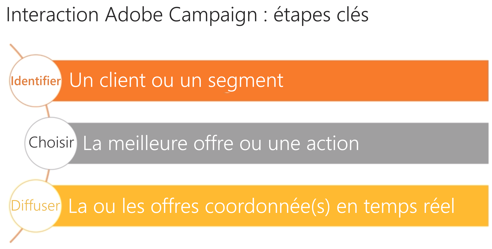

# Interaction et la gestion des offres{#interaction-and-offer-management}

Interaction permet de réagir en temps réel lors d&#39;une interaction avec un contact (un client ou une cible donnée) en lui proposant une ou plusieurs offres adaptées. Il peut s&#39;agir par exemple d&#39;un simple message de communication, d&#39;une promotion sur un ou plusieurs produits ou d&#39;un service.

Les offres sont proposées à un contact à l&#39;occasion d&#39;un contact entrant (via un site web ou un centre d&#39;appels) ou sortant (via une diffusion par email, courrier ou SMS dans le cadre d&#39;une campagne marketing).

Vous pouvez créer un catalogue d&#39;offres qui va s&#39;interfacer avec les canaux entrants et sortants afin de sélectionner la meilleure offre à proposer à un contact dans un contexte donné. La pertinence d&#39;une offre vis-à-vis de son destinataire est définie grâce à des règles dites d&#39;éligibilité. Le choix d&#39;une offre parmi un ensemble d&#39;offres pertinentes est déterminé à l&#39;aide de règles de priorité. Des règles de présentation des offres prennent en compte l&#39;historique des échanges avec le contact et permettent d&#39;éviter qu&#39;un contact reçoive la même offre un certain nombre de fois.

Interaction vous permet de créer et gérer un catalogue d’offres, et de paramétrer les règles d’éligibilité et les thèmes d’application qui leur sont associés. Vous pouvez personnaliser le contenu de votre offre selon le canal choisi à l’aide de différentes représentations. Enfin, pour déterminer l’impact d’une présentation d’offres, vous pouvez utiliser le module de simulation mis à votre disposition.

Pour vous familiariser avec la fonctionnalité d’interaction et les terminologies utilisées dans l’interaction de Campaign, regardez cette vidéo : [Aperçu de l’interaction Adobe Campaign](https://helpx.adobe.com/campaign/classic/how-to/acs-overview.html?playlist=/ccx/v1/collection/product/campaign/classic/segment/digital-marketers/explevel/intermediate/applaunch/get-started/collection.ccx.js&amp;ref=helpx.adobe.com).

## Rubriques connexes :

| Pages utiles | Autres ressources |
|---|---|
| [Etapes de mise en oeuvre de l’interaction](../../interaction/using/implementation-steps.md) | [Test  de la distribution  des](../../interaction/using/about-offers-simulation.md) |
| [Environnements en ligne/édition](../../interaction/using/live-design-environments.md) | [Ajout d’un   dans un courrier électronique](../../interaction/using/integrating-an-offer-via-the-wizard.md) |
| [Créer des emplacements d&#39;offres](../../interaction/using/creating-offer-spaces.md) | [Cas d’utilisation : ajout d’un   dans un site Web](../../interaction/using/offers-on-an-inbound-channel.md) |