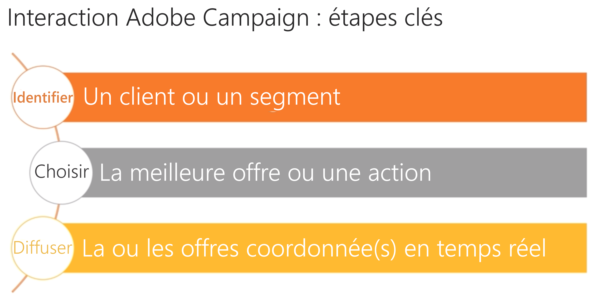

# Interaction et la gestion des offres{#interaction-and-offer-management}

Interaction permet de répondre en temps réel lors d&#39;une interaction avec un contact donné (un client ou une cible) en proposant une ou plusieurs offres adaptées. Il peut s&#39;agir par exemple de messages de communication simples, d&#39;offres spéciales sur un ou plusieurs produits ou d&#39;un service.

Les offres sont proposées à un contact à l&#39;occasion d&#39;un contact entrant (via un site web ou un centre d&#39;appels) ou sortant (via une diffusion par email, courrier ou SMS dans le cadre d&#39;une campagne marketing).

Vous pouvez créer un catalogue d’offres qui s’interface avec les canaux entrants et sortants afin de sélectionner la meilleure offre à envoyer à un contact dans un contexte donné. La pertinence de l’offre pour un destinataire est définie en fonction des règles d’éligibilité. La sélection d&#39;une offre à partir d&#39;un ensemble d&#39;offres pertinentes est déterminée à l&#39;aide de règles de priorité. Les règles de présentation des offres prennent en compte l&#39;historique d&#39;échange du contact et évitent de lui envoyer plusieurs fois la même offre.

Interaction vous permet de créer et de gérer un catalogue d&#39;offres, et de paramétrer les règles d&#39;éligibilité et les thèmes d&#39;application qui leur sont associés. Selon le canal choisi, le contenu de l&#39;offre peut être personnalisé grâce à différentes fonctions de rendu. Enfin, vous pouvez utiliser le module de simulation pour calculer l&#39;impact d&#39;une présentation d&#39;offres.

 Pour vous familiariser avec la fonctionnalité d’interaction et les terminologies utilisées dans Interaction de Campaign, regardez [cette vidéo](https://helpx.adobe.com/campaign/classic/how-to/acs-overview.html?playlist=/ccx/v1/collection/product/campaign/classic/segment/digital-marketers/explevel/intermediate/applaunch/get-started/collection.ccx.js&ref=helpx.adobe.com).

## Rubriques connexes :

| Pages utiles | Autres ressources |
|---|---|
| [Étapes de mise en œuvre d’Interaction](../../interaction/using/implementation-steps.md) | [Test de la distribution des offres](../../interaction/using/about-offers-simulation.md) |
| [Environnements en ligne/édition](../../interaction/using/live-design-environments.md) | [Ajout d’une offre dans un email](../../interaction/using/integrating-an-offer-via-the-wizard.md) |
| [Créer des emplacements d&#39;offres](../../interaction/using/creating-offer-spaces.md) | [Cas pratique : ajouter une offre dans un site web](../../interaction/using/offers-on-an-inbound-channel.md) |
