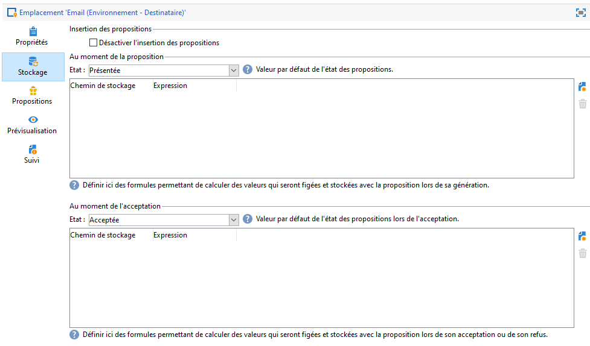

# Bonnes pratiques relatives aux interactions{#interaction-best-practices}


## Recommandations générales {#general-recommendations}

Cette section présente les bonnes pratiques pour gérer le module Interaction dans Adobe Campaign Classic, y compris les règles d&#39;éligibilité, les filtres prédéfinis, les activités de workflow et les options de bases de données.

Interaction dans Adobe Campaign requiert une gestion attentive pour fonctionner de manière efficace. Vous devez trouver un équilibre entre le nombre de contacts, de catégories d’offres et d’offres. Si ces facteurs ne sont pas gérés avec attention, votre instance Adobe Campaign peut rencontrer des problèmes.

### Mise en œuvre {#implementation}

Vous trouverez ci-dessous les éléments importants à garder à l’esprit lors de la mise en œuvre et de la configuration des interactions.

* Dans le cas du moteur batch (généralement utilisé dans les communications sortantes, telles que les emails), le débit est la préoccupation centrale, car plusieurs contacts peuvent être gérés simultanément. Le goulot d’étranglement typique est la performance de la base de données.
* La principale contrainte du moteur unitaire (généralement utilisé dans les communications entrantes, telles qu’une bannière sur un site web) est la latence, car quelqu’un attend une réponse. Le goulot d’étranglement typique est la performance de l’unité centrale.
* La conception du catalogue d&#39;offres a un impact considérable sur la performance d&#39;Adobe Campaign Classic.
* S&#39;il existe de nombreuses offres, fractionnez-les en plusieurs catalogues.

### Règles d’éligibilité {#eligibility-rules}

Vous trouverez ci-dessous certaines bonnes pratiques en matière de règles d’éligibilité.

* Simplifiez les règles. La complexité des règles a une incidence sur la performance, car elle prolonge la recherche. Une règle est complexe si elle comprend plus de cinq conditions.
* Afin d’accroître la performance, les règles peuvent être décomposées en différents filtres prédéfinis partagés entre des offres multiples.
* Placez les règles de catégorie d’offres les plus restrictives à la position la plus élevée possible dans l’arbre. De cette manière, elles excluront le plus grand nombre de contacts en premier, ce qui réduit le nombre de cibles et empêche leur traitement par d’autres règles.
* Placez les règles les plus coûteuses en termes de temps ou de traitement en bas de l&#39;arbre. De cette façon, ces règles seront uniquement exécutées sur l&#39;audience cible restante.
* Démarrez au niveau d&#39;une catégorie spécifique afin d&#39;éviter d&#39;analyser l&#39;ensemble de l&#39;arbre.
* Pour économiser le temps de traitement, précalculez les agrégats au lieu de créer des règles complexes avec des jointures. Pour ce faire, essayez de stocker les données client dans une table de référence qui peut être consultée au sein des règles d&#39;éligibilité.
* Utilisez un nombre minimum de poids pour limiter le nombre de requêtes.
* Il est recommandé de disposer d&#39;un nombre limité d&#39;offres par emplacement d&#39;offre. Cela accélère la récupération des offres dans n&#39;importe quel emplacement donné.
* Servez-vous d&#39;index, en particulier pour les colonnes de recherche fréquemment utilisées.

### Table de propositions {#proposition-table}

Vous trouverez ci-dessous quelques bonnes pratiques concernant la table de propositions.

* Utilisez un nombre minimum de règles pour que le traitement soit le plus rapide possible.
* Limitez le nombre d&#39;enregistrements dans la table de propositions : conservez uniquement les enregistrements requis pour contrôler la mise à jour de son statut et ce que requièrent les règles, puis archivez-les dans un autre système.
* Réalisez une maintenance de base de données intensive sur la table de propositions, par exemple, en reconstruisant les index ou en recréant la table.
* Limitez le nombre de propositions par cible. N&#39;en définissez pas davantage par rapport à ce que vous allez utiliser.
* Dans la mesure du possible, évitez les jointures dans les critères des règles.

## Conseils et astuces concernant la gestion des offres {#tips-managing-offers}

Cette section contient des conseils plus détaillés sur la gestion des offres et l&#39;utilisation du module Interaction dans Adobe Campaign Classic.

### Utilisation de plusieurs espaces d&#39;offres dans une diffusion par email {#multiple-offer-spaces}

Lorsque vous incluez des offres dans des diffusions, elles sont généralement sélectionnées en amont dans le workflow Campaign par le biais d’une activité d’enrichissement (ou d’une autre activité similaire).

Pour sélectionner des offres dans une activité d’enrichissement, vous pouvez choisir l’emplacement d’offre à utiliser. Cependant, quel que soit l&#39;emplacement sélectionné, le menu de personnalisation de la diffusion dépend de l&#39;espace d&#39;offre configuré dans la diffusion.

Dans l&#39;exemple ci-dessous, l&#39;emplacement d&#39;offre sélectionné dans la diffusion est **[!UICONTROL Email (Environnement - Destinataire)]**:


Si l&#39;emplacement d&#39;offre sélectionné dans la diffusion ne dispose pas d&#39;une fonction de rendu HTML configurée, vous ne la verrez pas dans le menu de diffusion et elle ne sera pas disponible pour pouvoir le sélectionner. Comme indiqué plus haut, cette situation est indépendante de l’emplacement d’offre sélectionné dans l’activité d’enrichissement.

Dans l&#39;exemple ci-dessous, la fonction de rendu HTML est disponible dans la liste déroulante, car l&#39;emplacement d&#39;offre sélectionné dans la diffusion comporte une fonction de rendu :


Cette fonction insère du code tel que : `<%@ include proposition="targetData.proposition" view="rendering/html" %>`.

Lorsque vous sélectionnez la proposition, la valeur de l&#39;attribut **[!UICONTROL vue]** est la suivante :
* &quot;render/html&quot; : rendu HTML. Il utilise la fonction de rendu HTML.
* &quot;offer/view/html&quot; : contenu HTML. Il n&#39;utilise pas la fonction de rendu HTML et n&#39;inclut que le champ HTML.

Lorsque vous incluez plusieurs emplacements d&#39;offre dans une diffusion par email unique alors que seuls certains d&#39;entre eux ont des fonctions de rendu, vous devez vous rappeler des offres et des emplacements d&#39;offre correspondants, et dans ces emplacements, ceux dotés de fonctions de rendu.

Pour éviter tout problème, il est donc recommandé de définir une fonction de rendu HTML pour tous les emplacements d&#39;offre, même si le vôtre ne nécessite que du contenu HTML.

### Définition du rang dans le tableau du log des propositions {#rank-proposition-log-table}

Les emplacements d&#39;offre permettent de stocker des données dans la table des propositions après génération ou acceptation de propositions :



Toutefois, cela ne s&#39;applique qu&#39;aux interactions entrantes.

Il est également possible de stocker des données supplémentaires dans la table des propositions si vous utilisez les interactions sortantes, ou les offres sortantes sans le module Interaction.

Un champ de la table temporaire de workflow dont le nom correspond à celui d&#39;un champ de la table des propositions est copié dans le même champ de la table des propositions.

Par exemple, en cas de sélection manuelle d&#39;une offre (sans le module interaction) dans un Enrichissement, les champs standard sont définis comme suit :


Il est possible d&#39;ajouter d&#39;autres champs, par exemple un champ @rank :


Puisqu&#39;il existe un champ @rank dans la table des propositions, la valeur contenue dans la table temporaire du workflow sera copiée.

Pour plus d&#39;informations sur le stockage de champs supplémentaires dans la table des propositions, voir la section [Intégrer une offre via un workflow](../../interaction/using/integrating-an-offer-via-a-workflow.md#storing-offer-rankings-and-weights).

Pour les offres sortantes avec le module Interaction, cette possibilité est utile lorsque plusieurs offres sont sélectionnées et que vous souhaitez enregistrer l&#39;ordre dans lequel elles seront affichées dans un email.

Vous pouvez également stocker des métadonnées supplémentaires directement dans la table des propositions, par exemple le niveau de dépense actuel, pour conserver des historiques enregistrés relatifs aux dépenses au moment de la génération des offres.

En cas d&#39;utilisation d&#39;une interaction sortante, il est possible d&#39;ajouter le champ @rank, comme dans l&#39;exemple ci-dessus. Cependant, sa valeur est automatiquement définie en fonction de l&#39;ordre renvoyé par le module Interaction. Par exemple, si vous utilisez le module Interaction pour sélectionner trois offres, les valeurs 1, 2 et 3 sont renvoyées dans le champ @rank.

Lorsque vous utilisez le module Interaction et que vous sélectionnez manuellement des offres, l&#39;utilisateur peut combiner les deux approches. Par exemple, l&#39;utilisateur peut définir manuellement le champ @rank sur 1 pour l&#39;offre sélectionnée manuellement et utiliser une expression telle que &quot;1 + @rank&quot; pour les offres renvoyées par le module Interaction. En supposant que l&#39;interaction sélectionne trois offres, les offres renvoyées par les deux approches seront classées de 1 à 4 :


### Extension du schéma nms:offer {#extending-nms-offer-schema}

Lors de l&#39;extension du schéma nms:offer, veillez à suivre la structure prête à l&#39;emploi déjà configurée :
* Définissez un nouveau champ pour le stockage du contenu sous `<element name="view">`.
* Un nouveau champ doit être défini deux fois. Une fois sous forme de champ XML normal, et une autre fois sous forme de champ XML CDATA en ajoutant &quot;_jst&quot; au nom. Par exemple :

  ```
  <element label="Price" name="price" type="long" xml="true"/>
  <element advanced="true" label="Script price" name="price_jst" type="CDATA" xml="true"/>
  ```

* Un champ contenant des URL à tracker doit être placé sous `<element name="trackedUrls">`, lequel se trouve sous `<element name="view" >`.
