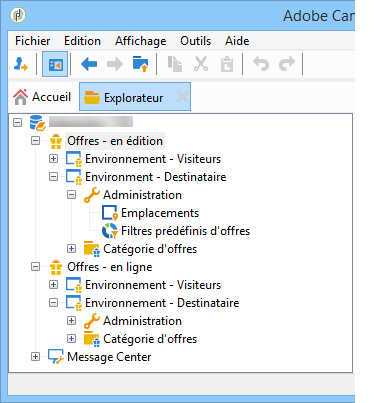
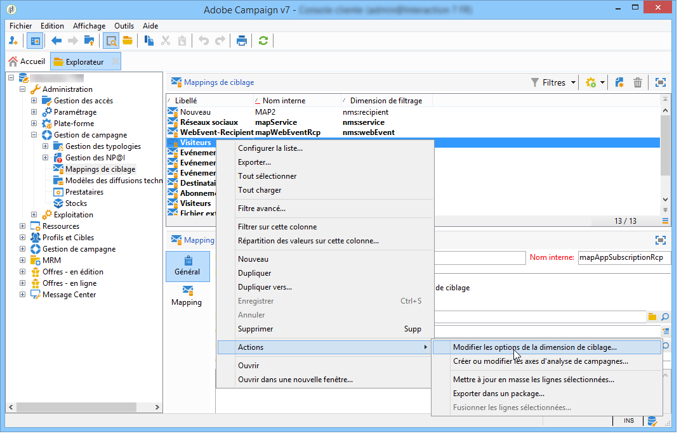
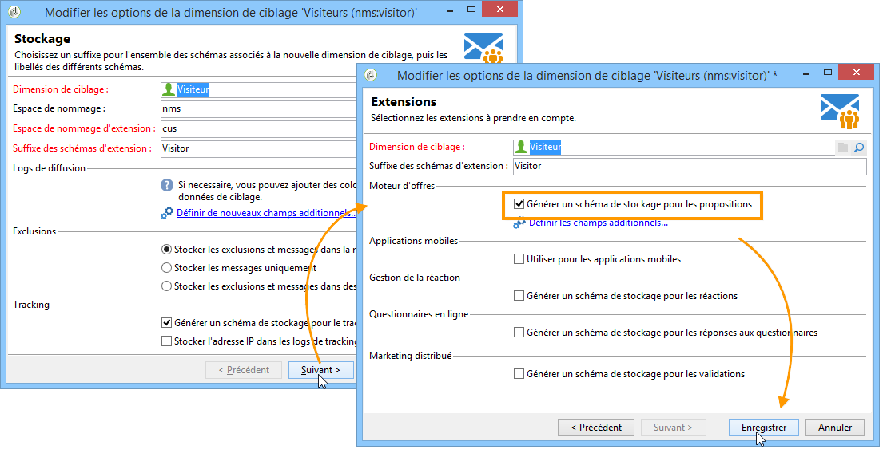
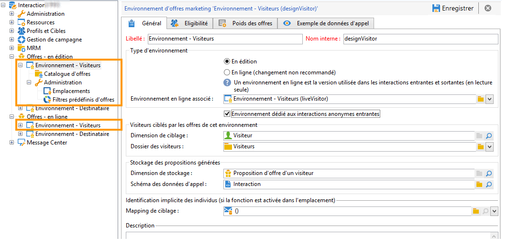

# Environnements en ligne/édition{#live-design-environments}

## Principe de fonctionnement {#operating-principle}

Interaction fonctionne avec deux types d&#39;environnements d&#39;offres :

* des environnements d&#39;offres **[!UICONTROL En édition]**, dans lesquels les offres sont en cours de création et peuvent être modifiées. Ces offres ne sont pas encore passées par un cycle de validation et ne sont donc pas diffusées aux contacts.
* des environnements d&#39;offres **[!UICONTROL En ligne]** qui contiennent les offres validées, telles qu&#39;elles sont présentées aux contacts. Les offres contenues dans ces environnements sont en lecture seule.

Chaque environnement **[!UICONTROL En édition]** est lié à un environnement **[!UICONTROL En ligne]**. Lorsqu&#39;une offre est terminée, son contenu et ses règles d&#39;éligibilité sont soumis à un cycle d’approbation. Lorsque le cycle de validation est complet, l’offre concernée est automatiquement déployée dans l’environnement **[!UICONTROL En ligne]**. Dès lors, elle est disponible pour être diffusée.

Par défaut, Interaction comprend un environnement **[!UICONTROL En édition]** et un environnement **[!UICONTROL En ligne]** qui lui est associé. Les deux environnements sont préconfigurés pour cibler le tableau des destinataires intégrée.

>[!NOTE]
>
>Pour cibler un autre tableau (tableau des visiteurs et visiteuses pour les offres anonymes ou tableau de destinataires spécifique), vous devez utiliser l’assistant de mapping de ciblage pour créer les environnements. Voir à ce sujet la section [Créer un environnement d’offre](#creating-an-offer-environment).

Le chargé d&#39;offres et le chargé de diffusion accèdent différemment aux environnements. Le chargé de diffusion ne peut visualiser que l&#39;environnement d&#39;offres **[!UICONTROL En ligne]** et utiliser les offres pour les diffuser. Le chargé d&#39;offres peut visualiser et modifier l&#39;environnement **[!UICONTROL En édition]** et consulter l’environnement **[!UICONTROL En ligne]**. Voir à ce sujet la section [Profils d’opérateurs](../../interaction/using/operator-profiles.md).

## Créer un environnement d&#39;offres {#creating-an-offer-environment}

Par défaut, Interaction est livré avec un environnement pré-paramétré pour cibler la table des destinataires (offres identifiées). Si vous souhaitez cibler une autre table (table des visiteurs pour les offres anonymes ou table de destinataires spécifique), vous devez effectuer le paramétrage suivant :

1. Positionnez-vous sur le noeud **[!UICONTROL Administration]** > **[!UICONTROL Gestion de campagne]** > **[!UICONTROL Mappings de ciblage]**. Cliquez avec le bouton droit sur le mapping de diffusion que vous souhaitez utiliser (**[!UICONTROL Visiteurs et visiteuses]** si vous souhaitez utiliser les offres anonymes) et sélectionnez **[!UICONTROL Actions]** > **[!UICONTROL Modifier les options de la dimension de ciblage]**.

   

1. Cliquez sur **[!UICONTROL Suivant]** pour accéder au second écran de l’assistant, cochez la case **[!UICONTROL Générer un schéma de stockage pour les propositions]** et cliquez sur **[!UICONTROL Enregistrer]**.

   

   >[!NOTE]
   >
   >Si la case était déjà cochée, décochez-la puis recochez-la.

1. Adobe Campaign crée les deux environnements (**[!UICONTROL En édition]** et **[!UICONTROL En ligne]**) correspondant au mapping de ciblage activé précédemment. L&#39;environnement est pré-paramétré avec les informations de ciblage.

   Si vous avez activé le mapping **[!UICONTROL Visiteurs]**, la case **[!UICONTROL Environnement dédié aux interactions anonymes entrantes]** est automatiquement cochée dans l&#39;onglet **[!UICONTROL Général]** de l&#39;environnement.

   Cette option permet d&#39;activer les fonctions spécifiques aux interactions anonymes, notamment dans le paramétrage des emplacements de l&#39;environnement. Vous pourrez ainsi paramétrer des options permettant de basculer d&#39;un environnement &quot;identifié&quot; à un environnement &quot;anonyme&quot;.

   Vous pouvez par exemple lier un emplacement d&#39;environnement de destinataire (contact identifié) à un emplacement correspondant d&#39;environnement de visiteur (contact non identifié). Ainsi, différentes offres seront mises à la disposition du contact, en fonction du caractère identifié ou non de ce dernier. Voir à ce sujet la section [Créer des emplacements](../../interaction/using/creating-offer-spaces.md).

   

>[!NOTE]
>
>Pour plus d&#39;informations sur les interactions anonymes sur canal entrant, consultez la section [Interactions anonymes](../../interaction/using/anonymous-interactions.md).
