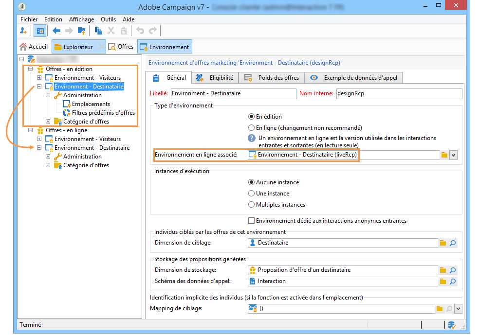

# Environnements en ligne/édition{#live-design-environments}

## Principe de fonctionnement {#operating-principle}

Interaction fonctionne avec deux types d&#39;environnements d&#39;offres :

* des environnements d&#39;offres **[!UICONTROL En édition]**, dans lesquels les offres sont en cours de création et peuvent être modifiées. Ces offres ne sont pas encore passées par un cycle de validation et ne sont donc pas diffusées aux contacts.
* des environnements d&#39;offres **[!UICONTROL En ligne]** qui contiennent les offres validées, telles qu&#39;elles sont présentées aux contacts. Les offres contenues dans ces environnements sont en lecture seule.

Chaque environnement **[!UICONTROL En édition]** est associé à un environnement **[!UICONTROL En ligne]**. Lorsqu&#39;une offre est finalisée, son contenu et ses règles d&#39;éligibilité passent par un cycle de validation. Lorsque le cycle de validation est complet, l&#39;offre concernée est automatiquement déployée dans l&#39;environnement **[!UICONTROL En ligne]**. Dès lors, elle est disponible pour être diffusée.

Par défaut, Interaction est livré avec un environnement **[!UICONTROL En édition]** et l&#39;environnement **[!UICONTROL En ligne]** qui lui est associé. Les deux environnements sont pré-paramétrés pour cibler la table des destinataires livrée d&#39;usine.

>[!NOTE]
>
>Pour cibler une autre table (table des visiteurs pour les offres anonymes ou table des destinataires spécifique), vous devez utiliser l’assistant de mappage de cible pour créer les environnements. Pour plus d’informations, reportez-vous à la section [Création d’un environnement](#creating-an-offer-environment)d’offre.

Offer managers and the delivery managers have access to different views of the environment. Delivery managers can only view the **[!UICONTROL Live]** offer environment and use offers to deliver them. Offer managers can view and alter the **[!UICONTROL Design]** environment and view the **[!UICONTROL Live]** environment. For more on this, refer to [Operator profiles](../../interaction/using/operator-profiles.md).

## Créer un environnement d&#39;offres {#creating-an-offer-environment}

Par défaut, Interaction est livré avec un environnement pré-paramétré pour cibler la table des destinataires (offres identifiées). Si vous souhaitez cibler une autre table (table des visiteurs pour les offres anonymes ou table de destinataires spécifique), vous devez effectuer le paramétrage suivant :

1. Positionnez-vous sur le noeud **[!UICONTROL Administration]** > **[!UICONTROL Gestion de campagne]** > **[!UICONTROL Mappings de ciblage]**. Cliquez avec le bouton droit sur le mapping de ciblage que vous souhaitez utiliser (**[!UICONTROL Visiteurs]** si vous souhaitez utiliser les offres anonymes) et sélectionnez **[!UICONTROL Actions]** > **[!UICONTROL Modifier les options de la dimension de ciblage]**.

   

1. Cliquez sur **[!UICONTROL Suivant]** pour accéder au second écran de l&#39;assistant, cochez la case **[!UICONTROL Générer un schéma de stockage pour les propositions]**, et cliquez sur **[!UICONTROL Enregistrer]**.

   

   >[!NOTE]
   >
   >Si la case était déjà cochée, décochez-la puis recochez-la.

1. Adobe Campaign crée les deux environnements (**[!UICONTROL En édition]** et **[!UICONTROL En ligne]**) correspondant au mapping de ciblage activé précédemment. L&#39;environnement est pré-paramétré avec les informations de ciblage.

   Si vous avez activé le mapping **[!UICONTROL Visiteurs]**, la case **[!UICONTROL Environnement dédié aux interactions anonymes entrantes]** est automatiquement cochée dans l&#39;onglet **[!UICONTROL Général]** de l&#39;environnement.

   Cette option permet d&#39;activer les fonctions spécifiques aux interactions anonymes, notamment dans le paramétrage des emplacements de l&#39;environnement. Vous pourrez ainsi paramétrer des options permettant de basculer d&#39;un environnement &quot;identifié&quot; à un environnement &quot;anonyme&quot;.

   Par exemple, vous pouvez lier un espace d’offre d’environnement de destinataire (contact identifié) à un espace d’offre qui correspond à un environnement de visiteur (contact non identifié). De cette façon, différentes offres seront mises à la disposition du contact selon qu’il est identifié ou non. For more on this, refer to [Creating offer spaces](../../interaction/using/creating-offer-spaces.md).

   

>[!NOTE]
>
>For more information on anonymous interactions on an inbound channel, refer to [Anonymous interactions](../../interaction/using/anonymous-interactions.md).

