# Gestion de la présentation des offres{#managing-offer-presentation}

## Aperçu des règles de présentation {#presentation-rules-overview}

Interaction permet de contrôler le flux des propositions d&#39;offres à l&#39;aide de règles dites de présentation. Ces règles, propres à Interaction, sont des règles de typologie. Elles permettent d&#39;exclure certaines offres en fonction de l&#39;historique des propositions déjà faites à un destinataire. Elles sont référencées au niveau de l&#39;environnement.

## Créer et référencer une règle de présentation d&#39;offre {#creating-and-referencing-an-offer-presentation-rule}

1. Positionnez-vous au niveau du noeud **[!UICONTROL Administration]** > **[!UICONTROL Gestion de campagne]** > **[!UICONTROL Gestion des typologies]** > **[!UICONTROL Règles de typologie]**.
1. Créez une règle de typologie et sélectionnez le type **[!UICONTROL Présentation des offres]**.

   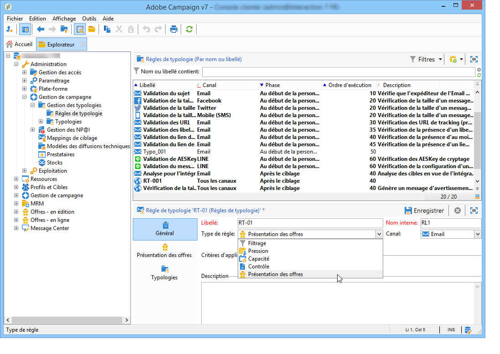

1. Spécifiez éventuellement le canal sur lequel doit porter la règle.

   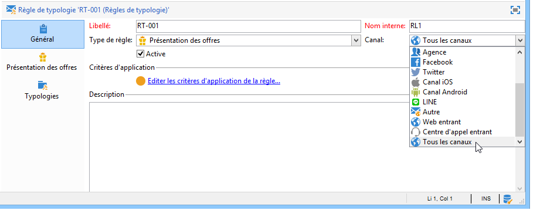

1. Configurez les critères d’application de la règle. Voir à ce sujet la section [Paramètres des règles de présentation](#presentation-rule-settings).
1. Positionnez-vous au niveau du noeud **[!UICONTROL Administration]** > **[!UICONTROL Gestion de campagne]** > **[!UICONTROL Gestion des typologies]** > **[!UICONTROL Typologies]** et créez une typologie destinée à regrouper toutes les règles de type **[!UICONTROL Présentation des offres]**.

   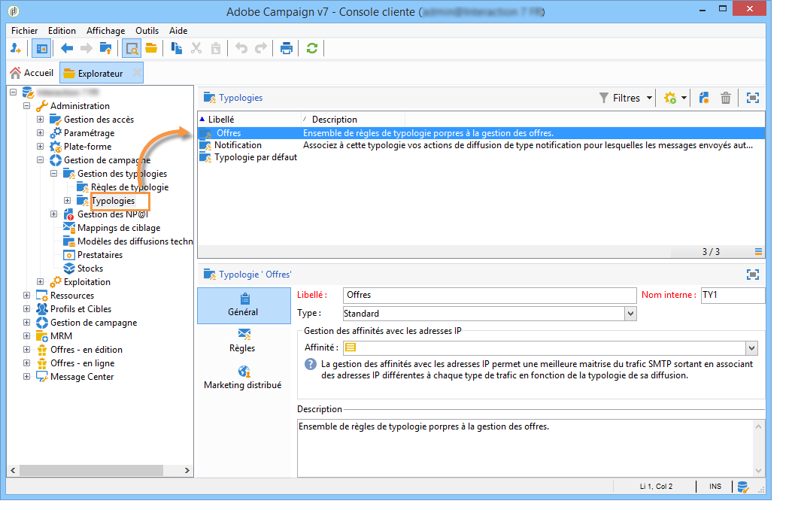

1. Une fois la typologie créée, positionnez-vous au niveau des règles de typologie et regroupez-les sous la typologie que vous venez de créer.

   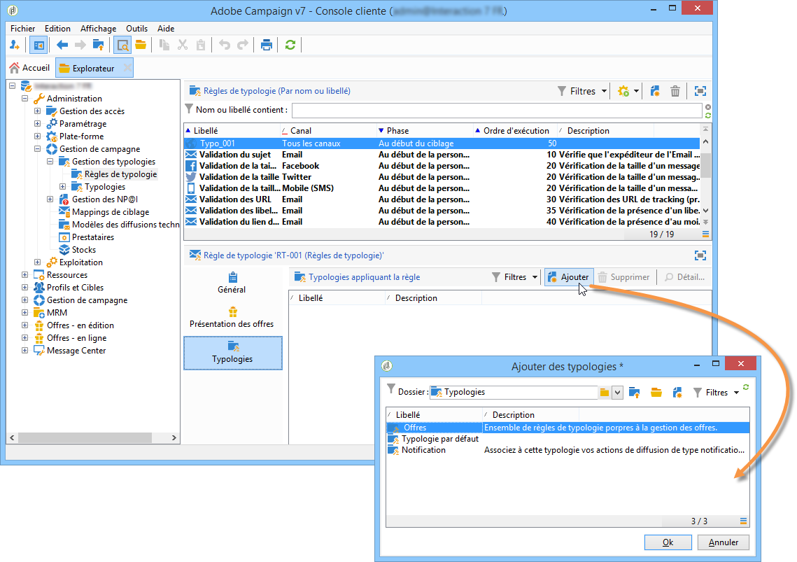

1. Au niveau de votre environnement d&#39;offres, référencez la typologie à l&#39;aide de la liste déroulante.

   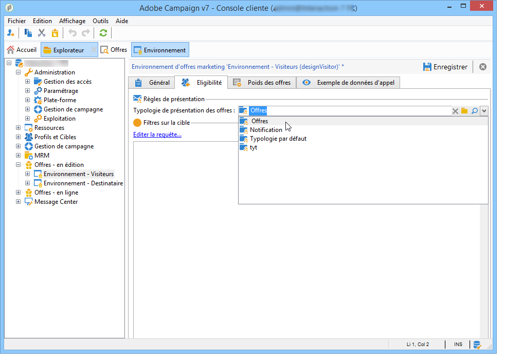

## Paramètres des règles de présentation {#presentation-rule-settings}

### Critères d&#39;application {#application-criteria-}

Disponibles dans l&#39;onglet **[!UICONTROL Général]**, les critères d&#39;application permettent de déterminer les offres auxquelles la règle de présentation doit s&#39;appliquer. Pour cela, vous devez créer une requête et sélectionner les offres concernées, comme décrit ci-après.

1. Dans votre règle de typologie, cliquez sur le lien **[!UICONTROL Editer les critères d&#39;application de la règle]** pour créer votre requête.

   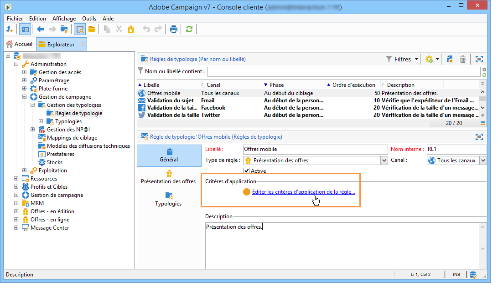

1. Dans la fenêtre de requête, vous pouvez appliquer un filtre sur les offres auxquelles vous souhaitez appliquer la règle de typologie.

   Vous pouvez par exemple sélectionner une catégorie d&#39;offres.

   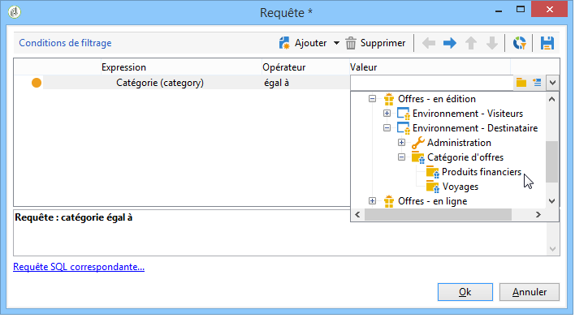

### Dimensions des offres {#offer-dimensions}

Dans l&#39;onglet **[!UICONTROL Présentation des offres]**, vous devez spécifier les mêmes dimensions pour la règle de présentation que celles paramétrées au niveau de l&#39;environnement.

La **[!UICONTROL Dimension de ciblage]** correspond à la table des destinataires (par défaut : `nms:recipients`) qui recevront les propositions d’offre. La **[!UICONTROL Dimension de stockage]** correspond à la table contenant l&#39;historique des propositions liées à la dimension de ciblage (par défaut : `nms:propositionRcp`).

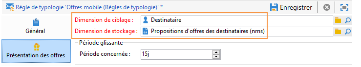

>[!NOTE]
>
>Vous pouvez utiliser des tables non fournies en standard. Si vous souhaitez utiliser une dimension de ciblage spécifique, vous devez créer les tables ainsi qu&#39;un environnement dédié à l&#39;aide du mapping de ciblage. Pour plus d’informations, reportez-vous à la section [Créer un environnement d’offres](../../interaction/using/live-design-environments.md#creating-an-offer-environment).

### Période {#period}

Il s&#39;agit de la période glissante durant laquelle les propositions sont prises en compte dans la règle. Elle restreint dans le temps la prise en compte de l&#39;historique des propositions d&#39;offres. La règle ne s&#39;applique pas aux propositions d&#39;offres faites en dehors de cette période.

La période débute **n** jours avant la date des propositions et prend fin **n** jours après, où **n** correspond au nombre entré au niveau du champ **[!UICONTROL Période concernée]** :

* Pour un emplacement de type entrant, la date des propositions est la date de présentation de l&#39;offre.
* Pour un emplacement de type sortant, la date des propositions est la date de contact de la diffusion (par exemple la date d&#39;envoi saisie dans un workflow de ciblage).

Utilisez les flèches du champ pour modifier le nombre de jours ou saisissez directement la durée souhaitée (par exemple : &quot;2j 6h&quot;).

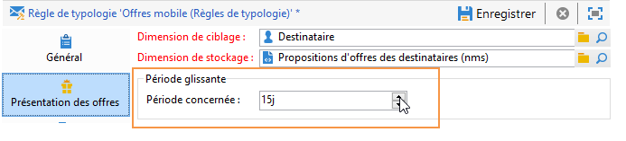

### Nombre de propositions {#number-of-propositions}

Vous pouvez fixer le nombre maximum de propositions à faire avant d&#39;exclure la ou les offres concernées.

Utilisez la flèche ascendante ou descendante pour modifier le nombre de propositions d&#39;offres.

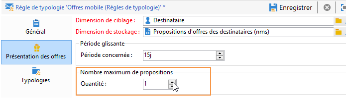

## Définir les propositions et les destinataires {#defining-propositions-and-recipients}

La section **[!UICONTROL Propositions à comptabiliser]** vous permet de préciser à la fois les destinataires et les propositions qui, s&#39;ils sont retrouvés dans l&#39;historique des propositions en nombre suffisant, aboutiront à l&#39;exclusion des offres définies dans l&#39;onglet **[!UICONTROL Général]**.

### Filtrer les propositions {#filtering-propositions}

Vous pouvez sélectionner des critères de filtrage pour exclure des propositions selon le canal, les offres impactées ou l&#39;état des propositions déjà effectuées.

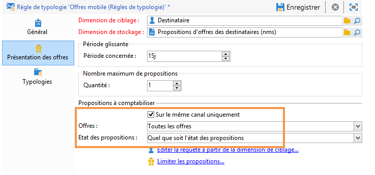

Ces critères constituent les cas d&#39;application les plus courants d&#39;une règle de présentation. Si vous souhaitez utiliser d&#39;autres critères, vous pouvez créer une requête à l&#39;aide du lien **[!UICONTROL Limiter les propositions...]**. Voir à ce sujet la section [Créer une requête sur les propositions](#creating-a-query-on-propositions).

* **Filtre sur le canal**

  **[!UICONTROL Sur le même canal uniquement]** : permet d&#39;exclure les propositions d&#39;offre sur le canal spécifié dans l&#39;onglet **[!UICONTROL Général]**.

  Par exemple, le canal spécifié pour la règle dans l&#39;onglet **[!UICONTROL Général]** est l&#39;email. Si les offres auxquelles la règle s&#39;applique n&#39;ont été proposées que sur le canal web, le moteur d&#39;interaction pourra présenter les offres dans une diffusion par email. En revanche, dès que les offres auront été présentées par email, le moteur d&#39;interaction choisira un autre canal pour proposer les offres.

  >[!NOTE]
  >
  >Il s&#39;agit bien du canal et non de l&#39;emplacement. Si la règle doit exclure une offre sur le canal web, l&#39;offre destinée à être proposée sur un site web à deux emplacements, (une bannière et le corps de texte de la page par exemple), n&#39;apparaîtra pas sur le site si elle a déjà été proposée auparavant.
  >
  >Dans le cas d&#39;un workflow impliquant la présentation d&#39;offres, les règles ne sont correctement prises en compte que si elles sont paramétrées sur **[!UICONTROL Tous les canaux]**.

* **Filtre sur l&#39;offre**

  Ce filtre permet de limiter à certains ensembles d&#39;offres les propositions d&#39;offres à comptabiliser.

  **[!UICONTROL Toutes les offres]** : valeur par défaut. Aucun filtre sur les offres n&#39;est appliqué.

  **[!UICONTROL L&#39;offre en cours de présentation]** : l&#39;offre spécifiée dans l&#39;onglet **[!UICONTROL Général]** est exclue si elle a déjà été proposée.

  **[!UICONTROL Les offres de la même catégorie]** : une offre est exclue si une proposition d&#39;offre de la même catégorie a déjà été faite.

  **[!UICONTROL Les offres auxquelles la règle s&#39;applique]** : lorsque plusieurs offres sont définies dans l&#39;onglet **[!UICONTROL Général]**, chaque proposition d&#39;offre de cet ensemble d&#39;offres est prise en compte et aboutit à l&#39;exclusion de toutes si le nombre maximum de proposition est atteint.

  Par exemple, les offres N°2, 3 et 5 sont définies dans l&#39;onglet **[!UICONTROL Général]**. Le nombre maximum de propositions est fixé à 2. Si l&#39;offre N°2 et 5 sont proposées chacune une fois, le nombre de propositions comptabilisé est de 2. Par conséquent, l&#39;offre N°3 ne sera jamais présentée.

* **Filtre sur l&#39;état de la proposition**

  Ce filtre permet de choisir directement les états les plus courants des propositions d&#39;offres à prendre en compte dans l&#39;historique des propositions.

  **[!UICONTROL Quel que soit l&#39;état des propositions]** : valeur par défaut. Aucun filtre n&#39;est appliqué sur l&#39;état des propositions.

  **[!UICONTROL Propositions acceptées ou refusées]** : permet d&#39;exclure les offres déjà proposées qui ont été acceptées ou refusées.

  **[!UICONTROL Propositions acceptées]** : permet d&#39;exclure les offres déjà proposées qui ont été acceptées.

  **[!UICONTROL Propositions refusées]** : permet d&#39;exclure les offres déjà proposées qui ont été refusées.

### Définir les destinataires {#defining-recipients}

Pour indiquer les destinataires, cliquez sur le lien **[!UICONTROL Editer la requête à partir de la dimension de ciblage...]**, puis sélectionnez les destinataires concernés par la règle.

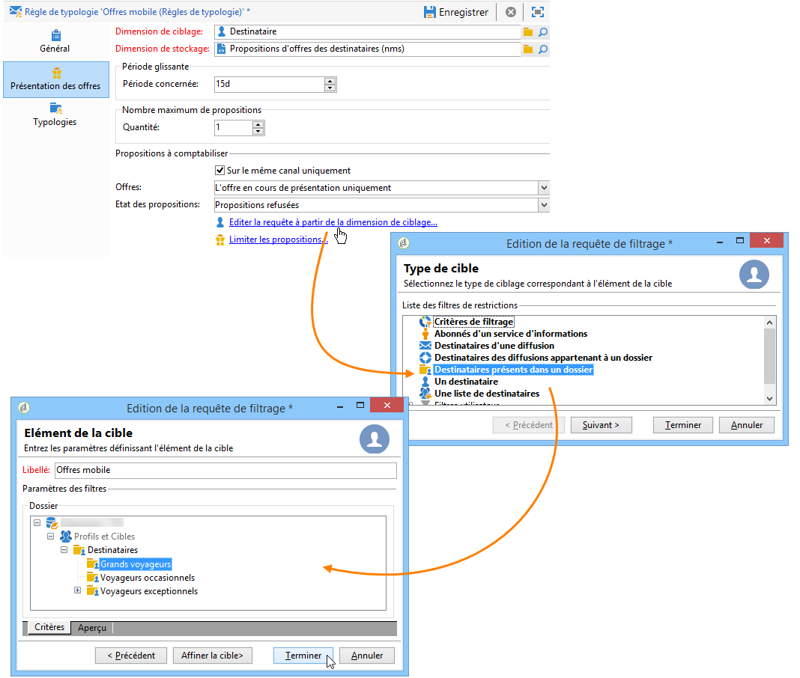

### Créer une requête sur les propositions {#creating-a-query-on-propositions}

Pour préciser les propositions à comptabiliser via une requête, cliquez sur le lien **[!UICONTROL Limiter les propositions]** et indiquez les critères à prendre en compte.

Dans l&#39;exemple ci-dessous, les propositions à comptabiliser au bout de deux présentations sont celles de la catégorie **Offres spéciales**, pour l&#39;emplacement **Centre d&#39;appels**, dont le poids est inférieur à **20**.

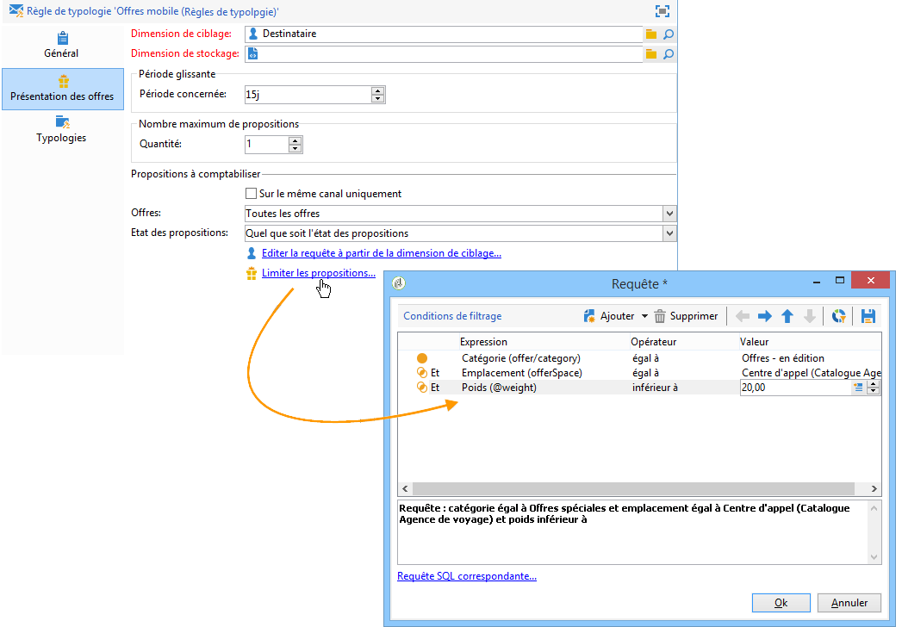
