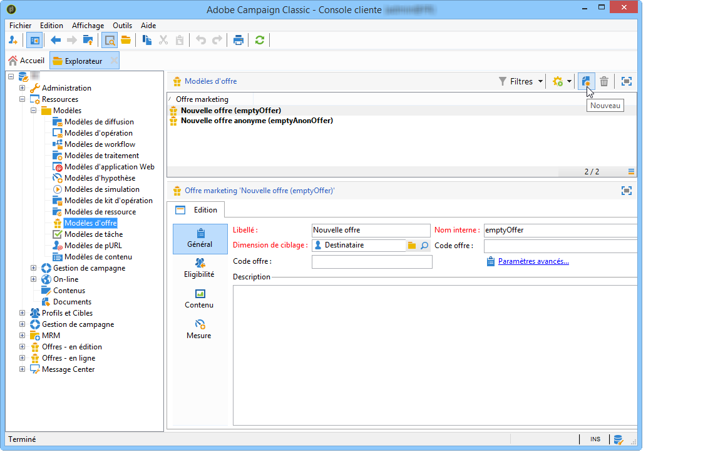
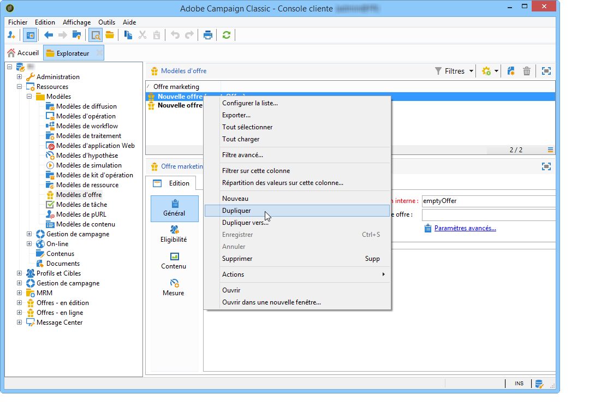
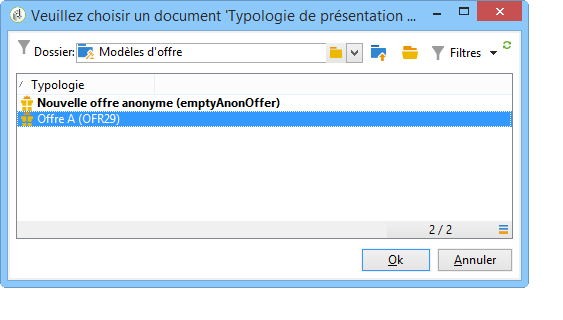

# Gérer les modèles d&#39;offre{#managing-offer-templates}

Des modèles d&#39;offre sont livrés d&#39;usine dans Adobe Campaign. Il vous est possible de les utiliser lors de la création de vos offres, de les dupliquer et d&#39;en adapter le paramétrage selon vos besoins. Vous pouvez également créer vos propres modèles. Les modèles d&#39;offre sont stockés dans le dossier **Ressources** > **Modèles** > **Modèles d&#39;offre**.

## Créer un modèle d&#39;offre {#creating-an-offer-template}

Afin de créer un modèle d&#39;offre, voici la marche à suivre :

1. Allez sur **Ressources** > **Modèles** > **Modèles d&#39;offre**.
1. Cliquez sur l&#39;icône **Nouveau**.

   

1. Paramétrez votre modèle de la même manière qu&#39;une offre classique, puis sauvegardez-le avec le bouton **Enregistrer**.

## Dupliquer un modèle d&#39;offre existant {#duplicate-an-existing-template}

Afin de dupliquer un modèle d&#39;offre (d&#39;usine ou non), voici la marche à suivre :

1. Allez sur **Ressources > Modèles > Modèles d&#39;offre**.
1. Cliquez avec le bouton droit de la souris sur le modèle que vous souhaitez dupliquer et sélectionnez **Dupliquer** dans le menu déroulant.

   

1. Modifiez si besoin les paramètres que vous souhaitez voir apparaître dans le modèle, puis sauvegardez ce modèle en cliquant sur **Enregistrer**.

Ce modèle sera désormais proposé lors de la création d&#39;une offre.

