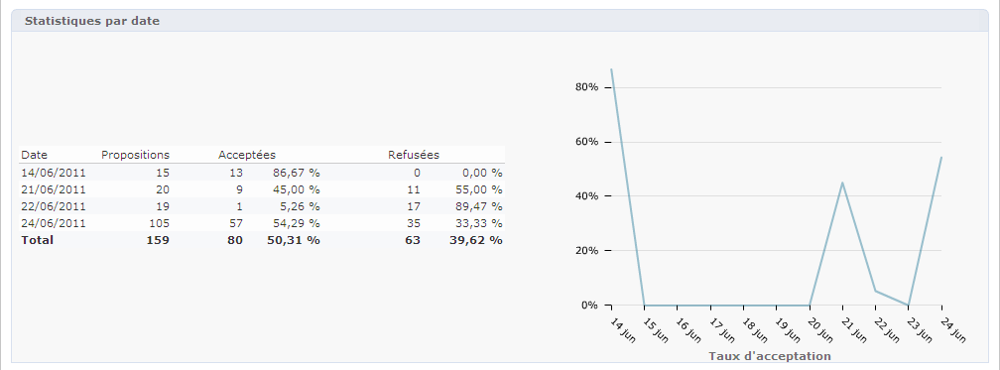
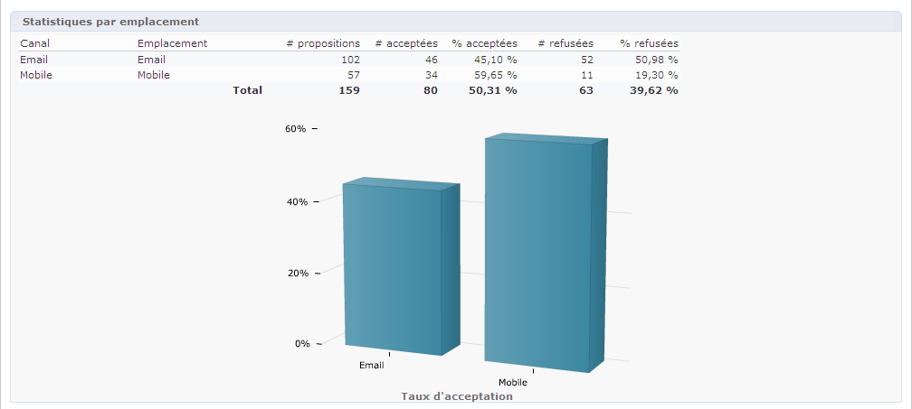
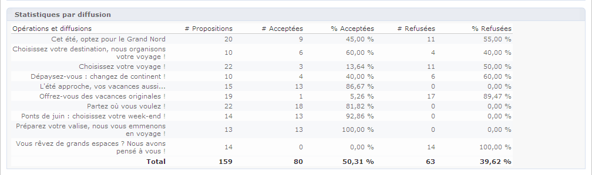
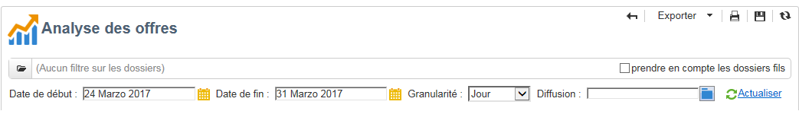

# Rapport Analyse des offres{#offer-analysis-report}

Le rapport **[!UICONTROL Analyse des offres]** vous permet d&#39;avoir une vue d&#39;ensemble du nombre de propositions acceptées ou refusées.

>[!NOTE]
>
>Cette fonctionnalité n&#39;est visible que par le chargé de diffusion, dans un environnement en ligne.

Les statistiques sont classées selon trois critères :

* Par date :

  

* Par emplacement :

  

* Par diffusions :

  

Vous pouvez filtrer les données à l&#39;aide de différents critères disponibles dans la partie supérieure du rapport. Lorsque vous avez choisi les critères, cliquez sur le lien **[!UICONTROL Actualiser]** pour les appliquer au rapport.

