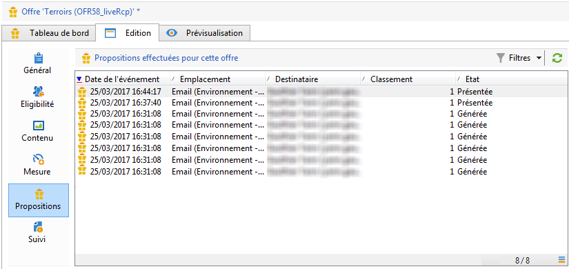
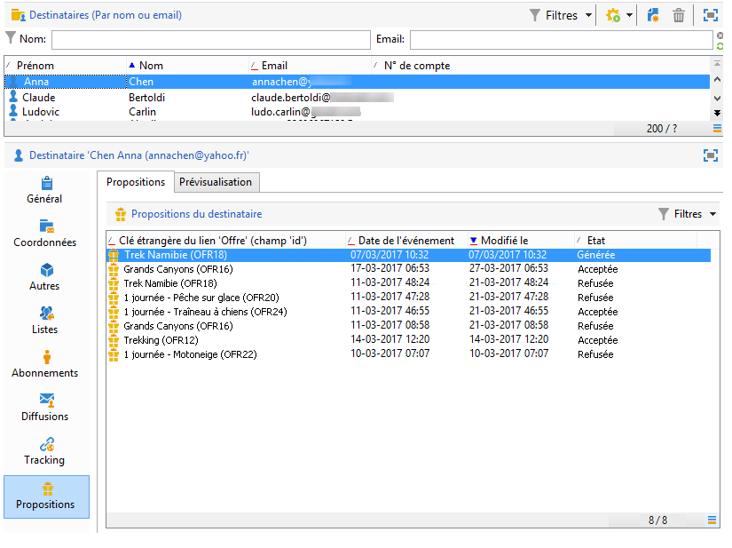
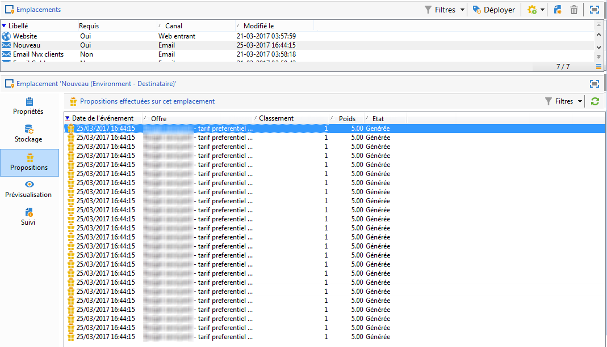

# Historique des propositions d&#39;offres{#offer-proposition-history}

Une fois vos propositions d&#39;offres effectuées, vous pouvez consulter l&#39;historique de vos différentes présentations.

>[!NOTE]
>
>Cette fonctionnalité n&#39;est visible que par le chargé de diffusion, dans un environnement en ligne.

* Au niveau de l&#39;offre, dans l&#39;onglet **[!UICONTROL Edition]**, cliquez sur **[!UICONTROL Propositions]**.

  

* Depuis le profil d&#39;un destinataire, cliquez sur l&#39;onglet **[!UICONTROL Propositions]**.

  

* Au niveau des emplacements, cliquez sur l&#39;onglet **[!UICONTROL Propositions]**.

  
