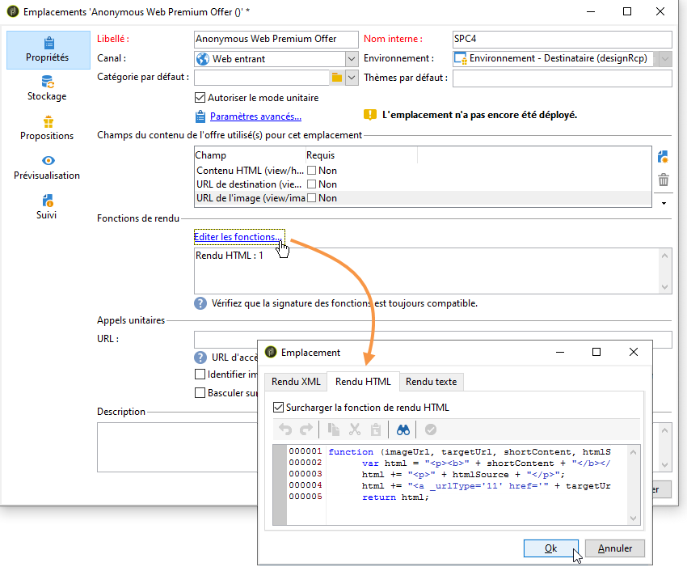
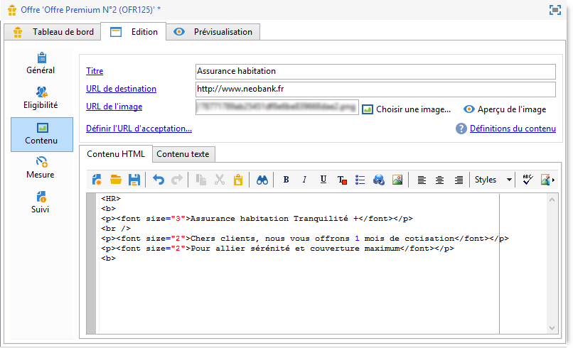

# Offres sur canal entrant{#offers-on-an-inbound-channel}


## Présenter une offre à un visiteur anonyme {#presenting-an-offer-to-an-anonymous-visitor}

Le site Neobank souhaite afficher une offre sur son site web à l&#39;attention des visiteurs qui navigueront sur cette page sans s&#39;être identifiés.

Pour mettre en place cette interaction, vous allez :

1. [Créer un environnement anonyme](#creating-an-anonymous-environment)
1. [Créer des emplacements anonymes](#creating-anonymous-offer-spaces)
1. [Créer une catégorie d’offres et un thème](#creating-an-offer-category-and-a-theme)
1. [Créer des offres anonymes](#creating-anonymous-offers)
1. [Paramétrer les emplacements dans le site web](#configure-the-web-offer-space-on-the-website)

### Créer un environnement anonyme {#creating-an-anonymous-environment}

Suivez la procédure de la section [Créer un environnement d&#39;offre](../../interaction/using/live-design-environments.md#creating-an-offer-environment) afin de créer votre environnement anonyme basé sur la dimension des **Visiteurs**.

Vous obtenez une arborescence contenant votre nouvel environnement :


### Créer des emplacements anonymes {#creating-anonymous-offer-spaces}

1. Dans l&#39;arborescence de votre environnement anonyme (**Visiteurs**), positionnez-vous au niveau du noeud **[!UICONTROL Administration]** > **[!UICONTROL Emplacements]**.
1. Cliquez sur **[!UICONTROL Nouveau]** pour créer les canaux d&#39;appel.

   

   >[!NOTE]
   >
   >L&#39;emplacement est automatiquement lié à l&#39;environnement anonyme.

1. Modifiez le libellé et sélectionnez le canal **[!UICONTROL Web entrant]**. Vous devez également cocher la case **[!UICONTROL Autoriser le mode unitaire]**.

   

1. Sélectionnez les champs du contenu de l&#39;offre utilisés pour l&#39;emplacement et indiquez-les comme requis en cochant la case correspondante.

   De cette manière, les offres dont l&#39;un des éléments suivants manque ne seront pas éligibles sur cet emplacement :

   * Title
   * Contenus HTML ;
   * URL de l&#39;image ;
   * URL de destination

   

1. Éditez la fonction de rendu HTML, par exemple de la manière suivante :

   ```
   function (imageUrl, targetUrl, shortContent, htmlSource){
         var html = "<p><b>" + shortContent + "</b></p>";
         html += "<p>" + htmlSource + "</p>";
         html += "<a _urlType='11' href='" + targetUrl + "'></a>";
         return html;
       }   
   ```

   >[!IMPORTANT]
   >
   >La fonction de rendu doit appeler les champs utilisés pour l&#39;emplacement dans l&#39;ordre dans lequel ils ont été précédemment sélectionnés afin que les offres s&#39;affichent correctement.

   

1. Enregistrez l&#39;emplacement.

### Créer une catégorie d&#39;offres et un thème {#creating-an-offer-category-and-a-theme}

1. Dans l&#39;arborescence, positionnez-vous sur le noeud **[!UICONTROL Catalogue d&#39;offres]** de l&#39;environnement que vous venez de créer.
1. Cliquez avec le bouton droit de la souris sur le noeud **[!UICONTROL Catalogue d&#39;offres]** et sélectionnez **[!UICONTROL Ajoutez un dossier &#39;Catégorie d&#39;offres&#39;]**.

   Nommez la nouvelle catégorie ; par exemple **Produits financiers**.

1. Dans l&#39;onglet **[!UICONTROL Eligibilité]** de la catégorie, saisissez le thème **financement** puis enregistrez vos modifications.

   

### Créer des offres anonymes {#creating-anonymous-offers}

1. Positionnez-vous sur la catégorie que vous venez de créer.
1. Cliquez sur **[!UICONTROL Nouveau]**.

   

1. Sélectionnez le modèle d&#39;offre anonyme livré d&#39;usine ou un modèle que vous aurez précédemment créé.

   

1. Modifiez le libellé puis enregistrez votre offre.

   

1. Dans l&#39;onglet **[!UICONTROL Eligibilité]**, définissez les poids de l&#39;offre en fonction de ses contextes d&#39;application.

   Dans notre exemple, l&#39;offre est paramétrée pour apparaître prioritairement dans la page d&#39;accueil du site jusqu&#39;à la fin de l&#39;année.

   

1. Dans l&#39;onglet **[!UICONTROL Contenu]**, définissez le contenu de l&#39;offre.

   >[!NOTE]
   >
   >Vous pouvez sélectionner **[!UICONTROL Définitions du contenu]** pour afficher la liste des éléments requis pour l&#39;emplacement web.

   

1. Créez une deuxième offre.

   

1. Dans l&#39;onglet **[!UICONTROL Eligibilité]**, appliquez le même poids qu&#39;à la première offre que vous avez créée.
1. Effectuez le cycle de validation de chacune des offres afin de les rendre disponibles, ainsi que leur(s) emplacement(s) validé(s), dans l&#39;environnement en ligne.

### Paramétrer l&#39;emplacement de l&#39;offre dans le site web {#configure-the-web-offer-space-on-the-website}

Afin que les offres que vous venez de paramétrer apparaissent dans le site web, vous allez insérer un code Javascript dans la page HTML de votre site destiné à appeler le moteur d&#39;Interaction (voir à ce sujet la section [À propos des canaux entrants](../../interaction/using/about-inbound-channels.md)).

1. Accédez à votre page HTML et insérez un attribut @id dont la valeur correspond au nom interne de l&#39;emplacement anonyme créé précédemment (voir [Créer des emplacements anonymes ](#creating-anonymous-offer-spaces)), précédé de **i_**.

   

1. Insérez l&#39;URL d&#39;appel.

   

   Les zones URL bleues ci-dessus correspondent au nom de l’instance, au nom interne de l’environnement (voir [Création d’un environnement anonyme](#creating-an-anonymous-environment)) et au thème lié à la catégorie ([Créer une catégorie d’offres et un thème](#creating-an-offer-category-and-a-theme)). Cette dernière option est facultative.

Lorsqu&#39;un visiteur accède à la page d&#39;accueil du site web, les offres dont le thème est **financement** s&#39;affichent à l&#39;emplacement prévu de la page HTML.


Un même visiteur se présentant plusieurs fois sur la page verra s&#39;afficher alternativement l&#39;une ou l&#39;autre des offres de la catégorie du fait que le même poids a été paramétré pour chacune.

## Basculer vers un environnement anonyme lorsqu&#39;un contact n&#39;est pas identifié {#switching-to-an-anonymous-environment-in-case-of-unidentified-contacts}

La société Neobank souhaite proposer des offres marketing destinées à deux publics différents. Elle veut pouvoir afficher des offres génériques pour des personnes qui navigueraient anonymement sur son site web. Dans le cas où l&#39;un de ses internautes se révèlerait être un client disposant d&#39;identifiants fournis par Neobank, la société souhaite qu&#39;il puisse voir des offres personnalisées dès lors qu&#39;il se connecte à son compte.

Le scénario de ce cas client se déroule de la manière suivante :

1. Une personne se rend sur le site de Neobank, sans se connecter.

   

   Trois offres anonymes s&#39;affichent sur la page : deux offres **Premium**, mettant en avant les produits de Neobank et une offre provenant de l&#39;un des partenaires de Neobank.

   

1. L’internaute se connecte avec ses informations d’identification, car il est un client de Neobank.

   

   Trois offres personnalisées s&#39;affichent à son intention.

   

Pour mettre en oeuvre ce cas client, vous devez disposer de deux environnements d&#39;offres : un environnement destiné à des interactions anonymes et un environnement d&#39;offres paramétrées pour des contacts identifiés. L&#39;environnement d&#39;offres identifiées sera paramétré pour basculer automatiquement vers l&#39;environnement anonyme si le contact ne s&#39;est pas connecté et n&#39;est donc pas identifié.

Les étapes sont les suivantes :

* Créer un catalogue d&#39;offres spécifiques aux interactions entrantes anonymes, selon les étapes suivantes :

   1. [Créer un environnement destiné aux contacts anonymes](#creating-an-environment-for-anonymous-contacts)
   1. [Paramétrer des emplacements pour l&#39;environnement anonyme](#configuring-offer-spaces-for-the-anonymous-environment)
   1. [Créer des catégories d&#39;offres dans l&#39;environnement anonyme](#creating-offer-categories-in-an-anonymous-environment)
   1. [Créer des offres destinées à des visiteurs anonymes](#creating-offers-for-anonymous-visitors)

* Créer un catalogue d&#39;offres spécifique aux interactions entrantes identifiées, selon les étapes suivantes :

   1. [Paramétrer les emplacements dans l&#39;environnement identifié](#configure-the-offer-spaces-in-the-identified-environment)
   1. [Créer des catégories d&#39;offres dans l&#39;environnement identifié](#creating-offer-categories-in-an-identified-environment)
   1. [Créer des offres personnalisées](#creating-personalized-offers)

* Paramétrer l&#39;appel du moteur d&#39;offre :

   1. [Paramétrer les emplacements dans la page web](#configuring-offer-spaces-on-the-web-page)
   1. [Spécifier les paramètres avancés de l&#39;emplacement identifié](#specifying-the-advanced-settings-of-the-identified-offer-spaces)

### Créer un environnement destiné aux contacts anonymes {#creating-an-environment-for-anonymous-contacts}

1. Créez un environnement d’offres pour les interactions entrantes anonymes via l’assistant de mappage de diffusion (mappage des **Visiteurs**). Voir à ce sujet la section [Créer un environnement d’offre](../../interaction/using/live-design-environments.md#creating-an-offer-environment).

   

### Paramétrer des emplacements pour l&#39;environnement anonyme {#configuring-offer-spaces-for-the-anonymous-environment}

Les offres qui doivent être présentées sur le site web appartiennent à deux catégories distinctes : **Premium** et **Partenaires**. Dans notre exemple, nous choisissons de créer un emplacement spécifique pour chacune des catégories.

Pour créer l&#39;emplacement correspondant à la catégorie **Premium**, procédez comme suit :

1. Dans l&#39;arborescence Adobe Campaign, positionnez-vous sur l&#39;environnement anonyme en édition, et ajoutez un emplacement.

   

1. Créez un nouvel emplacement de type **[!UICONTROL Web entrant]**.

   

1. Attribuez-lui le libellé **Offre Premium Web Anonyme** par exemple.
1. Ajoutez les champs du contenu de l&#39;offre utilisés pour cet emplacement et paramétrez les fonctions de rendus.

   

   >[!IMPORTANT]
   >
   >La fonction de rendu doit appeler les champs utilisés pour l&#39;emplacement dans l&#39;ordre dans lequel ils ont été précédemment sélectionnés afin que les offres s&#39;affichent correctement.

1. Faites de même pour créer un emplacement pour canal web entrant qui correspondra à la catégorie **Partenaires**.

   

### Créer des catégories d&#39;offres dans l&#39;environnement anonyme {#creating-offer-categories-in-an-anonymous-environment}

Vous allez créer deux catégories d&#39;offres : la catégorie **Premium** et la catégorie **Partenaires**. Chaque catégorie contiendra deux offres destinées à des contacts anonymes.

1. Dans l&#39;environnement anonyme que vous venez de créer, positionnez-vous sur le noeud **[!UICONTROL Catalogue d&#39;offres]**.
1. Ajoutez un dossier de type **[!UICONTROL Catégorie d&#39;offres]** et attribuez-lui le libellé **Premium**.

   

1. Créez une seconde catégorie et attribuez-lui le libellé **Partenaires**.

   

### Créer des offres destinées à des visiteurs anonymes {#creating-offers-for-anonymous-visitors}

Vous allez à présent créer deux offres dans chacune des catégories crées précédemment.

1. Positionnez-vous dans la catégorie **Premium** et créez une première offre anonyme.

   

1. Dans l&#39;onglet **[!UICONTROL Eligibilité]**, définissez les poids de l&#39;offre en fonction de ses contextes d&#39;application.

   

1. Dans l&#39;onglet **[!UICONTROL Contenu]**, définissez le contenu de l&#39;offre.

   

1. Créez une deuxième offre dans la catégorie **Premium**.

   

1. Positionnez-vous dans la catégorie **Partenaires** et créez une première offre anonyme.
1. Dans l&#39;onglet **[!UICONTROL Contenu]**, définissez le contenu de l&#39;offre.

   

1. Dans l&#39;onglet **[!UICONTROL Eligibilité]**, définissez les poids de l&#39;offre en fonction de ses contextes d&#39;application.

   

1. Créez une deuxième offre pour la catégorie **Partenaires**.

   

1. Dans l&#39;onglet **[!UICONTROL Eligibilité]**, appliquez le même poids qu&#39;à la première offre de cette catégorie, afin que les offres soient affichées à tour de rôle sur le site web.

   

1. Effectuez le cycle de validation de chacune des offres afin de déclencher leur mise en ligne. Lors de la validation du contenu, activez l&#39;emplacement **Partenaires** ou **Premium**, en fonction de l&#39;offre.

### Paramétrer les emplacements dans l&#39;environnement identifié {#configure-the-offer-spaces-in-the-identified-environment}

Les offres que vous allez présenter sur le site web sont issues de deux catégories différentes : **Premium** et **Partenaires**. Dans notre exemple, nous choisissons de créer un emplacement propre à chaque catégorie.

Pour créer les deux emplacements, procédez de la même manière que pour les emplacements anonymes. Consultez la section [Paramétrer des emplacements pour l’environnement anonyme](#configuring-offer-spaces-for-the-anonymous-environment).

1. Dans l&#39;arborescence Adobe Campaign, positionnez-vous sur l&#39;environnement identifié et ajoutez les emplacements **Premium** et **Partenaires**.
1. Appliquez le processus détaillé dans [Paramétrer des emplacements pour l&#39;environnement anonyme](#configuring-offer-spaces-for-the-anonymous-environment).

   

1. Sélectionnez l&#39;option **[!UICONTROL Basculer sur un emplacement anonyme si aucun individu n&#39;a été identifié]**.

   

1. Dans la liste déroulante, sélectionnez l’espace d’offre Web anonyme créé précédemment (voir [Paramétrer des emplacements pour l&#39;environnement anonyme](#configuring-offer-spaces-for-the-anonymous-environment)).

   

### Spécifier les paramètres avancés de l&#39;emplacement identifié {#specifying-the-advanced-settings-of-the-identified-offer-spaces}

Dans notre exemple, l&#39;identification du contact se fait via son email dans la base de données Adobe Campaign. Pour ajouter l&#39;email du destinataire dans l&#39;emplacement, procédez comme suit :

1. Dans l&#39;environnement identifié, positionnez-vous dans le dossier des emplacements.
1. Sélectionnez l&#39;emplacement **Premium** et cliquez sur **[!UICONTROL Paramètres avancés]**.

   

1. Dans l&#39;onglet **[!UICONTROL Identification de la cible]**, cliquez sur **[!UICONTROL Ajouter]**.

   

1. Cliquez sur **[!UICONTROL Editer l&#39;expression]** et dans la table des destinataires, sélectionnez le champ **[!UICONTROL Email]**.

   

1. Cliquez sur **[!UICONTROL OK]** pour fermer la fenêtre **[!UICONTROL Paramètres avancés]** et terminer le paramétrage de l&#39;emplacement **Premium**.
1. Procédez de la même manière pour l&#39;emplacement **Partenaires**.

   

### Créer des catégories d&#39;offres dans l&#39;environnement identifié {#creating-offer-categories-in-an-identified-environment}

Vous allez créer deux catégories distinctes : la catégorie **Premium** et la catégorie **Partenaires**, chacune contiendra deux offres personnalisées.

1. Dans l&#39;environnement identifié, positionnez-vous sur le noeud **[!UICONTROL Catalogue d&#39;offres]**.
1. Comme dans l&#39;environnement anonyme, ajoutez deux dossiers de type **[!UICONTROL Catégorie d&#39;offres]** et attribuez-leur les libellés **Premium** et **Partenaires**.

   

### Créer des offres personnalisées {#creating-personalized-offers}

Vous allez créer deux offres personnalisées dans chaque catégorie, soit quatre offres au total.

1. Positionnez-vous dans la catégorie **Premium** et créez une première offre personnalisée.

   

1. Dans l&#39;onglet **[!UICONTROL Eligibilité]**, définissez les poids de l&#39;offre en fonction de ses contextes d&#39;application.

   

1. Dans l&#39;onglet **[!UICONTROL Contenu]**, définissez le contenu de l&#39;offre.

   

1. Créez une deuxième offre dans la catégorie **Premium**.

   

1. Positionnez-vous dans la catégorie **Partenaires** et créez une première offre personnalisée.

   

1. Dans l&#39;onglet **[!UICONTROL Eligibilité]**, définissez les poids de l&#39;offre en fonction de ses contextes d&#39;application.

   

1. Créez une deuxième offre pour la catégorie **Partenaires**.

   

1. Dans l&#39;onglet **[!UICONTROL Eligibilité]**, appliquez le même poids qu&#39;à la première offre de cette catégorie, afin que les offres soient affichées à tour de rôle sur le site web.
1. Effectuez le cycle de validation de chacune des offres afin de déclencher leur mise en ligne. Lors de la validation du contenu, activez l&#39;emplacement **Partenaires** ou **Premium**, en fonction de l&#39;offre.

### Paramétrer les emplacements dans la page web {#configuring-offer-spaces-on-the-web-page}

Le site de la société Neobank dispose de trois emplacements pour afficher ses offres : deux emplacements pour les offres bancaires issues de la catégorie **Premium** et un emplacement pour les offres issues de la catégorie **Partenaires**.


Pour paramétrer les emplacements des offres dans la page HTML du site web, procédez comme suit :

1. Dans le contenu de la page HTML, insérez trois

   éléments avec un attribut @id dont la valeur nous permettra d’appeler les offres dans les différents espaces d’offre du site Web.

   

1. Insérez ensuite le script qui permet de définir les valeurs des attributs.

   

   Dans cet exemple, **ContBO1** et **ContBO2** reçoivent la valeur **OsWebBestOfferIdentified**, c’est-à-dire le nom interne de l’emplacement **Premium** créé précédemment dans l&#39;environnement identifié. Les valeurs **CatBestOffer** et **CatBestOfferAnonym** correspondent au nom interne des catégories **Premium** pour les environnements anonymes et identifiés.

   

   De même, **ContPtn** reçoit la valeur **SPC29** qui correspond au nom interne de l&#39;emplacement **Partenaires** créé dans l&#39;environnement identifié. **OC35** et **OC31** correspondent au nom interne des catégories **Partenaires** des environnements anonymes et identifiés.

   

1. Affectez à la variable **interactionTarget** les informations qui vont permettre d&#39;identifier la personne qui se connecte au site Neobank.

   

   L’identification de la personne peut être basée sur un cookie de navigateur, un paramètre de lecture dans l’URL, l’email ou l’identifiant de la personne. Si un champ de la table des destinataires autre que la clé primaire est utilisé, il doit être défini dans les paramètres avancés de l’espace (voir [Spécifier les paramètres avancés des espaces d’offre identifiés](#specifying-the-advanced-settings-of-the-identified-offer-spaces)).

1. Insérez l&#39;URL d&#39;appel.

   

   L&#39;URL contient le nom interne **OE18** de l&#39;environnement identifié.

Lors de l&#39;affichage de la page web, le script permet d&#39;appeler le moteur d&#39;Interaction afin que s&#39;affiche le contenu des offres dans les emplacements prévus à cet effet sur la page web. En un seul appel au serveur Adobe Campaign, le moteur détermine l&#39;environnement, l&#39;emplacement et les catégories à sélectionner.

Dans notre exemple, le moteur reconnaît l&#39;environnement identifié (**OE18**). Il identifie l&#39;emplacement (**SPC27**) et la catégorie **Premium** (**OC34**) pour le premier et le deuxième emplacement de la page web, ainsi que l&#39;emplacement (**SPC29**) et la catégorie **Partenaires** (**OC35**) pour le troisième emplacement dans le site.

Si jamais le moteur n&#39;identifie pas le destinataire, il bascule vers les emplacements anonymes qui sont référencés dans les emplacements identifiés et vers les catégories anonymes (**OC30** et **OC31**) telles qu&#39;elles sont spécifiées dans le script.
