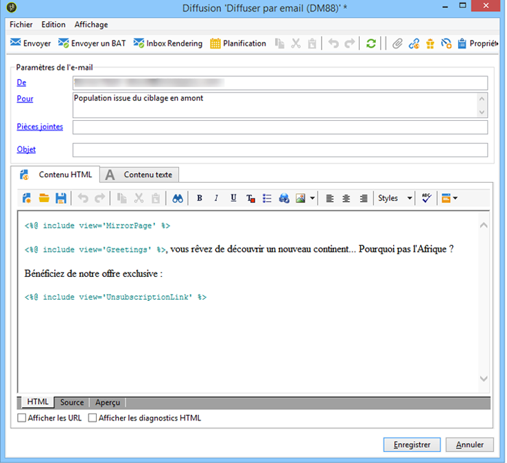
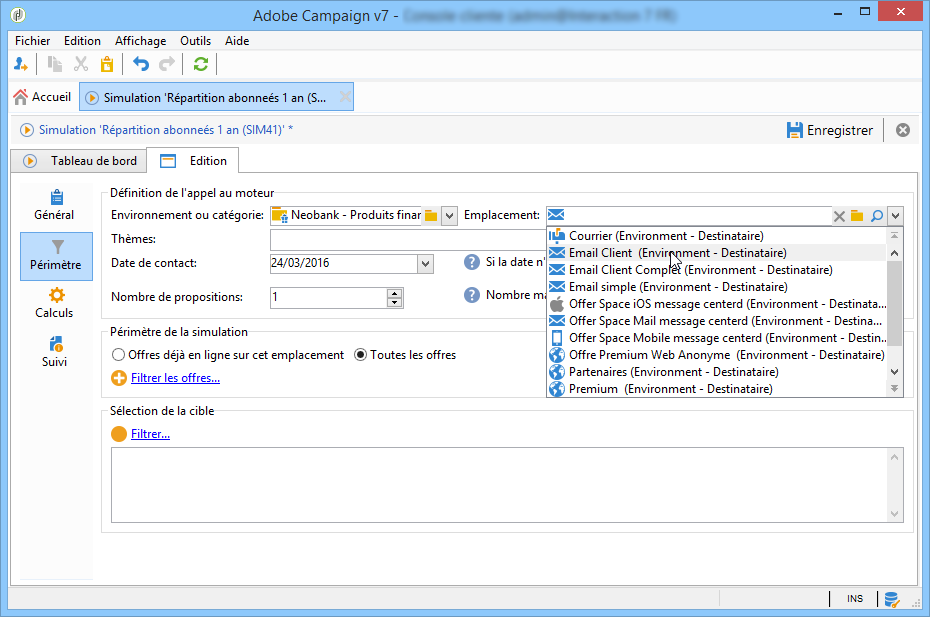

# Offres sur canal sortant{#offers-on-an-outbound-channel}

## Diffusion d&#39;une offre par email {#email-offer-delivery}

Dans votre base, vous disposez d&#39;une catégorie d&#39;offres de voyages à destination de l&#39;Afrique. L&#39;éligibilité, les contextes et les représentations de chaque offre ont été paramétrés. Vous allez à présent créer une campagne pour présenter vos offres par email.

1. Créez votre opération marketing et votre workflow de ciblage.

   

1. Editez la diffusion email et cliquez sur l&#39;icône **[!UICONTROL Offres]**.

   

1. Sélectionnez l&#39;emplacement Email de votre environnement d&#39;offres correspondant aux voyages.

   

1. Choisissez la catégorie dans laquelle se trouvent les offres de voyages pour l&#39;Afrique.

   

1. Choisissez de présenter deux offres dans votre diffusion.

   

1. Fermez la fenêtre de gestion des offres et créez le contenu de votre diffusion.

   

1. Cliquez sur le champ de fusion pour insérer une première proposition d&#39;offre et choisissez la Fonction de rendu HTML.

   

1. Insérez la deuxième proposition d&#39;offre.

   

1. Cliquez sur **[!UICONTROL Aperçu]** pour prévisualiser vos offres dans la diffusion puis sélectionnez un destinataire afin de visualiser les offres telles qu&#39;il les recevra.

   

1. Enregistrez votre diffusion et lancez le workflow de ciblage.
1. Ouvrez votre diffusion et cliquez sur l&#39;onglet **[!UICONTROL Suivi]** : vous pouvez constater que le moteur d&#39;offre a déterminé les propositions à faire entre les différentes offres existant dans la catégorie.

   

## Effectuer une simulation d&#39;offres {#perform-an-offer-simulation}

1. Dans l’onglet **[!UICONTROL Profils et cibles]**, cliquez sur le lien **[!UICONTROL Simulations]**, puis sur le bouton **[!UICONTROL Créer]**.

   

1. Choisissez un libellé et spécifiez des paramètres d&#39;exécution si besoin est.

   

1. Enregistrez la simulation. Celle-ci s&#39;ouvre alors dans un nouvel onglet.

   

1. Cliquez sur l&#39;onglet **[!UICONTROL Edition]**, puis sur **[!UICONTROL Périmètre]**.

   

1. Sélectionnez la catégorie sur laquelle vous souhaitez simuler vos offres.

   

1. Sélectionnez l&#39;emplacement sur lequel doit porter la simulation.

   

1. Entrez des dates de validité. Vous devez obligatoirement spécifier au moins une date de début. Ceci permet au moteur d&#39;offres de filtrer les offres et de choisir celles qui sont valides à la date donnée.
1. Si nécessaire, spécifiez un ou plusieurs thèmes pour limiter le nombre d&#39;offres à celles ayant ce mot-clé dans leurs paramètres.

   Dans notre exemple, la variable **Voyage** catégorie contient deux sous-catégories avec deux thèmes distincts. Nous allons lancer une simulation pour les offres avec l’événement **Clients > 1 an** thème.

   

1. Sélectionnez les destinataires à cibler.

   

1. Paramétrez le nombre d&#39;offres que vous souhaitez proposer à chaque destinataire.

   Dans notre exemple, le moteur d&#39;offres va sélectionner pour chaque destinataire les 3 offres dont le poids est le plus élevé.

   

1. Enregistrez vos paramètres puis cliquez sur **[!UICONTROL Démarrer la simulation]**, sur l&#39;onglet **[!UICONTROL Tableau de bord]**, pour lancer la simulation.

   

1. Lorsque la simulation est terminée, consultez les **[!UICONTROL Résultats]** pour connaître la répartition des propositions par offres.

   Dans notre exemple, le moteur d&#39;offres a bien basé la répartition des offres sur une base de 3 propositions.

   

1. Affichez le rapport **[!UICONTROL Répartition des offres par rang]** pour voir le classement des offres sélectionnées par le moteur d&#39;offres.

   

1. Si besoin est, modifiez les éléments du périmètre autant de fois que nécessaire et relancez la simulation en cliquant sur **[!UICONTROL Démarrer la simulation]**.

   

1. Pour conserver les données des simulations, utilisez les fonctions d&#39;historisation ou d&#39;export disponibles dans le rapport.

   
