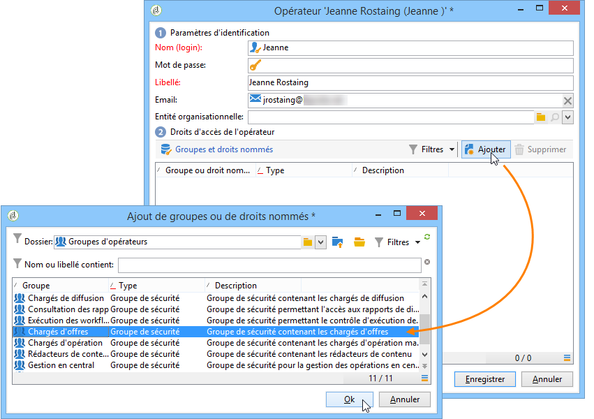
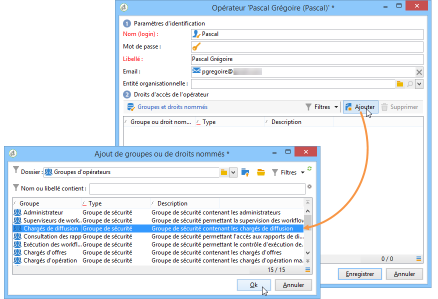

# Profils d&#39;opérateurs{#operator-profiles}

Deux types d&#39;opérateurs sont amenés à utiliser Interaction : un chargé d&#39;offres et un chargé de diffusion. Chacun dispose de droits spécifiques qui ne leur donnent accès qu&#39;à certaines parties de l&#39;arborescence de la plateforme.

* **[!UICONTROL Chargé d&#39;offres]** : crée et maintient les offres. Notez que si des offres sont utilisées dans le workflow, l’opérateur doit se trouver dans le groupe d’opérateurs **[!UICONTROL Administrateur]** ou **[!UICONTROL Chargés d’offres]** pour l’exécuter.
* **[!UICONTROL Chargé de diffusion]** : valide et utilise les offres

Les étapes de création des opérateurs propres à Interaction sont identiques à celles utilisées pour créer n&#39;importe quel opérateur dans la plateforme. Reportez-vous à [cette section](../../platform/using/access-management.md) pour plus d&#39;informations. Les droits sont configurés lors de la création de l&#39;opérateur.

## Chargé d&#39;offres {#offer-manager}

1. Créez votre nouvel opérateur.
1. Dans la fenêtre **[!UICONTROL Groupes et droits nommés]**, cliquez sur **[!UICONTROL Ajouter]** et sélectionnez le groupe **[!UICONTROL Chargé d&#39;offres]**.

   

Les droits attribués au chargé d&#39;offres lui permettent d&#39;effectuer les opérations suivantes :

* Modifier des environnements **[!UICONTROL En édition]**.
* Consulter des environnements **[!UICONTROL En ligne]**.
* Paramétrer des fonctions d&#39;administration (emplacements et filtres prédéfinis).
* Créer et modifier des catégories.
* Créer des offres.
* Paramétrer l&#39;éligibilité des offres.
* Valider des offres.

  >[!NOTE]
  >
  >Le chargé d’offres ne peut valider une offre que dans deux cas particuliers. Le premier étant si aucune personne en particulier n’a été spécifiée comme validant et le second étant si l’opérateur en charge de la création des modèles (disposant du droit pour l’affectation des validants) l’a spécifié comme validant dans le modèle d’offre sur lequel l’offre était basée.

## Chargé de diffusion {#delivery-manager}

1. Créez votre nouvel opérateur.
1. Dans la fenêtre **[!UICONTROL Groupes et droits nommés]**, cliquez sur **[!UICONTROL Ajouter]** et sélectionnez le groupe **[!UICONTROL Chargé de diffusion]**.

   

Les droits attribués au chargé de diffusion lui permettent d’effectuer les opérations suivantes :

* Afficher les environnements **[!UICONTROL En ligne]**.
* Afficher et modifier des catégories d&#39;offres.
* Valider des offres s’il y est spécifié comme l’un des validants.

  >[!NOTE]
  >
  >Le chargé de diffusion ne peut valider une offre que s’il a été défini comme validant lors de la configuration de l’offre.

## Récapitulatif des droits selon le type d&#39;opérateur {#recap-of-rights-according-to-operator}

<table> 
 <tbody> 
  <tr> 
   <td> </td> 
   <td> <strong>Chargé d'offres (en édition)</strong>  </td> 
   <td> <strong>Chargé d'offres (en ligne)</strong>  </td> 
  </tr> 
  <tr> 
   <td> <strong>Niveau de l'arborescence</strong>  </td> 
   <td> </td> 
   <td> </td> 
  </tr> 
  <tr> 
   <td> Offres en édition / Offres en ligne  </td> 
   <td> Lecture / Ecriture  </td> 
   <td> Lecture  </td> 
  </tr> 
  <tr> 
   <td> Environnement - Destinataire  </td> 
   <td> Lecture / Ecriture  </td> 
   <td> Lecture  </td> 
  </tr> 
  <tr> 
   <td> Administration  </td> 
   <td> Lecture / Ecriture  </td> 
   <td> Lecture  </td> 
  </tr> 
  <tr> 
   <td> Emplacements  </td> 
   <td> Lecture / Ecriture  </td> 
   <td> Lecture  </td> 
  </tr> 
  <tr> 
   <td> Filtres prédéfinis d'offres  </td> 
   <td> Lecture / Ecriture  </td> 
   <td> Lecture  </td> 
  </tr> 
  <tr> 
   <td> Typologie  </td> 
   <td> Lecture / Ecriture  </td> 
   <td> Lecture  </td> 
  </tr> 
  <tr> 
   <td> Règles de typologie  </td> 
   <td> Lecture / Ecriture  </td> 
   <td> Lecture  </td> 
  </tr> 
  <tr> 
   <td> Catalogue d'offres  </td> 
   <td> Lecture / Ecriture  </td> 
   <td> Lecture  </td> 
  </tr> 
  <tr> 
   <td> Catégorie d'offres  </td> 
   <td> Lecture / Ecriture  </td> 
   <td> Lecture  </td> 
  </tr> 
 </tbody> 
</table>

<table> 
 <tbody> 
  <tr> 
   <td> </td> 
   <td> <strong>Chargé de diffusion (en édition)</strong>  </td> 
   <td> <strong>Chargé de diffusion (en ligne)</strong>  </td> 
  </tr> 
  <tr> 
   <td> <strong>Niveau de l'arborescence</strong>  </td> 
   <td> </td> 
   <td> </td> 
  </tr> 
  <tr> 
   <td> Offres en édition / Offres en ligne  </td> 
   <td> </td> 
   <td> Lecture  </td> 
  </tr> 
  <tr> 
   <td> Environnement - Destinataire  </td> 
   <td> </td> 
   <td> Lecture  </td> 
  </tr> 
  <tr> 
   <td> Administration  </td> 
   <td> </td> 
   <td> </td> 
  </tr> 
  <tr> 
   <td> Emplacements  </td> 
   <td> </td> 
   <td> </td> 
  </tr> 
  <tr> 
   <td> Filtres prédéfinis d'offres  </td> 
   <td> Lecture  </td> 
   <td> Lecture  </td> 
  </tr> 
  <tr> 
   <td> Typologie  </td> 
   <td> Lecture  </td> 
   <td> Lecture  </td> 
  </tr> 
  <tr> 
   <td> Règles de typologie  </td> 
   <td> </td> 
   <td> Lecture  </td> 
  </tr> 
  <tr> 
   <td> Catalogue d'offres  </td> 
   <td> Lecture  </td> 
   <td> Lecture  </td> 
  </tr> 
  <tr> 
   <td> Catégorie d'offres  </td> 
   <td> </td> 
   <td> Lecture  </td> 
  </tr> 
 </tbody> 
</table>
